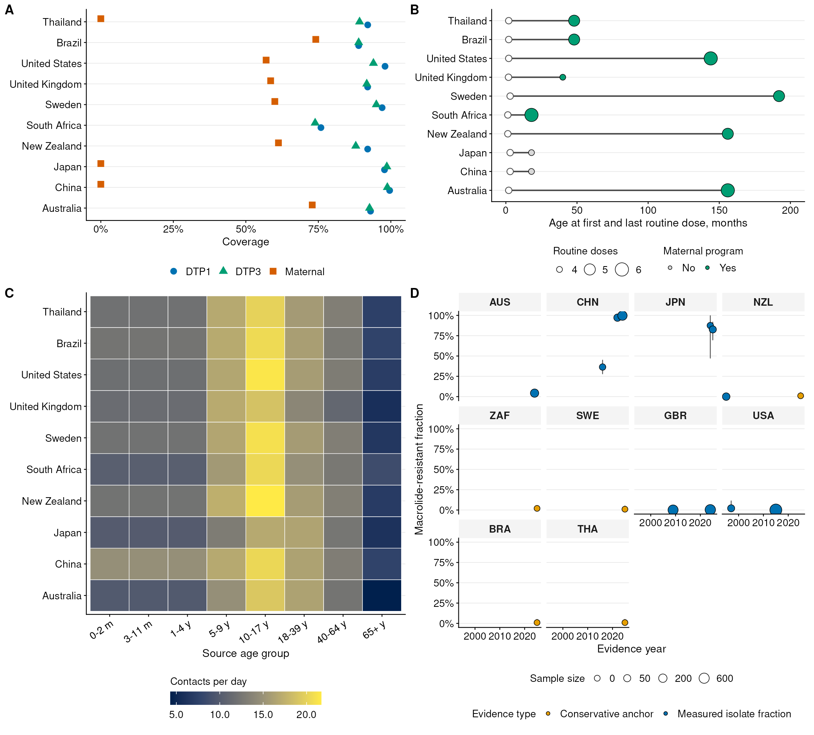
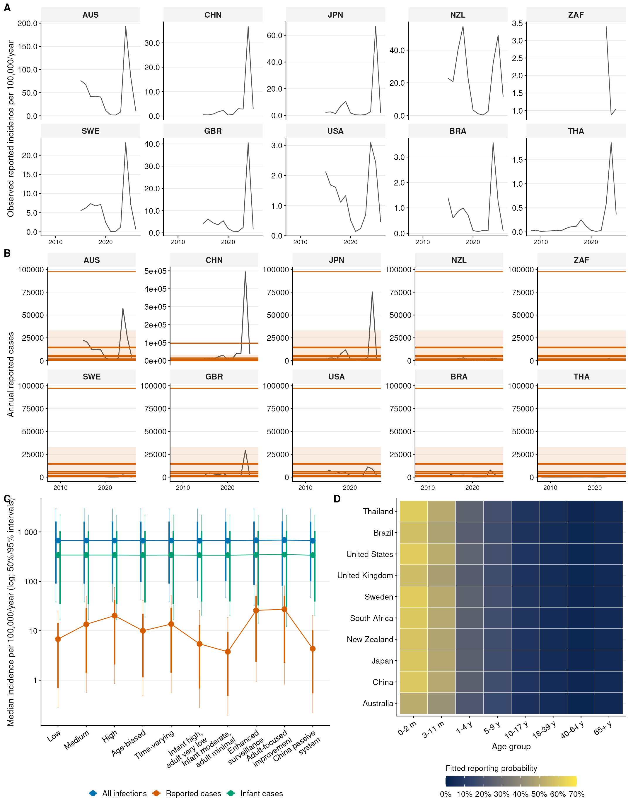
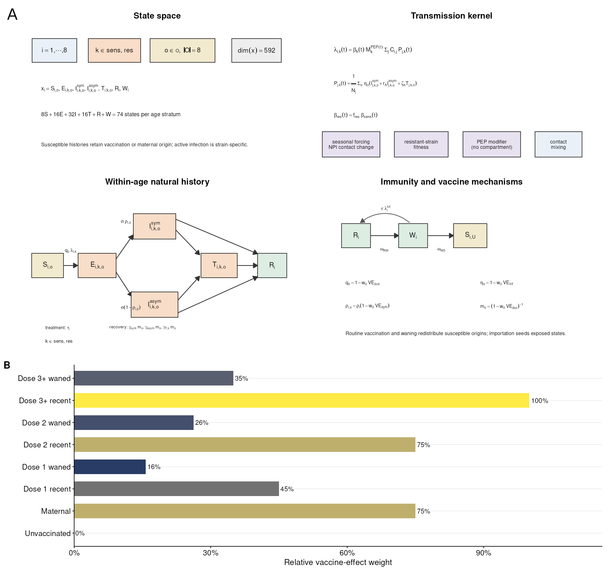
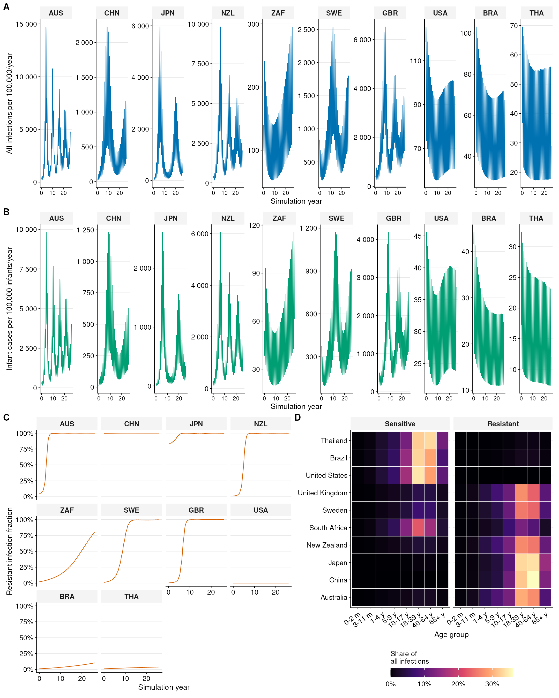
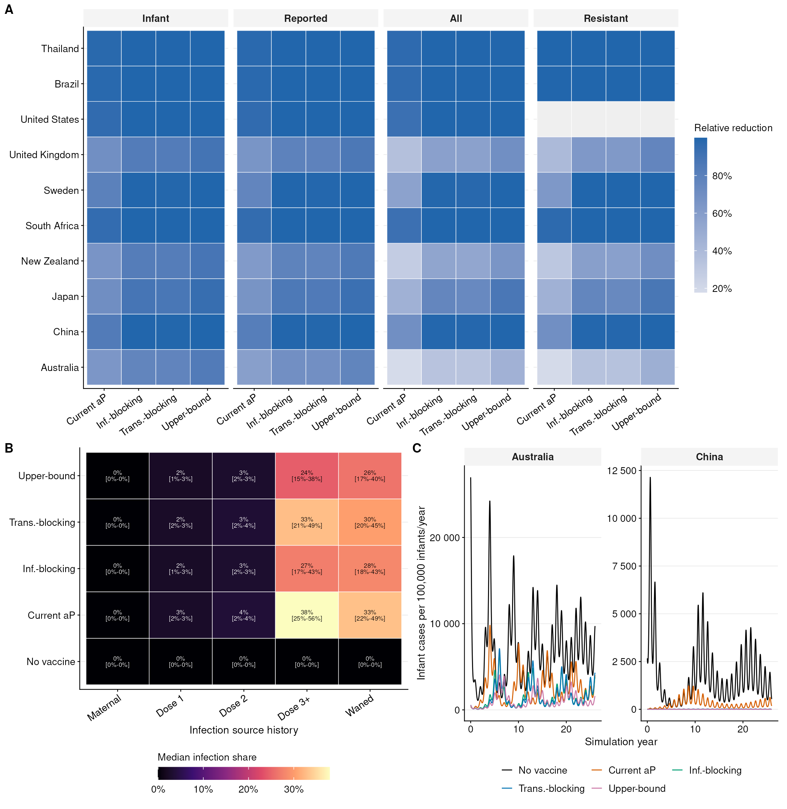
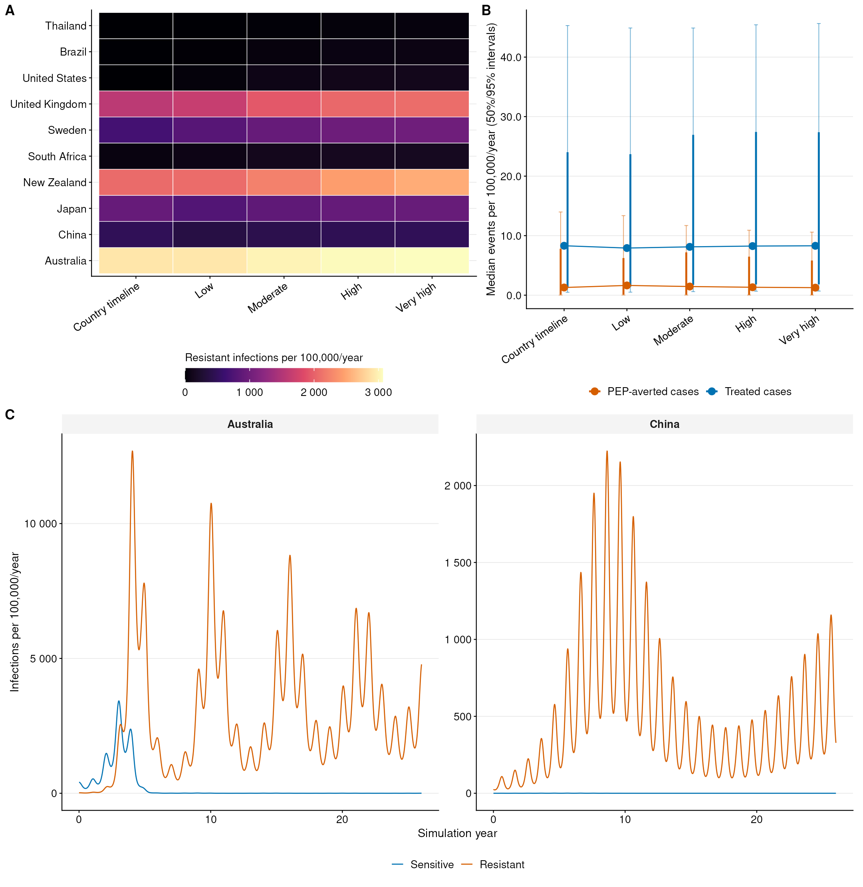
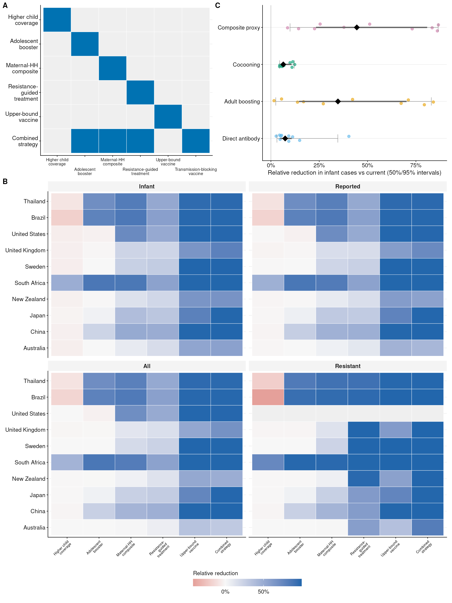
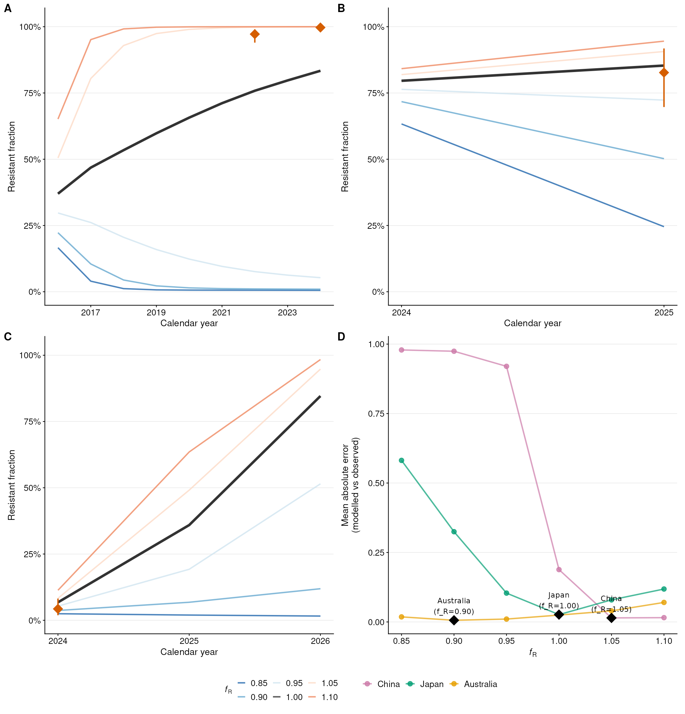

  <h3 style="font-family: inherit; font-weight: normal; margin-bottom: 0;">Supplementary Materials</h3>
  <h1 style="font-family: inherit; font-weight: bold; font-size: 1.5em;">Scenario Projections of Infant Pertussis Burden With Vaccine Transmission Blocking and Macrolide Resistance</h1>
   
   
  Kangguo Li et al. (2026)

## Contents

Materials and Methods.

eFigures.

eTables.

References.

## Materials and Methods

### Study design

We developed a deterministic age-structured compartmental model of *Bordetella pertussis* transmission to evaluate how vaccine mechanism assumptions and macrolide resistance jointly affect infant disease burden, all-age infection burden, notified cases, resistant infections, and conditional epidemiologic intervention scenario projections.

The vaccine-history structure follows the WHO pertussis vaccine framework [1]. The natural-immunity and boosting structure builds on pertussis waning, resurgence, and asymptomatic-transmission models [2-5]. Vaccine transmission-mechanism scenarios were motivated by acellular-vaccine transmission and waning evidence [6-9]. Maternal-origin states represent short-lived passive infant protection informed by pregnancy vaccination effectiveness studies [10-12].

Ten national profiles were analyzed: Australia, Brazil, China, Japan, New Zealand, South Africa, Sweden, Thailand, the United Kingdom, and the United States. The set is purposive rather than globally representative; it was chosen to maximize contrast in programmatic and resistance assumptions, spanning Western Pacific, South-East Asian, European, Americas, and African settings, large and small population denominators, contrasting booster and maternal-immunization program signatures, heterogeneous reported incidence, and both measured and conservative low macrolide-resistance anchors.

Country-specific population denominators came from United Nations World Population Prospects [13]. Vaccine schedule and coverage inputs used WHO/UNICEF Joint Reporting Form and immunization records [14]. Contact matrices used Prem/contactdata social-contact estimates [15-17], and reported-case intervals used the harmonized PertussisIncidence surveillance table [18]. Treatment and PEP assumptions followed CDC clinical guidance [19,20].

Resistance guidance came from CDC and ECDC sources [21,22]. The country evidence timeline combined reports from China [23,24], Australia [25], Japan [26], the Americas [27], and earlier regional MRBP reports [28,29]. The principal simulations used a 15-year pre-analysis burn-in to reduce dependence on arbitrary initial conditions, followed by a 26-year analysis horizon beginning on 1 January 2025, with model output retained at 7-day intervals.

All incidence measures are reported as annualized counts per 100,000 persons unless stated otherwise. Infant outcomes combine the 0-2 month and 3-11 month age groups, because these strata jointly capture the highest-risk pre-primary-series and partially vaccinated infant population. Simulated intervention scenario-order summaries are epidemiologic diagnostics; selected-parameter joint PSA order-stability diagnostics and QALY-like burden translations are supplementary sensitivity analyses and do not constitute cost-effectiveness, feasibility, or equity-weighted policy appraisal.

The supplementary appendix is generated directly from the same analysis pipeline used for the simulations, so the text, figures, and tables remain aligned with the model assumptions. eTable 2 provides the study parameter-design matrix, source/provenance links, and detailed-table locations across scenario, sensitivity, and uncertainty analyses; eTable 9 summarizes the fixed model settings and output conventions that govern interpretation.

### Country profile construction

Population denominators were aggregated from one-year age groups into eight model strata. Age 0 population was partitioned according to the configured infant age-bin widths, with $2/12$ assigned to the 0-2 month stratum and $10/12$ assigned to the 3-11 month stratum; ages 1-4 years, 5-9 years, 10-17 years, 18-39 years, 40-64 years, and 65 years or older were then aggregated directly. Let $N_i$ denote the resulting population in age group $i$. In the ODE, age movement uses the same configured age-bin durations, so the denominator split and maternal-protection ageing rule are aligned.

Routine and maternal immunization inputs were transformed into age-specific vaccine-origin coverage proxies using DTP1 coverage $v_1$, DTP3 coverage $v_3$, maternal coverage $m$, the number of childhood booster doses $b$, and an indicator $A$ for an adolescent booster program:

$$
v_{0-2m}=\mathrm{clip}(0.02+0.55m,\ 0.02,\ 0.75),
$$

$$
v_{3-11m}=\mathrm{clip}(0.75v_1+0.12v_3+0.12m,\ 0,\ 0.95),
$$

$$
v_{1-4y}=\mathrm{clip}\{v_3[0.88+0.04\min(b,2)],\ 0,\ 0.98\},
$$

$$
v_{5-9y}=\mathrm{clip}\{v_3[0.80+0.06\min(b,2)],\ 0,\ 0.96\},
$$

$$
v_{10-17y}=\mathrm{clip}\{v_3[0.55+0.12\min(b,2)+0.15A],\ 0,\ 0.95\},
$$

$$
v_{18-39y}=\mathrm{clip}(0.20+0.15A+0.05m,\ 0.10,\ 0.75),
$$

$$
v_{40-64y}=\mathrm{clip}(0.12+0.05A+0.02m,\ 0.08,\ 0.50),
$$

$$
v_{65+y}=\mathrm{clip}(0.08+0.02A,\ 0.05,\ 0.30).
$$

These deterministic transformations assign individuals to mechanistic protection histories and do not imply that age-specific pertussis immunization coverage, especially adult coverage, is directly observed in all settings. They are coverage-to-state mapping proxies that translate DTP1, DTP3, booster, and maternal-program records into the compartment origins needed by the model. The waning structure follows acellular-pertussis vaccine duration evidence [7-9], and the maternal-origin mapping follows pregnancy vaccination effectiveness evidence [10-12]. Adult values represent residual or recently boosted immune-history proxies, not measured adult pertussis vaccine uptake.

Seasonal forcing parameters were inferred from the timing of positive reported cases. For observation $l$, let $c_l$ be reported cases and $\theta_l=2\pi(d_l-1)/365$, where $d_l$ is the day of year. The circular concentration was

$$
R_c=
\frac{
\left[(\sum_l c_l\sin\theta_l)^2+(\sum_l c_l\cos\theta_l)^2\right]^{1/2}
}{
\max(\sum_l c_l,10^{-9})
},
$$

with annual phase

$$
\phi =
\left[
\frac{365}{2\pi}\mathrm{atan2}\left(\sum_l c_l\sin\theta_l,\sum_l c_l\cos\theta_l\right)+1
\right]\bmod 365
$$

and annual amplitude

$$
a=\mathrm{clip}(0.08+0.55R_c,\ 0.08,\ 0.35).
$$

The amplitude mapping is a surveillance-derived heuristic rather than a separately identifiable seasonal-transmission estimate; seasonal amplitude is therefore included in calibration and sensitivity workflows.

Multi-year recurrence was treated as a diagnostic forcing component rather than direct evidence of a single causal oscillator. Annual reported-case peaks were identified with a minimum spacing of two years and a prominence threshold equal to 10% of the maximum annual count. A 3-5 year median peak interval was considered compatible with multi-year recurrence; otherwise the multi-year amplitude was set to zero [2,3].

Prem/contactdata all-setting matrices were first represented on 5-year age bins and then aggregated to the eight model age groups using population weights [15-17]. If $P_{ab}$ is the fine-age contact matrix, $w_{ia}$ is the distribution of age group $i$ over fine source bin $a$, and $f_{jb}$ is the fraction of fine target bin $b$ belonging to model group $j$, then

$$
C_{ij}^{raw}=\sum_a\sum_b w_{ia}P_{ab}f_{jb}.
$$

Population-weighted reciprocity was imposed by replacing each off-diagonal pair with the shared contact total

$$
\tilde{C}_{ij}=
\frac{C_{ij}^{raw}N_i+C_{ji}^{raw}N_j}{2N_i},
\quad
\tilde{C}_{ji}=
\frac{C_{ij}^{raw}N_i+C_{ji}^{raw}N_j}{2N_j}.
$$

This correction preserves the average number of cross-group contacts while ensuring $N_i\tilde{C}_{ij}=N_j\tilde{C}_{ji}$.

For the individual stochastic contact-clustering toy model, the same extraction and aggregation procedure was repeated for the contactdata location-specific matrices (home, school, work, and other). These setting-specific matrices were used only for structural-sensitivity illustration; the calibrated deterministic model used the reciprocity-balanced all-setting matrix. Because Prem/contactdata 5-year bins cannot directly resolve the 0-2 month and 3-11 month infant strata, infant-target contacts are a main structural uncertainty and were evaluated through infant-contact sensitivity diagnostics.

### Age groups, strains, and state variables

The model uses eight age groups:

$$
i \in \mathcal{A} = \{0\text{-}2m,\ 3\text{-}11m,\ 1\text{-}4y,\ 5\text{-}9y,\ 10\text{-}17y,\ 18\text{-}39y,\ 40\text{-}64y,\ 65+y\}.
$$

Pertussis infections are divided into macrolide-sensitive and macrolide-resistant strains:

$$
k \in \mathcal{K} = \{\mathrm{sens},\mathrm{res}\}.
$$

Here strain subscripts $\mathrm{sens}$ and $\mathrm{res}$ denote macrolide-sensitive and macrolide-resistant infection. These strain labels are distinct from susceptible compartments $S_{i,o}$ and naturally immune states $R_i$.

Susceptible individuals retain vaccine or maternal-protection origin histories:

$$
o \in \mathcal{O} = \{U,\ M,\ D1_{rec},\ D1_{wan},\ D2_{rec},\ D2_{wan},\ D3_{rec},\ D3_{wan}\}.
$$

Here $U$ is unvaccinated, $M$ is maternally protected, $D1$ and $D2$ are one- and two-dose histories, and $D3$ represents three-or-more-dose histories; subscripts $rec$ and $wan$ denote recent and waned protection.

For each age group, the model tracks susceptible-origin states $S_{i,o}$, exposed states $E_{i,k,o}$, symptomatic infectious states $I^{sym}_{i,k,o}$, asymptomatic infectious states $I^{asym}_{i,k,o}$, treated infectious states $T_{i,k,o}$, naturally immune states $R_i$, and waned-natural-immunity states $W_i$. The per-age state space contains 8 susceptible-origin states, 16 exposed states, 32 infectious states, 16 treated states, and two natural-immunity states, yielding 74 compartments per age group and 592 dynamic state variables.

### Vaccine mechanism parameterization

Four vaccine mechanism parameters define a scenario:

$$
\mathrm{VE}_{sus},\quad \mathrm{VE}_{sym},\quad \mathrm{VE}_{inf},\quad \mathrm{VE}_{dur}.
$$

These represent reductions in susceptibility to infection, symptomatic disease given infection, onward infectiousness after infection, and infectious duration, respectively. They are mechanistic scenario-decomposition parameters, not quantities separately identifiable from routine surveillance alone. Throughout this appendix, $\mathrm{VE}_{sus}$ is the model parameter corresponding to protection against infection through reduced susceptibility, whereas $\mathrm{VE}_{inf}$ is not an infection-acquisition endpoint but a reduction in infectiousness among infected vaccine-history origins. Vaccine effects are origin-specific through a relative effect weight $w_o \in [0,1]$. The default weights distinguish maternal protection, partial-dose histories, recent three-or-more-dose protection, and waned protection:

$$
w_o =
\begin{cases}
0, & o=U,\\
w_M, & o=M,\\
w_1, & o=D1_{rec},\\
w_1w_{wan}, & o=D1_{wan},\\
w_2, & o=D2_{rec},\\
w_2w_{wan}, & o=D2_{wan},\\
1, & o=D3_{rec},\\
w_{wan}, & o=D3_{wan}.
\end{cases}
$$

The origin-specific susceptibility multiplier is

$$
q_o = \max(0, 1 - w_o\mathrm{VE}_{sus}).
$$

The probability that an infection in age group $i$ and origin $o$ is symptomatic is

$$
\rho_{i,o} = \mathrm{clip}\{\rho_i(1-w_o\mathrm{VE}_{sym}),0,1\},
$$

where $\rho_i$ is the age-specific baseline symptom probability. The origin-specific infectiousness multiplier is

$$
\eta_o = \mathrm{clip}(1-w_o\mathrm{VE}_{inf},0,1),
$$

and vaccine shortening of infectious duration is represented by a recovery-rate multiplier

$$
m_o = \left[\max(0.05,1-w_o\mathrm{VE}_{dur})\right]^{-1}.
$$

This formulation separates protection against infection, clinical disease, onward infectiousness, and duration of infectiousness. $\mathrm{VE}_{inf}$ and $\mathrm{VE}_{dur}$ jointly reduce onward transmission through infectiousness and duration pathways and should not be interpreted as additive effects. The same origin weight is used across mechanisms for parsimony because mechanism-specific origin weights are not identifiable from the available surveillance data; those assumptions are evaluated through vaccine-mechanism scenarios and sensitivity analyses. Maternal-immunization interventions may override the four vaccine-mechanism parameters only for the maternal-protection origin; otherwise the global scenario values are used for all origins. The parameterization permits aP-like profiles with strong protection against symptoms but weak infection or transmission blocking [6], and waned profiles informed by duration-of-protection evidence [7-9].

### Seasonal transmission and force of infection

Let $N_i(t)$ denote the current population in age group $i$, and $C_{ij}$ the country-specific reciprocity-balanced contact rate from age group $i$ to age group $j$. Seasonal forcing is country specific:

$$
s(t) = \max\left(0,\left[1+a\cos\left(\frac{2\pi(d(t)-\phi)}{365}\right)\right]\left[1+a_m\cos\left(\frac{2\pi(t-\phi_m)}{365P_m}\right)\right]g_{NPI}(t)\right),
$$

where $a$ and $\phi$ are annual amplitude and phase, $d(t)$ is calendar day of year, and the optional multi-year term has amplitude $a_m$, period $P_m$, and phase $\phi_m$. The multiplier $g_{NPI}(t)$ represents configured COVID-19/non-pharmaceutical-intervention contact reductions and equals 1 when no country-specific NPI period is specified. The multi-year component is included only when surveillance-derived peak diagnostics support recurrent 3-5 year structure.

The infectious pressure contributed by age group $j$ and strain $k$ is

$$
\Pi_{j,k}(t) =
\frac{1}{N_j(t)}
\sum_{o \in \mathcal{O}}
\eta_o\left[
I^{sym}_{j,k,o}
+ r_A I^{asym}_{j,k,o}
+ \zeta_k T_{j,k,o}
\right],
$$

where $r_A$ is the relative infectiousness of asymptomatic infection. The treated-state infectiousness multiplier is strain-specific:

$$
\zeta_k = 1 - e^{inf}_k,
$$

where $e^{inf}_k$ is the treatment-associated reduction in infectiousness for strain $k$. The pre-PEP forces of infection are

$$
\lambda^0_{i,\mathrm{sens}}(t) = \beta_{\mathrm{sens}} s(t)\sum_j C_{ij}\Pi_{j,\mathrm{sens}}(t),
$$

$$
\lambda^0_{i,\mathrm{res}}(t) = \beta_{\mathrm{sens}} f_{\mathrm{res}} s(t)\sum_j C_{ij}\Pi_{j,\mathrm{res}}(t),
$$

where $\beta_{\mathrm{sens}}$ is the sensitive-strain transmission parameter and $f_{\mathrm{res}}$ is the resistant-strain relative fitness. The latter is an epidemiologic stress-test scalar, not a direct laboratory measurement of intrinsic bacterial growth or transmissibility.

Postexposure prophylaxis is represented as a prevalence-triggered reduction in force of infection. Let

$$
D(t)=
\frac{\sum_i p_i^{det}(t)\sum_{k,o} I^{sym}_{i,k,o}}{\sum_i N_i(t)}
$$

be detected symptomatic prevalence, and

$$
A(t)=\frac{D(t)}{D(t)+h}
$$

the activation function, where $h$ is the activation prevalence. With PEP coverage $c_{PEP}$ and strain-specific PEP effectiveness $e^{PEP}_k$,

$$
\lambda_{i,k}(t)=\lambda^0_{i,k}(t)\left[1-c_{PEP}A(t)e^{PEP}_k\right].
$$

PEP is therefore represented as a force-of-infection modifier rather than as a separate prophylaxis state. PEP-averted cases are calculated as a diagnostic contrast between pre-PEP and post-PEP infection flows, not as an additional compartment. This reduced-form representation captures partial reach of household or close-contact prophylaxis but does not explicitly model contact tracing, household clustering, adherence, or prophylaxis timing.

### Infection progression, treatment, and recovery

New infections from susceptible-origin state $S_{i,o}$ enter the strain-specific exposed states:

$$
\frac{dE_{i,k,o}}{dt}\bigg|_{infection} = \lambda_{i,k}(t)q_oS_{i,o}.
$$

Let $\sigma$ be the exposed-to-infectious progression rate and $\gamma_{sym}$ and $\gamma_{asym}$ baseline recovery rates. Treatment rates are age-specific because only a fraction of infections are diagnosed and treated. If $\tau_{sym}$ and $\tau_{asym}$ are the configured symptomatic and asymptomatic treatment-rate ceilings and $p_i^{diag}(t)$ is the age-specific diagnosis probability, the implemented rates are

$$
\tau^{sym}_i(t)=\tau_{sym}\frac{p_i^{diag}(t)}{\max_j p_j^{diag}(t)},
\quad
\tau^{asym}_i(t)=\tau_{asym}\frac{p_i^{diag}(t)}{\max_j p_j^{diag}(t)}.
$$

The infection progression equations are:

$$
\frac{dE_{i,k,o}}{dt} = \lambda_{i,k}q_oS_{i,o} - \sigma E_{i,k,o},
$$

$$
\frac{dI^{sym}_{i,k,o}}{dt} =
\rho_{i,o}\sigma E_{i,k,o}
- \tau^{sym}_i(t)I^{sym}_{i,k,o}
- m_o\gamma_{sym}I^{sym}_{i,k,o},
$$

$$
\frac{dI^{asym}_{i,k,o}}{dt} =
(1-\rho_{i,o})\sigma E_{i,k,o}
- \tau^{asym}_i(t)I^{asym}_{i,k,o}
- m_o\gamma_{asym}I^{asym}_{i,k,o}.
$$

Treated infections follow:

$$
\frac{dT_{i,k,o}}{dt} =
\tau^{sym}_i(t)I^{sym}_{i,k,o}
+ \tau^{asym}_i(t)I^{asym}_{i,k,o}
- m_o\gamma^T_kT_{i,k,o},
$$

with

$$
\gamma^T_k =
\frac{\gamma_{sym}}{\max(0.05,1-e^{dur}_k)},
$$

where $e^{dur}_k$ is the treatment-associated reduction in infectious duration for strain $k$. The treated state uses the symptomatic infectious-duration baseline because treatment is assumed to occur mainly among diagnosed symptomatic infections, while asymptomatic treatment is rare. Macrolide-resistant infections therefore receive smaller treatment effects unless a resistance-guided strategy modifies the resistant treatment block. This treatment block follows CDC clinical overview and treatment/PEP guidance, including the use of macrolides as standard first-line agents and alternative antibiotics when resistance is suspected or confirmed [19,20].

Naturally immune states receive all recoveries and wane into a "waned but boostable" state (W) at rate $\omega_{RW}$. Individuals in W who are re-exposed to circulating pertussis (total force of infection $\lambda_i^{total} = \lambda_{i,\mathrm{sens}} + \lambda_{i,\mathrm{res}}$) have their immunity restored to R at rate $\varepsilon\lambda_i^{total}$, where $\varepsilon$ is the boosting efficiency. Those in W who are not boosted eventually lose all immunity and return to S at rate $\omega_{WS}$. This SIRWS structure (Lavine et al. 2011; Wearing & Rohani 2009) naturally produces immunity debt during periods of reduced pathogen circulation:

$$
\frac{dR_i}{dt} =
\sum_{k,o}m_o\left[
\gamma_{sym}I^{sym}_{i,k,o}
+ \gamma_{asym}I^{asym}_{i,k,o}
+ \gamma^T_kT_{i,k,o}
\right]
-\omega_{RW}R_i
+\varepsilon\lambda_i^{total}W_i,
$$

$$
\frac{dW_i}{dt} =
\omega_{RW}R_i
-\varepsilon\lambda_i^{total}W_i
-\omega_{WS}W_i,
$$

$$
\frac{dS_{i,\mathrm{unvaccinated}}}{dt}\bigg|_{W\ loss} = +\omega_{WS}W_i.
$$

When boosting is disabled in the implementation, the legacy comparison uses direct waning from $R_i$ to unvaccinated susceptibility at the configured natural-immunity waning rate. When the SIRWS structure is enabled but $\varepsilon=0$, immunity instead passes through $W_i$ without re-exposure boosting. The key SIRWS parameters are: $\omega_{RW} = 1/1825$ day$^{-1}$ (5-year R→W transition), $\omega_{WS} = 1/3650$ day$^{-1}$ (10-year W→S transition), and $\varepsilon = 0.70$ (boosting efficiency).

### Waning vaccine and maternal protection

Maternal protection wanes into unvaccinated susceptibility at rate $\omega_M$:

$$
\frac{dS_{i,\mathrm{maternal}}}{dt}\bigg|_{waning}=-\omega_MS_{i,\mathrm{maternal}},
\quad
\frac{dS_{i,\mathrm{unvaccinated}}}{dt}\bigg|_{maternal\ waning}=+\omega_MS_{i,\mathrm{maternal}}.
$$

In addition, maternally protected individuals who age out of the youngest infant stratum are converted to unvaccinated susceptibility, because this state represents short-lived maternally derived protection rather than a durable vaccine-dose history.

Recent vaccine-dose states wane into corresponding waned states at rate $\omega_V$, and waned vaccine states return to unvaccinated susceptibility at rate $\omega_W$. For each dose category $d$,

$$
\frac{dS_{i,d,recent}}{dt}\bigg|_{waning}=-\omega_VS_{i,d,recent},
$$

$$
\frac{dS_{i,d,waned}}{dt}\bigg|_{waning}=+\omega_VS_{i,d,recent}-\omega_WS_{i,d,waned},
$$

$$
\frac{dS_{i,\mathrm{unvaccinated}}}{dt}\bigg|_{waned\ loss}=+\omega_WS_{i,d,waned}.
$$

The return to unvaccinated susceptibility is a model-level loss of mechanistic protection, not a claim that individual vaccination history is forgotten or unobservable.

Routine vaccination is implemented as a relaxation toward country-specific age-group coverage targets. For age group $i$, desired vaccine-origin mass is proportional to current population $N_i(t)$, target coverage $v_i$, and target origin distribution $g_{i,o}$. For vaccine-dose origins, the deficit is

$$
\delta_{i,o}(t)=
\max\left[
0,\ 
\frac{v_iN_i(t)g_{i,o}}{\sum_{o'\in\mathcal{V}}g_{i,o'}}
-S_{i,o}(t)
\right],
$$

where $\mathcal{V}$ is the set of vaccine-dose origins. The total vaccination flow from unvaccinated susceptibility is capped by both the available unvaccinated susceptible pool and the configured maximum daily flow fraction $\phi_V=0.01$ day$^{-1}$:

$$
F_i(t)=\min\left[
\kappa_V\sum_{o\in\mathcal{V}}\delta_{i,o}(t),\ \phi_VS_{i,U}(t)
\right],
$$

and is distributed in proportion to $\delta_{i,o}(t)$. This formulation prevents vaccination flows from exceeding 1% of the available unvaccinated susceptible pool per day. Routine and booster interventions are therefore represented as susceptible-origin redistribution toward age-specific targets rather than as explicit individual vaccination events among all disease states.

Before burn-in, country-specific vaccine coverage initializes susceptible-origin mass using age-specific origin distributions. The default allocation assigns maternal protection to 0-2 month infants, partial-dose histories to 3-11 month infants, and recent or waned three-or-more-dose histories to older age groups. Initial exposed and infectious seeds are allocated by age and by the susceptible-origin shares within each age group, with strains split according to the initial resistance prevalence.

### Resistance initialization and importation

Each resistance scenario specifies a target resistant fraction at the start of the analysis period. Country-timeline targets combine the raw evidence rows listed in eTable 6 with the analysis-year rule described below; fixed targets provide low-to-very-high contrasts for mechanism exploration. After burn-in, active exposed, infectious, and treated compartments are rebalanced so that for every origin and active compartment pair,

$$
X_{i,\mathrm{res},o}^{active} \leftarrow p_{\mathrm{res}} X_{i,\cdot,o}^{active},
\quad
X_{i,\mathrm{sens},o}^{active} \leftarrow (1-p_{\mathrm{res}})X_{i,\cdot,o}^{active},
$$

where $p_{\mathrm{res}}$ is the target resistant fraction. The same target fraction is applied across active age, origin, and infectious-stage pairs at the analysis start. This separates the intended resistance scenario from strain fixation that can arise during long deterministic burn-in. Country-timeline scenarios use the latest admissible country-specific resistance estimate at or before the anchor year; fixed scenarios use the low, moderate, high, or very-high values specified in eTable 3.

No ongoing prevalence anchoring was applied during the saved analysis period. After the burn-in rebalance, the resistant fraction evolves through differential strain fitness, treatment and PEP effects, susceptible-origin composition, and importation. This separation was used because macrolide-resistance interpretation differs across evidence types. CDC and ECDC guidance define the clinical and laboratory context [21,22]. Country anchors then use molecular and outbreak reports from China [23,24], Australia [25], Japan [26], the Americas [27], and regional historical MRBP reports [28,29].

Low-level importation adds exposed infections at a country-level rate $u$ per 100,000 persons per year. With age distribution $a_i^{imp}$ and resistant importation fraction $p_{\mathrm{res}}^{imp}$,

$$
M_i(t)=\frac{u}{100000 \times 365}N_{\cdot}a_i^{imp},
$$

and imports are distributed across susceptible origins according to their current share of the susceptible-origin pool. The imported exposed flow is $M_i(t)p_{\mathrm{res}}^{imp}$ for resistant infection and $M_i(t)(1-p_{\mathrm{res}}^{imp})$ for sensitive infection. Imported infections are subtracted from susceptible-origin pools according to the current origin composition, preserving vaccine-origin accounting. Importation is a smooth low-level reintroduction process and is not intended to represent stochastic travel clusters or outbreak-linked introductions.

### Demography and age movement

Demographic turnover keeps country-specific age profiles approximately stationary while allowing cohort movement through the state space. When a country-specific WPP annual trajectory is available, births are supplied by interpolated WPP age-0 inflow, aging proceeds at rates determined by age-bin durations, and a gentle first-order nudge pulls each age group toward the WPP target population to absorb net migration and differential mortality that are not explicit in the ODE. When no trajectory is available (e.g. in unit tests), a fixed-profile fallback is used in which age-exit rates are chosen so that the absolute ageing flow implied by the reference infant age group is compatible with the country-specific age profile. For a generic compartment $X_i$, the age-transition component is

$$
\frac{dX_i}{dt}\bigg|_{ageing} =
-\mu_iX_i + \mu_{i-1}X_{i-1}
$$

for non-youngest age groups. The youngest age group additionally receives births according to the country-specific birth-entry distribution $\pi_X$,

$$
\frac{dX_0}{dt}\bigg|_{births}=B(t)\pi_X,
$$

and the oldest age group exits at rate $\mu_A$. In the WPP-driven mode, $B(t)$ is the interpolated WPP daily birth inflow and a first-order within-age nudge $\nu_i(t)X_i$ absorbs net migration and differential mortality not represented explicitly in the ODE. In the fixed-profile mode, total births equal the outflow from the oldest age group. Maternal protection in the youngest infant group is treated as short-lived maternally derived protection and is converted back to unvaccinated susceptibility when infants age out of the 0-2 month group.

### Numerical solution and burn-in

The model is a continuous-time ordinary differential equation system with rates expressed per day. Main simulations were solved using an adaptive Runge-Kutta method with relative tolerance $10^{-5}$ and absolute tolerance $10^{-7}$. State values were projected to non-negative values when evaluating rates so that small numerical undershoots could not produce negative force-of-infection, recovery, or vaccination flows.

The main analysis used 15 years of burn-in followed by resistance rebalancing and a 26-year saved analysis period (1 January 2025 through 31 December 2050). Calibration simulations used the same 15-year burn-in with coarser saved output and calibration-specific tolerances to reduce computational cost while preserving annual case totals for likelihood evaluation. All summary statistics were computed from the saved analysis interval only.

### Observation model and incidence summaries

Model output records instantaneous daily rates at scheduled output times and converts rates to interval counts by trapezoidal integration. For an interval $[t_{\ell-1},t_\ell]$ and rate $r(t)$,

$$
\widehat{C}_\ell =
\frac{r(t_{\ell-1})+r(t_\ell)}{2}
(t_\ell-t_{\ell-1}).
$$

Age-specific symptomatic case incidence is

$$
C^{sym}_{i,k}(t)=\sum_o \lambda_{i,k}(t)q_oS_{i,o}(t)\rho_{i,o}.
$$

Reported cases are

$$
C^{rep}_{i,k}(t)=p_i^{rep}(t)C^{sym}_{i,k}(t),
$$

where $p_i^{rep}(t)$ is the age-specific final reporting probability, optionally modified by reporting-rate sensitivity scenarios or calibration. Reporting probabilities are clipped to $[0,1]$ after applying any multiplier or time-varying sensitivity scenario.

The reporting model is intentionally separated from the PEP activation term. Reporting-rate sensitivity scenarios modify only $p_i^{rep}(t)$, whereas PEP activation uses a distinct detection proxy $p_i^{det}(t)$ defined in the country profile. This prevents surveillance-completeness sensitivity analyses from mechanically changing true transmission or prophylaxis effects. The age-specific reporting priors used during calibration are broad literature-informed bands rather than direct country-specific estimates. Notification-efficiency and serology studies informed under-ascertainment scale and age-pattern uncertainty [30,31]. Capture-recapture and cough-serology evidence informed under-reporting in selected settings [32,33], and active surveillance informed China-specific under-ascertainment [34].

Annualized incidence per 100,000 persons over an analysis period of length $Y$ years is

$$
I_{all}=\frac{\sum_{\ell,i,k}\widehat{C}^{inf}_{\ell,i,k}}{Y\bar{N}_{\cdot}}100000,
$$

$$
I_{reported}=\frac{\sum_{\ell,i,k}\widehat{C}^{rep}_{\ell,i,k}}{Y\bar{N}_{\cdot}}100000,
$$

$$
I_{infant}=\frac{\sum_{\ell,i \in \mathcal{I},k}\widehat{C}^{sym}_{\ell,i,k}}{Y\bar{N}_{\mathcal{I}}}100000,
$$

where $\mathcal{I}$ includes the two infant age groups. Infant symptomatic cases are model-generated age-specific outcomes; calibration is to country-level reported-case intervals rather than to an external infant-only incidence series. Relative reduction for an outcome $Z$ versus comparator $Z_0$ is

$$
\Delta_Z = 1-\frac{Z}{Z_0}.
$$

### Calibration and likelihood

Country-level calibration targets reported cases over their observed surveillance intervals. The observed series uses the harmonized pertussis surveillance workbook when available, retaining weekly, monthly, annual, and partial-year records with explicit period start and end dates. The calibration window retains the six most recent observed calendar years represented in those intervals, aligns model time to the first retained observed period, and allocates modeled reported cases by calendar-day overlap before comparing observed and modeled interval totals. Annualized incidence summaries are derived from the actual observed coverage days rather than assuming that partial-year records represent complete calendar years.

The full calibration-vector formulation can adjust the sensitive-strain transmission coefficient $\beta_{\mathrm{sens}}$ (stored as `transmission.beta_S` in configuration files and eTables), the reporting multiplier, seasonal amplitude, importation rate, and resistant importation fraction:

$$
\theta =
\{\log\beta_{\mathrm{sens}},\ \log m_{rep},\ \mathrm{clogit}(a/0.35),\ \log u,\ \mathrm{clogit}(p_{\mathrm{res}}^{imp})\}.
$$

Here $\mathrm{clogit}$ denotes a logit transform after clipping the argument away from 0 and 1. The admissible ranges were $\beta_{\mathrm{sens}}\in[0.002,0.2]$, $m_{rep}\in[0.01,10]$, $a\in[0,0.35]$, $u\in[0.01,2]$ imported infections per 100,000 persons per year, and $p_{\mathrm{res}}^{imp}\in[0,1]$. The retained principal calibration used a staged search that brackets and bisects $\beta_{\mathrm{sens}}$ against the annualized mean observed reports, followed by a reporting-multiplier adjustment within prior bounds. A full L-BFGS-B formulation is retained for the same parameter vector as an alternative optimizer contract. The likelihood for observed reporting-interval cases is negative binomial:

$$
Y_t \sim \mathrm{NegBin}(\mu_t,r),
$$

with probability parameter

$$
p_t=\frac{r}{r+\mu_t}.
$$

Under this parameterization, $E(Y_t)=\mu_t$ and $\mathrm{Var}(Y_t)=\mu_t+\mu_t^2/r$.

The negative log-likelihood is

$$
-\ell =
-\sum_t
\left[
\log \Gamma(Y_t+r)
-\log \Gamma(r)
-\log \Gamma(Y_t+1)
+r\log p_t
+Y_t\log(1-p_t)
\right].
$$

Reporting-rate priors penalize calibrated reporting probabilities that fall outside country-specific literature-informed bounds. For lower and upper bounds $L_i$ and $U_i$, penalty weight $\xi$ (default 1.0 unless a country profile specifies otherwise), and calibrated probability $p_i^{rep}$,

$$
P_{rep} =
\xi\sum_i
\begin{cases}
\left(\frac{L_i-p_i^{rep}}{U_i-L_i}\right)^2, & p_i^{rep}<L_i,\\
\left(\frac{p_i^{rep}-U_i}{U_i-L_i}\right)^2, & p_i^{rep}>U_i,\\
0, & L_i\le p_i^{rep}\le U_i.
\end{cases}
$$

The retained fit minimizes the negative log-likelihood plus $P_{rep}$. This is a penalized likelihood constraint on reporting probabilities rather than a full Bayesian prior. Calibration results were considered accepted when the optimizer returned a finite solution and the modeled mean annual reported incidence was within the pre-specified relative tolerance of the observed mean over the calibration window.

### Scenario analyses and uncertainty evaluation

The scenario analysis had eight linked components, summarized as a study parameter-design matrix in eTable 2. Vaccine-mechanism scenarios contrasted no vaccine, symptom-protective aP-like protection, stronger infection blocking, stronger transmission blocking, and upper-bound high-transmission-blocking protection. Macrolide-resistance scenarios used either country-specific evidence anchors or fixed low, moderate, high, and very-high resistant fractions. A two-dimensional grid varied $\mathrm{VE}_{inf}$ and the initial, target, and importation resistant prevalence together to isolate the interaction between transmission blocking and resistance. A continuous resistance-fitness grid varied $f_{\mathrm{res}}$ from 0.70 to 1.25 and crossed those values with selected $\mathrm{VE}_{inf}$ assumptions, so the analysis included equal- and higher-fitness resistant strains rather than assuming a persistent resistant-strain penalty. Intervention scenarios then modified routine child coverage, the maternal-household composite transmission-reduction proxy, adolescent boosting, resistance-guided treatment, PEP effectiveness, and vaccine-mechanism assumptions. Reporting-rate sensitivity scenarios perturbed only the observation process, global sensitivity analysis sampled vaccine effects, immunity waning, transmission, treatment, PEP, resistance fitness, and reporting, and the beta-grid interval workflow used deterministic quadrature as a conditional uncertainty analysis.

Global sensitivity analysis used a Latin-hypercube design with 48 parameter sets. Parameter-outcome associations were summarized using Pearson, Spearman, and PRCC screening correlations between sampled parameter values and total infant cases, providing measures of direction and relative influence rather than a full variance-decomposition estimate. These runs should therefore be read as robustness and scenario-ordering diagnostics, not as posterior uncertainty intervals or formal probabilistic projections [35].

Bayesian uncertainty analysis used the same deterministic ODE model as the scenario analysis, but separated a primary identifiable posterior dimension from weakly identifiable nuisance dimensions. For each country, the posterior density combined a negative binomial reported-case likelihood with a literature-informed prior on $\beta_{\mathrm{sens}}$. The reporting multiplier, $\mathrm{VE}_{sus}$, $\mathrm{VE}_{inf}$, $\mathrm{VE}_{dur}$, relative asymptomatic infectiousness, symptomatic and asymptomatic infectious duration, resistant-strain fitness, and resistance prevalence anchors were fixed at calibrated, literature-informed, or pre-specified baseline values in the primary beta-grid interval analysis because pilot MCMC and slice-sampling runs showed strong $\beta_{\mathrm{sens}}$-reporting-VE coupling. Those nuisance assumptions were evaluated through reporting-rate sensitivity analyses, vaccine-mechanism scenarios, global sensitivity screening, resistance scenarios, and the continuous resistance-fitness grid. Posterior draws were obtained by deterministic quadrature over an adaptive log-$\beta_{\mathrm{sens}}$ grid; a country's posterior was accepted only if both grid edges were at least 20 log-posterior units below the mode, the effective number of grid points was at least 10, and no single grid point carried more than 20% posterior mass. Conditional beta-grid intervals additionally applied the negative-binomial stochastic overlay after scaling the aggregate superspreading dispersion by the number of analysis years, so a 26-year annualized burden estimate was not treated as a single annual observation. Figure 4B used the same horizon-scaled stochastic overlay to annotate deterministic current-vs-intervention reductions with conditional 95% intervals; these annotations are not full intervention posterior credible intervals or full structural- or implementation-uncertainty intervals. Main-text uncertainty intervals should therefore be interpreted as conditional beta-grid intervals, not as full joint posterior uncertainty over all nuisance and structural assumptions.

### Model implementation and settings

The model is a deterministic age-structured ODE system with explicit vaccine-history, strain, and treatment states; PEP is applied as a force-of-infection modifier rather than as an explicit prophylaxis compartment. Its core settings are summarized in eTable 9, which includes the age partition, strain structure, solver choices, burn-in and analysis horizon, reporting model, and resistance initialization rules. Those settings were chosen so the appendix reflects the epidemiologic structure of the model rather than document-generation mechanics.

### Interpretation limits

The analysis is a mechanistic scenario study with pragmatic country-level calibration, not a full statistical reconstruction of national pertussis transmission. Deterministic compartments do not represent stochastic fadeout, superspreading, household clustering, or individual vaccination histories. The Bayesian workflow propagates conditional $\beta_{\mathrm{sens}}$ posterior uncertainty through the deterministic model and overlays aggregate stochastic dispersion, but does not convert the model into a stochastic individual-based simulation. Country profiles combine directly measured inputs, processed surveillance summaries, and explicitly labelled assumptions; therefore, cross-country differences should be interpreted as conditional contrasts under harmonized model structure. Macrolide-resistance anchors are intentionally conservative where public numeric estimates were unavailable, and resistance and fitness-grid scenarios are designed to evaluate plausible management consequences rather than forecast future clone frequencies.

## eFigures

**eFigure 1. Country-specific input data and macrolide-resistance evidence used to instantiate the ten national pertussis transmission profiles.** **(A)** Vaccine program coverage. Available DTP1, DTP3, and maternal immunization coverage values used to initialize age-specific vaccine-origin distributions and birth-entry protection. **(B)** Routine schedule timing. Age at first and last routine pertussis-containing dose, with dose count and maternal program status summarizing major differences in immunization schedules. **(C)** Aggregated contact intensity. Population-weighted contact rates after reconstruction, aggregation, and reciprocity balancing to the eight model age groups. **(D)** Macrolide-resistance evidence timeline. Country-specific resistance anchors and measured isolate or surveillance fractions are plotted by evidence year, with uncertainty intervals where available.

**eFigure 2. Surveillance, calibration, and reporting diagnostics for the modeled country profiles.** **(A)** Observed surveillance time series. Harmonized reported pertussis incidence used for country input derivation, with weekly, monthly, annual, and partial-year observations annualized by their actual coverage days. **(B)** Calibration diagnostic. Observed reported-case intervals are compared with calibrated model means and conditional intervals for countries with accepted country-level calibrations. **(C)** Reporting-rate sensitivity. Median annualized infection, reported-case, and infant-case incidence under alternative reporting assumptions, illustrating the influence of surveillance ascertainment on absolute burden. **(D)** Fitted reporting probabilities by age. Age-specific reporting probabilities retained after calibration are shown relative to prior reporting assumptions.

**eFigure 3. Transmission model structure and vaccine-effect weights.** **(A)** Mechanistic model-design schematic. Four formula-based diagrams summarize the state space, transmission kernel, within-age natural history, and immunity/vaccine-mechanism parameterization. The full ODE repeats a 74-state within-age template across 8 age strata, with strain-specific force of infection, origin-specific vaccine effects, SIRWS waning/boosting, contact mixing, seasonal/NPI forcing, resistant-strain fitness, importation and PEP represented as modifiers or external flows rather than additional disease compartments. **(B)** Origin-specific effect weights. Maternal, partial-dose, recent, and waned vaccine histories carry distinct relative effect weights used by all vaccine-mechanism scenarios.

**eFigure 4. Baseline temporal dynamics over the saved analysis period.** **(A)** All-infection incidence at model output time points. Country-specific infection trajectories show recurrent transmission dynamics under the baseline vaccine and resistance assumptions. **(B)** Infant case incidence at model output time points. Symptomatic infant burden is scaled to infant population denominators to highlight country-level differences in risk to the most vulnerable age groups. **(C)** Resistant fraction dynamics. The resistant infection fraction is tracked after burn-in rebalancing to separate scenario initialization from within-analysis strain dynamics. **(D)** Age and strain contribution. The share of infections attributable to each age group and strain summarizes the demographic and resistance composition of baseline transmission.

**eFigure 5. Vaccine-mechanism analysis and infection-source decomposition.** **(A)** Country-specific outcome reductions. Relative reductions in infant cases, reported cases, total infections, and resistant infections are shown for each country-scenario combination. **(B)** Infection-source histories. Median infection shares are decomposed by maternal, dose-1, dose-2, dose-3-plus, and waned source histories. **(C)** Representative vaccine trajectories. Infant case trajectories for Australia and China illustrate how vaccine-mechanism assumptions alter both magnitude and temporal pattern.

**eFigure 6. Dynamic consequences of macrolide-resistance assumptions.** **(A)** Resistant infection burden. Annualized resistant infection incidence is summarized by country and resistance scenario. **(B)** Treatment and PEP event burden. Treated-case and PEP-averted event rates are compared across resistance assumptions to quantify management-related outcome changes. **(C)** Sensitive and resistant strain trajectories. Representative country-timeline trajectories for Australia and China show how initial resistance prevalence, fitness, and importation interact during the saved analysis period.

**eFigure 7. Extended intervention-strategy outcomes across countries and endpoints.** **(A)** Intervention lever matrix. Each strategy is mapped to the higher-child-coverage, adolescent-booster, maternal-household composite proxy, resistance-guided-treatment, upper-bound-vaccine, and transmission-blocking-vaccine levers it modifies. **(B)** Country-specific outcome reductions. Relative reductions in infant cases, reported cases, total infections, and resistant infections are shown for each strategy and country. **(C)** Maternal-household composite proxy decomposition. Infant-case reductions are shown separately for direct antibody protection, adult boosting, cocooning, and the full composite proxy.

**eFigure 8. Resistance hindcast plausibility checks against observed macrolide-resistance trajectories.** **(A)** China hindcast. Modeled resistant fractions initialized from the 2016 resistance anchor are compared with observed 2022 and 2024 resistance estimates across six resistant-fitness assumptions (0.85-1.10). **(B)** Japan hindcast. Modeled trajectories initialized from the 2024 high-prevalence anchor are compared with the observed 2025 resistance estimate. **(C)** Australia hindcast. Modeled trajectories from 2024 through 2026 are initialized from and compared with low but detectable 2024 resistance, testing whether the model maintains low resistance under neutral fitness and limited importation. **(D)** Hindcast scoring summary. Mean absolute error is summarized by country and fitness value, with the best-fitting fitness value highlighted for each country.

## eTables

<!-- BEGIN ETABLE 1 -->
**eTable 1. Country-profile inputs, selection rationale, and data-quality dimensions.**

<!-- Generated by `manuscript_notes/render_supplementary_tables.py`; do not edit inside this block. -->

| Country | WHO region | Population | Recent reported incidence per 100k | Vaccine product | DTP3 coverage | Booster schedule | Maternal vaccination policy | Seasonal phase | Seasonal amplitude | Resistance anchor | Data quality | Reason for inclusion |
| --- | --- | --- | --- | --- | --- | --- | --- | --- | --- | --- | --- | --- |
| Australia | Western Pacific | 26,713,206 | 54.98 | aP | 0.9266 | 6 routine doses; adolescent booster | 20-32w | 300.45 | 0.1646 | 4.3% (2024) | High | High recent reported incidence; measured low but detectable resistance; mature maternal and booster program. |
| Brazil | Americas | 211,998,565 | 0.8601 | wP | 0.8891 | 5 routine doses; no adolescent booster | 20-32w | 325.83 | 0.18 | 1.0% (2025) | Moderate | Large Americas profile with wP schedule, maternal program, and detected resistant cases without national fraction. |
| China | Western Pacific | 1,419,321,285 | 4.431 | aP | 0.988 | 4 routine doses; no adolescent booster | No routine maternal programme recorded | 155.34 | 0.2994 | 99.7% (2024) | High | Large population, marked post-pandemic resurgence, and near-complete measured macrolide resistance anchor. |
| Japan | Western Pacific | 123,753,042 | 7.837 | aP | 0.9862 | 4 routine doses; no adolescent booster | No routine maternal programme recorded | 191.35 | 0.2794 | 82.7% (2025) | High | Western Pacific resurgence and high measured resistance in 2024-2025 reports. |
| New Zealand | Western Pacific | 5,213,946 | 25.11 | aP | 0.8791 | 5 routine doses; adolescent booster | 16-26w | 358.27 | 0.1963 | 1.0% (2025) | Moderate | Small high-income profile with maternal and adolescent programs and emerging resistance concern. |
| South Africa | African | 64,007,189 | 2.276 | aP | 0.739 | 6 routine doses; adolescent booster | 26-34w | 184.59 | 0.2007 | 2.0% (2025) | Moderate | African-region profile with shorter overlapping calibration window and contrasting demography. |
| Sweden | European | 10,606,995 | 5.955 | aP | 0.95 | 5 routine doses; adolescent booster | 16-36w | 281.95 | 0.2059 | 1.0% (2025) | High | European profile with high-quality surveillance and booster program contrast. |
| Thailand | South-East Asia | 71,668,012 | 0.1977 | wP | 0.8922 | 5 routine doses; no adolescent booster | NA | 28.67 | 0.2359 | 1.0% (2025) | Moderate | South-East Asian low reported-incidence profile with wP schedule and low maternal coverage. |
| United Kingdom | European | 69,138,185 | 7.268 | aP | 0.917 | 4 routine doses; no adolescent booster | 16-32w | 133.56 | 0.1959 | 0.3% (2024) | High | European maternal-program profile with established pregnancy vaccination and surveillance data. |
| United States | Americas | 345,426,570 | 1.439 | aP | 0.94 | 6 routine doses; adolescent booster | 27-36w | 335.77 | 0.1043 | 0.0% (2015) | High | Large Americas profile with adolescent and maternal Tdap program and low reported resistance. |
<!-- END ETABLE 1 -->

<!-- BEGIN ETABLE 2 -->
**eTable 2. Study parameter-design matrix for scenario, sensitivity, and uncertainty analyses.**

<!-- Generated by `manuscript_notes/render_supplementary_tables.py`; do not edit inside this block. -->

| Analysis component | Design level | Parameter settings | Source/provenance | Fixed or conditioned assumptions | Primary role | Detailed location |
| --- | --- | --- | --- | --- | --- | --- |
| Country profiles and calibration | Ten calibrated country profiles | Australia, Brazil, China, Japan, New Zealand, South Africa, Sweden, Thailand, United Kingdom, and United States; country-specific demography, contact matrices, vaccination schedules and coverage, seasonality, surveillance intervals, resistance anchors, calibrated beta_S, and reporting multipliers. | Population denominators [13], schedule and coverage records [14], contact matrices [15-17], reported-case intervals [18], treatment and PEP assumptions [19,20], resistance guidance [21,22], and country resistance reports [23,24], [25], [26], [27], [28,29]; calibrated beta_S and reporting multipliers are model-estimated from reported-case intervals. | Common deterministic ODE structure, age partition, natural-history defaults, 15-year burn-in, and 2025-2050 saved horizon. | Defines calibrated current-practice comparators and cross-country heterogeneity. | eTables 1, 5, 7, 9, and 12. |
| Vaccine-mechanism profile | no_vaccine | VE_sus=0.0; VE_sym=0.0; VE_inf=0.0; VE_dur=0.0 | Null counterfactual with all vaccine-effect parameters set to zero; no external efficacy claim. | Other natural-history, contact, reporting, and resistance settings held to the scenario-specific country baseline unless explicitly crossed in grid analyses. | No vaccine protection. | Figure 2A and eTables 14 and 27. |
| Vaccine-mechanism profile | symptom_protective | VE_sus=0.15; VE_sym=0.85; VE_inf=0.25; VE_dur=0.0 | Acellular-pertussis-like disease protection, asymptomatic-transmission structure, incomplete infection blocking, and waning informed by the WHO vaccine framework [1], transmission evidence [5,6], and duration-of-protection studies [7-9]. | Other natural-history, contact, reporting, and resistance settings held to the scenario-specific country baseline unless explicitly crossed in grid analyses. | aP-like disease protection with moderate infection/transmission blocking. The high VE_sym value is literature-supported for disease protection, while VE_sus, VE_inf, and VE_dur are a mechanistic decomposition of that evidence rather than directly observed surveillance parameters. VE_inf = 0.25 represents a population-average residual transmission-blocking assumption across recently and distantly vaccinated individuals. | Figure 2A and eTables 14 and 27. |
| Vaccine-mechanism profile | infection_blocking | VE_sus=0.7; VE_sym=0.85; VE_inf=0.4; VE_dur=0.1 | Mechanistic scenario above the population-average aP profile, bounded by vaccine-framework assumptions [1], transmission evidence [5,6], and waning studies [7-9], then checked against vaccine-pipeline interpretation in eTable 27. | Other natural-history, contact, reporting, and resistance settings held to the scenario-specific country baseline unless explicitly crossed in grid analyses. | Stronger reduction in susceptibility to infection. VE_inf = 0.40 represents a plausible upper mechanism bound for recently boosted or more infection-blocking protection, not a direct empirical estimate for current aP products. | Figure 2A and eTables 14 and 27. |
| Vaccine-mechanism profile | transmission_blocking | VE_sus=0.3; VE_sym=0.85; VE_inf=0.55; VE_dur=0.3 | Improved-transmission-blocking scenario informed by the WHO vaccine framework [1], aP/wP transmission evidence [5,6], waning studies [7-9], and product-target reasoning in eTable 27; not a licensed product estimate. | Other natural-history, contact, reporting, and resistance settings held to the scenario-specific country baseline unless explicitly crossed in grid analyses. | Strong reduction in onward infectiousness and duration. Represents an improved aP formulation or wP-like transmission blocking. | Figure 2A and eTables 14 and 27. |
| Vaccine-mechanism profile | next_generation | VE_sus=0.8; VE_sym=0.9; VE_inf=0.65; VE_dur=0.4 | Upper-bound high-transmission-blocking product-target profile; represented as a hypothetical mechanism profile using vaccine-framework assumptions [1], transmission evidence [5,6], waning studies [7-9], and pipeline mapping in eTable 27. | Other natural-history, contact, reporting, and resistance settings held to the scenario-specific country baseline unless explicitly crossed in grid analyses. | Strong infection, symptom, and transmission protection. Represents an upper-bound high-transmission-blocking pertussis vaccine profile with mucosal immunity induction (e.g. live-attenuated nasal or outer membrane vesicle platforms). | Figure 2A and eTables 14 and 27. |
| Macrolide-resistance scenario | country_timeline | target resistant fraction=0.3; importation resistant fraction=0.3; anchor rate/y=2.0; country timeline=True; fitness_R=1.0; resistant treatment effect=0.1; resistant PEP effectiveness=0.1 | Country-specific resistance anchors combined clinical guidance [21,22] with country reports from China [23,24], Australia [25], Japan [26], the Americas [27], and regional MRBP evidence [28,29]; raw evidence is tabulated in eTable 6 and parameter rationale in eTable 28. | Country-timeline anchors use latest admissible evidence through the 2025 analysis anchor; fixed scenarios provide low-to-very-high contrasts. | Country-specific macrolide resistance prevalence from data/raw/country_resistance_timeline.csv. The prevalence anchors are data-derived. Fitness_R = 1.0 is an epidemiologically motivated neutral baseline, not a directly measured strain-fitness estimate: China MRBP rose from 36% (2016) to near-fixation (>99%, 2024), and related MRBP lineages were reported internationally without clear transmission disadvantage. The fitness_grid and fitness_sensitivity scenarios explore the full range [0.70-1.25]. | eTables 3, 6, 13, and 28. |
| Macrolide-resistance scenario | low | target resistant fraction=0.05; importation resistant fraction=0.05; anchor rate/y=2.0; country timeline=False; fitness_R=1.0; resistant treatment effect=0.1; resistant PEP effectiveness=0.1 | Fixed prevalence stress-test anchored to observed low-prevalence settings and conservative imported-risk assumptions [21,27-29]; see eTables 3, 6, and 28. | Country-timeline anchors use latest admissible evidence through the 2025 analysis anchor; fixed scenarios provide low-to-very-high contrasts. | Low macrolide resistance prevalence with fitness-neutral strain. | eTables 3, 6, 13, and 28. |
| Macrolide-resistance scenario | moderate | target resistant fraction=0.3; importation resistant fraction=0.3; anchor rate/y=2.0; country timeline=False; fitness_R=1.0; resistant treatment effect=0.1; resistant PEP effectiveness=0.1 | Fixed prevalence stress-test spanning plausible intermediate resistance pressure, using clinical guidance [21,22], China and Australia reports [23-25], Japan and Americas reports [26,27], and regional MRBP evidence [28,29]; see eTables 3, 6, and 28. | Country-timeline anchors use latest admissible evidence through the 2025 analysis anchor; fixed scenarios provide low-to-very-high contrasts. | Moderate macrolide resistance prevalence with fitness-neutral strain. | eTables 3, 6, 13, and 28. |
| Macrolide-resistance scenario | high | target resistant fraction=0.7; importation resistant fraction=0.7; anchor rate/y=2.0; country timeline=False; fitness_R=1.0; resistant treatment effect=0.1; resistant PEP effectiveness=0.1 | Fixed prevalence stress-test motivated by high-prevalence MRBP reports in China [23,24], Japan [26], and regional evidence [28,29]; see eTables 3, 6, and 28. | Country-timeline anchors use latest admissible evidence through the 2025 analysis anchor; fixed scenarios provide low-to-very-high contrasts. | High macrolide resistance prevalence with fitness-neutral strain. | eTables 3, 6, 13, and 28. |
| Macrolide-resistance scenario | very_high | target resistant fraction=0.95; importation resistant fraction=0.95; anchor rate/y=2.0; country timeline=False; fitness_R=1.0; resistant treatment effect=0.1; resistant PEP effectiveness=0.1 | Upper prevalence stress-test motivated by near-fixation observations in China and high-prevalence Japanese clusters [23,24,26]; see eTables 3, 6, and 28. | Country-timeline anchors use latest admissible evidence through the 2025 analysis anchor; fixed scenarios provide low-to-very-high contrasts. | Very high macrolide resistance prevalence with fitness-neutral strain. | eTables 3, 6, 13, and 28. |
| Macrolide-resistance scenario | country_timeline_fitness_cost | target resistant fraction=0.3; importation resistant fraction=0.3; anchor rate/y=2.0; country timeline=True; fitness_R=0.85; resistant treatment effect=0.1; resistant PEP effectiveness=0.1 | Counterfactual fitness-cost sensitivity retained to bound traditional resistance-cost assumptions against observed MRBP expansion in China [23,24], Australia [25], Japan and the Americas [26,27], and regional reports [28,29]. | Country-timeline anchors use latest admissible evidence through the 2025 analysis anchor; fixed scenarios provide low-to-very-high contrasts. | Country-timeline resistance with moderate fitness cost (15%). Retained as a sensitivity scenario representing the traditional assumption that ribosomal mutations impose a growth penalty. Recent rapid expansion makes a large persistent cost less plausible, but this scenario is included to bound the optimistic end of resistance projections. | eTables 3, 6, 13, and 28. |
| Macrolide-resistance scenario | country_timeline_fitness_advantage | target resistant fraction=0.3; importation resistant fraction=0.3; anchor rate/y=2.0; country timeline=True; fitness_R=1.1; resistant treatment effect=0.1; resistant PEP effectiveness=0.1 | Fitness-advantage sensitivity motivated by rapid MRBP expansion and international spread in China [23,24], Australia [25], Japan and the Americas [26,27], and regional reports [28,29], without a demonstrated transmission penalty. | Country-timeline anchors use latest admissible evidence through the 2025 analysis anchor; fixed scenarios provide low-to-very-high contrasts. | Country-timeline resistance with fitness advantage (10%). The MT28-ptxP3 MRBP clone has been reported with resistance and vaccine-antigen lineages in rapidly expanding outbreaks. This scenario tests whether a modest fitness advantage materially changes long-term resistance burden projections; the 10% value is a stress-test assumption, not a measured relative-fitness estimate. | eTables 3, 6, 13, and 28. |
| Macrolide-resistance scenario | high_fitness_advantage | target resistant fraction=0.7; importation resistant fraction=0.7; anchor rate/y=2.0; country timeline=False; fitness_R=1.15; resistant treatment effect=0.1; resistant PEP effectiveness=0.1 | Worst-case stress test combining high starting resistance with a fitness-advantaged strain; rationale summarized in eTable 28 and resistance evidence from China [23,24], Japan [26], and regional MRBP reports [28,29]. | Country-timeline anchors use latest admissible evidence through the 2025 analysis anchor; fixed scenarios provide low-to-very-high contrasts. | High resistance prevalence with fitness advantage (15%). Worst-case scenario combining high initial resistance with a fitness-advantaged strain, representing the upper bound of resistant infection burden. Motivated by genomic reports of co-selection between resistance and vaccine-antigen lineages; retained as a stress-test assumption rather than a directly estimated fitness value. | eTables 3, 6, 13, and 28. |
| Intervention strategy scenario | current | ; | Country-specific schedule and coverage inputs from WHO/UNICEF and national records [1,14], with standard treatment/PEP assumptions from CDC guidance [20]. | Strategies are grouped by interpretive status rather than treated as directly substitutable policies; costs, feasibility, equity weights, and implementation constraints are not optimized. | Current vaccination and standard macrolide treatment. | eTables 4, 15-20, 22, and 25. |
| Intervention strategy scenario | higher_child_coverage | ; | Scenario modification of country routine childhood coverage using country schedule and coverage inputs [1,14]; not a new efficacy estimate. | Strategies are grouped by interpretive status rather than treated as directly substitutable policies; costs, feasibility, equity weights, and implementation constraints are not optimized. | Increased routine childhood vaccine coverage. | eTables 4, 15-20, 22, and 25. |
| Intervention strategy scenario | adolescent_booster | ; | Scenario modification of booster timing/coverage using country schedule inputs and pertussis vaccine guidance [1,14]. | Strategies are grouped by interpretive status rather than treated as directly substitutable policies; costs, feasibility, equity weights, and implementation constraints are not optimized. | Additional booster for school-age children and adolescents. | eTables 4, 15-20, 22, and 25. |
| Intervention strategy scenario | maternal_immunization | ; | Maternal and household-proxy scenario informed by maternal-program evidence [10-12] and infant-specific effectiveness estimates [36,37]; decomposed in eTable 17. | Strategies are grouped by interpretive status rather than treated as directly substitutable policies; costs, feasibility, equity weights, and implementation constraints are not optimized. | Pregnancy Tdap-based infant protection package. The package combines short-lived passive antibody protection for newborns, a reproductive-age adult recent-boosting proxy, and cocooning protection. The coverage_updates for young_adult_18_39y represent the fraction of the age group with recently boosted immunity from pregnancy Tdap (~72% uptake among pregnant women, with ~4% of women pregnant per year and boosting lasting ~3-5 years, giving ~10-15% of the age group with recent boosting at any time, added to the baseline ~40% coverage). The contact_matrix_reduction captures the cocooning pathway: vaccinated mothers transmit less to their own infants, reducing the effective contact rate in the mother-infant dyad. Observational studies attribute part of total infant protection to this indirect pathway, but the 30% contact reduction is a decomposed mechanism assumption. | eTables 4, 15-20, 22, and 25. |
| Intervention strategy scenario | maternal_direct_antibody_only | ; | Component diagnostic based on maternal-program evidence [10-12] and infant-specific effectiveness estimates [36,37], not a standalone policy estimate. | Strategies are grouped by interpretive status rather than treated as directly substitutable policies; costs, feasibility, equity weights, and implementation constraints are not optimized. | Direct infant protection through transplacental antibody transfer ONLY. No adult boosting or cocooning effect. Isolates the contribution of passive maternal antibodies to infant protection. | eTables 4, 15-20, 22, and 25. |
| Intervention strategy scenario | maternal_adult_boosting_only | ; | Component diagnostic separating adult boosting from direct infant antibody and cocooning effects; informed by maternal-program interpretation [10-12] and infant-specific estimates [36,37]. | Strategies are grouped by interpretive status rather than treated as directly substitutable policies; costs, feasibility, equity weights, and implementation constraints are not optimized. | Adult/maternal boosting ONLY. No direct infant antibody protection or cocooning contact reduction. Isolates the contribution of boosted maternal immunity reducing the probability that mothers become infected and transmit to their infants through normal contact. | eTables 4, 15-20, 22, and 25. |
| Intervention strategy scenario | maternal_cocooning_only | ; | Component diagnostic for household/contact reduction, interpreted with maternal-program evidence [10-12] and infant-protection estimates [36,37]. | Strategies are grouped by interpretive status rather than treated as directly substitutable policies; costs, feasibility, equity weights, and implementation constraints are not optimized. | Cocooning/contact reduction ONLY. No direct infant antibody protection or adult boosting. Isolates the contribution of reduced mother-infant transmission from vaccinated household contacts. | eTables 4, 15-20, 22, and 25. |
| Intervention strategy scenario | resistance_guided_treatment | ; | Resistance-aware testing, treatment, and PEP scenario translated from CDC treatment/PEP and antibiotic-resistance guidance [20,21]. | Strategies are grouped by interpretive status rather than treated as directly substitutable policies; costs, feasibility, equity weights, and implementation constraints are not optimized. | Resistance testing plus alternative treatment for resistant infections. | eTables 4, 15-20, 22, and 25. |
| Intervention strategy scenario | next_generation_vaccine | ; | Hypothetical product-target scenario interpreted through the WHO vaccine framework [1], transmission evidence [5,6], waning studies [7-9], and vaccine-pipeline mapping in eTable 27. | Strategies are grouped by interpretive status rather than treated as directly substitutable policies; costs, feasibility, equity weights, and implementation constraints are not optimized. | Improved transmission-blocking vaccine. | eTables 4, 15-20, 22, and 25. |
| Intervention strategy scenario | combined_strategy | ; | Composite stress test combining the cited maternal, adolescent-booster, resistance-guided, and transmission-blocking assumptions; not a single externally validated package. | Strategies are grouped by interpretive status rather than treated as directly substitutable policies; costs, feasibility, equity weights, and implementation constraints are not optimized. | Pregnancy Tdap-based infant protection package, adolescent booster, and resistance-guided treatment. | eTables 4, 15-20, 22, and 25. |
| Observation and reporting sensitivity | medium | multiplier=1.0; age multipliers=False; time variation=False | Reporting sensitivities are scenario perturbations around literature-informed reporting priors from notification-efficiency and serology studies [30,31], capture-recapture and cough-serology evidence [32,33], and active surveillance [34]; fitted probabilities are shown in eTable 12. | Reporting scenarios perturb the observation process only; PEP activation uses a separate detection proxy. | Separates surveillance completeness from true transmission and resistant-strain dynamics. | Supplementary Methods and eTables 10 and 12. |
| Observation and reporting sensitivity | high | multiplier=1.5; age multipliers=False; time variation=False | Reporting sensitivities are scenario perturbations around literature-informed reporting priors from notification-efficiency and serology studies [30,31], capture-recapture and cough-serology evidence [32,33], and active surveillance [34]; fitted probabilities are shown in eTable 12. | Reporting scenarios perturb the observation process only; PEP activation uses a separate detection proxy. | Separates surveillance completeness from true transmission and resistant-strain dynamics. | Supplementary Methods and eTables 10 and 12. |
| Observation and reporting sensitivity | low | multiplier=0.5; age multipliers=False; time variation=False | Reporting sensitivities are scenario perturbations around literature-informed reporting priors from notification-efficiency and serology studies [30,31], capture-recapture and cough-serology evidence [32,33], and active surveillance [34]; fitted probabilities are shown in eTable 12. | Reporting scenarios perturb the observation process only; PEP activation uses a separate detection proxy. | Separates surveillance completeness from true transmission and resistant-strain dynamics. | Supplementary Methods and eTables 10 and 12. |
| Observation and reporting sensitivity | age_biased | multiplier=; age multipliers=True; time variation=False | Reporting sensitivities are scenario perturbations around literature-informed reporting priors from notification-efficiency and serology studies [30,31], capture-recapture and cough-serology evidence [32,33], and active surveillance [34]; fitted probabilities are shown in eTable 12. | Reporting scenarios perturb the observation process only; PEP activation uses a separate detection proxy. | Separates surveillance completeness from true transmission and resistant-strain dynamics. | Supplementary Methods and eTables 10 and 12. |
| Observation and reporting sensitivity | time_varying | multiplier=1.0; age multipliers=False; time variation=True | Reporting sensitivities are scenario perturbations around literature-informed reporting priors from notification-efficiency and serology studies [30,31], capture-recapture and cough-serology evidence [32,33], and active surveillance [34]; fitted probabilities are shown in eTable 12. | Reporting scenarios perturb the observation process only; PEP activation uses a separate detection proxy. | Separates surveillance completeness from true transmission and resistant-strain dynamics. | Supplementary Methods and eTables 10 and 12. |
| Observation and reporting sensitivity | infant_high_adult_very_low | multiplier=; age multipliers=True; time variation=False | Reporting sensitivities are scenario perturbations around literature-informed reporting priors from notification-efficiency and serology studies [30,31], capture-recapture and cough-serology evidence [32,33], and active surveillance [34]; fitted probabilities are shown in eTable 12. | Reporting scenarios perturb the observation process only; PEP activation uses a separate detection proxy. | Separates surveillance completeness from true transmission and resistant-strain dynamics. | Supplementary Methods and eTables 10 and 12. |
| Observation and reporting sensitivity | infant_moderate_adult_minimal | multiplier=; age multipliers=True; time variation=False | Reporting sensitivities are scenario perturbations around literature-informed reporting priors from notification-efficiency and serology studies [30,31], capture-recapture and cough-serology evidence [32,33], and active surveillance [34]; fitted probabilities are shown in eTable 12. | Reporting scenarios perturb the observation process only; PEP activation uses a separate detection proxy. | Separates surveillance completeness from true transmission and resistant-strain dynamics. | Supplementary Methods and eTables 10 and 12. |
| Observation and reporting sensitivity | enhanced_surveillance | multiplier=; age multipliers=True; time variation=False | Reporting sensitivities are scenario perturbations around literature-informed reporting priors from notification-efficiency and serology studies [30,31], capture-recapture and cough-serology evidence [32,33], and active surveillance [34]; fitted probabilities are shown in eTable 12. | Reporting scenarios perturb the observation process only; PEP activation uses a separate detection proxy. | Separates surveillance completeness from true transmission and resistant-strain dynamics. | Supplementary Methods and eTables 10 and 12. |
| Observation and reporting sensitivity | adult_focused_improvement | multiplier=; age multipliers=True; time variation=False | Reporting sensitivities are scenario perturbations around literature-informed reporting priors from notification-efficiency and serology studies [30,31], capture-recapture and cough-serology evidence [32,33], and active surveillance [34]; fitted probabilities are shown in eTable 12. | Reporting scenarios perturb the observation process only; PEP activation uses a separate detection proxy. | Separates surveillance completeness from true transmission and resistant-strain dynamics. | Supplementary Methods and eTables 10 and 12. |
| Observation and reporting sensitivity | china_passive_system | multiplier=; age multipliers=True; time variation=False | Reporting sensitivities are scenario perturbations around literature-informed reporting priors from notification-efficiency and serology studies [30,31], capture-recapture and cough-serology evidence [32,33], and active surveillance [34]; fitted probabilities are shown in eTable 12. | Reporting scenarios perturb the observation process only; PEP activation uses a separate detection proxy. | Separates surveillance completeness from true transmission and resistant-strain dynamics. | Supplementary Methods and eTables 10 and 12. |
| Vaccine-resistance interaction grids | VE_inf-only grid and continuous fitness_R x VE_inf grid | fitness_R values 0.70-1.25; VE_inf values 0.05-0.55; VE_inf-only thresholds also vary resistance prevalence anchors and resistant importation fraction. | Grid bounds combine vaccine-framework and transmission uncertainty [1], [5,6], waning uncertainty [7-9], resistance guidance [21,22], and country resistance evidence [23,24], [25], [26], [27], [28,29]; summarized in eTables 11 and 14. | VE_sus and VE_dur held at grid-baseline values for VE_inf-only thresholds; country profiles remain calibrated. | Identifies transmission-blocking thresholds and shows how resistant fitness modifies vaccine benefit. | Figure 3D-F and eTables 11 and 14. |
| Exploratory uncertainty and robustness diagnostics | Sensitivity screens and robustness diagnostics | 48-run Latin-hypercube screening; 128 selected-parameter joint order-stability samples; temporal, infant-contact, maternal-duration, treatment/PEP, event-scale, and stochastic toy diagnostics. | Designed as robustness diagnostics following immunization-model reporting guidance [35], using parameter ranges documented in eTables 5, 10, 16-18, 21, 23, 25, and 28. | Diagnostics are not full posterior or decision analyses; they support scenario-order and structural-robustness interpretation. | Quantifies which assumptions threaten interpretation of infant-burden and intervention-order conclusions. | eTables 16-26. |
| Conditional beta-grid interval analysis | Adaptive log-beta_S quadrature | beta_S posterior dimension and negative-binomial stochastic overlay scaled to the analysis horizon; pre-specified tail, effective-grid-size, and maximum-mass checks. | Conditional uncertainty workflow follows the model-reporting distinction between calibrated identifiable parameters and fixed nuisance assumptions [35]; priors and fixed nuisance settings are in eTable 10. | Reporting multiplier, vaccine nuisance parameters, infectious durations, asymptomatic infectiousness, resistance fitness, and resistance anchors fixed at calibrated, literature-informed, or pre-specified baseline values. | Provides conditional uncertainty intervals for selected main-text summaries without claiming full joint structural uncertainty. | eTable 10 and beta-grid quality outputs retained in repository CSV files. |
<!-- END ETABLE 2 -->

<!-- BEGIN ETABLE 3 -->
**eTable 3. Macrolide-resistance initialization, importation, and fitness assumptions.**

<!-- Generated by `manuscript_notes/render_supplementary_tables.py`; do not edit inside this block. -->

| Scenario | Target resistant fraction | Importation resistant fraction | Anchor rate per year | Country timeline | Fitness_R | Description |
| --- | --- | --- | --- | --- | --- | --- |
| country_timeline | 0.3 | 0.3 | 2.000 | Yes | 1.000 | Country-specific macrolide resistance prevalence from data/raw/country_resistance_timeline.csv. The prevalence anchors are data-derived. Fitness_R = 1.0 is an epidemiologically motivated neutral baseline, not a directly measured strain-fitness estimate: China MRBP rose from 36% (2016) to near-fixation (>99%, 2024), and related MRBP lineages were reported internationally without clear transmission disadvantage. The fitness_grid and fitness_sensitivity scenarios explore the full range [0.70-1.25]. |
| low | 0.05 | 0.05 | 2.000 | No | 1.000 | Low macrolide resistance prevalence with fitness-neutral strain. |
| moderate | 0.3 | 0.3 | 2.000 | No | 1.000 | Moderate macrolide resistance prevalence with fitness-neutral strain. |
| high | 0.7 | 0.7 | 2.000 | No | 1.000 | High macrolide resistance prevalence with fitness-neutral strain. |
| very_high | 0.95 | 0.95 | 2.000 | No | 1.000 | Very high macrolide resistance prevalence with fitness-neutral strain. |
| country_timeline_fitness_cost | 0.3 | 0.3 | 2.000 | Yes | 0.85 | Country-timeline resistance with moderate fitness cost (15%). Retained as a sensitivity scenario representing the traditional assumption that ribosomal mutations impose a growth penalty. Recent rapid expansion makes a large persistent cost less plausible, but this scenario is included to bound the optimistic end of resistance projections. |
| country_timeline_fitness_advantage | 0.3 | 0.3 | 2.000 | Yes | 1.100 | Country-timeline resistance with fitness advantage (10%). The MT28-ptxP3 MRBP clone has been reported with resistance and vaccine-antigen lineages in rapidly expanding outbreaks. This scenario tests whether a modest fitness advantage materially changes long-term resistance burden projections; the 10% value is a stress-test assumption, not a measured relative-fitness estimate. |
| high_fitness_advantage | 0.7 | 0.7 | 2.000 | No | 1.150 | High resistance prevalence with fitness advantage (15%). Worst-case scenario combining high initial resistance with a fitness-advantaged strain, representing the upper bound of resistant infection burden. Motivated by genomic reports of co-selection between resistance and vaccine-antigen lineages; retained as a stress-test assumption rather than a directly estimated fitness value. |
<!-- END ETABLE 3 -->

<!-- BEGIN ETABLE 4 -->
**eTable 4. Intervention strategy definitions and modified control levers.**

<!-- Generated by `manuscript_notes/render_supplementary_tables.py`; do not edit inside this block. -->

| Strategy | Scenario category | Interpretive status | Description |
| --- | --- | --- | --- |
| current |  |  | Current vaccination and standard macrolide treatment. |
| higher_child_coverage |  |  | Increased routine childhood vaccine coverage. |
| adolescent_booster |  |  | Additional booster for school-age children and adolescents. |
| maternal_immunization |  |  | Pregnancy Tdap-based infant protection package. The package combines short-lived passive antibody protection for newborns, a reproductive-age adult recent-boosting proxy, and cocooning protection. The coverage_updates for young_adult_18_39y represent the fraction of the age group with recently boosted immunity from pregnancy Tdap (~72% uptake among pregnant women, with ~4% of women pregnant per year and boosting lasting ~3-5 years, giving ~10-15% of the age group with recent boosting at any time, added to the baseline ~40% coverage). The contact_matrix_reduction captures the cocooning pathway: vaccinated mothers transmit less to their own infants, reducing the effective contact rate in the mother-infant dyad. Observational studies attribute part of total infant protection to this indirect pathway, but the 30% contact reduction is a decomposed mechanism assumption. |
| maternal_direct_antibody_only |  |  | Direct infant protection through transplacental antibody transfer ONLY. No adult boosting or cocooning effect. Isolates the contribution of passive maternal antibodies to infant protection. |
| maternal_adult_boosting_only |  |  | Adult/maternal boosting ONLY. No direct infant antibody protection or cocooning contact reduction. Isolates the contribution of boosted maternal immunity reducing the probability that mothers become infected and transmit to their infants through normal contact. |
| maternal_cocooning_only |  |  | Cocooning/contact reduction ONLY. No direct infant antibody protection or adult boosting. Isolates the contribution of reduced mother-infant transmission from vaccinated household contacts. |
| resistance_guided_treatment |  |  | Resistance testing plus alternative treatment for resistant infections. |
| next_generation_vaccine |  |  | Improved transmission-blocking vaccine. |
| combined_strategy |  |  | Pregnancy Tdap-based infant protection package, adolescent booster, and resistance-guided treatment. |
<!-- END ETABLE 4 -->

<!-- BEGIN ETABLE 5 -->
**eTable 5. Baseline parameter values, admissible ranges, and evidence provenance.**

<!-- Generated by `manuscript_notes/render_supplementary_tables.py`; do not edit inside this block. -->

| Parameter | Description | Baseline value | Range | Unit | Source or assumption | Sensitivity |
| --- | --- | --- | --- | --- | --- | --- |
| simulation.end_time | Simulation analysis horizon | 9,495.0 | see config/model_settings.yaml sensitivity_parameters | days | Analysis design | No |
| simulation.burn_in_years | Pre-analysis burn-in horizon | 15.00 | see config/model_settings.yaml sensitivity_parameters | years | Analysis design | No |
| transmission.beta_S | Transmission rate for macrolide-sensitive pertussis | 0.01 | see config/model_settings.yaml sensitivity_parameters | per contact day | Calibrated to reported pertussis incidence | No |
| transmission.relative_infectiousness_asymptomatic | Relative infectiousness of asymptomatic infection | 0.35 | see config/model_settings.yaml sensitivity_parameters | ratio | Literature-informed assumption | Yes |
| transmission.multi_year_period_years | Target/diagnostic inter-epidemic period | 4.000 | see config/model_settings.yaml sensitivity_parameters | years | Pertussis cycle-model evidence | No |
| transmission.multi_year_amplitude | Weak multi-year phase-locking amplitude | 0 | see config/model_settings.yaml sensitivity_parameters | ratio | Model-structure assumption | Yes |
| natural_history.latent_duration | Latent period duration | 8.000 | see config/model_settings.yaml sensitivity_parameters | days | CDC clinical guidance | No |
| natural_history.infectious_duration_symptomatic | Symptomatic infectious duration | 21.00 | see config/model_settings.yaml sensitivity_parameters | days | CDC clinical guidance | Yes |
| natural_history.infectious_duration_asymptomatic | Asymptomatic infectious duration | 14.00 | see config/model_settings.yaml sensitivity_parameters | days | Literature-informed assumption | Yes |
| natural_history.recovered_immunity_duration | Duration of post-infection protection | 3,285.0 | see config/model_settings.yaml sensitivity_parameters (reciprocal of rates.waning_natural) | days | CDC clinical guidance and cycle-model evidence | Yes |
| natural_history.vaccine_protection_duration | Duration of vaccine-derived protection proxy | 1,825.0 | see config/model_settings.yaml sensitivity_parameters (reciprocal of rates.waning_vaccine) | days | aP waning literature | Yes |
| treatment.treatment_rate_symptomatic | Daily transition from symptomatic infection to treatment | 0.025 | see config/model_settings.yaml sensitivity_parameters | per day | CDC guidance plus implementation assumption | Yes |
| PEP.coverage_household_contacts | Dynamic PEP coverage ceiling among close contacts | 0.3 | see config/model_settings.yaml sensitivity_parameters | proportion | CDC guidance plus implementation assumption | Yes |
<!-- END ETABLE 5 -->

<!-- BEGIN ETABLE 6 -->
**eTable 6. Country-specific macrolide-resistance evidence used for resistance anchoring.**

<!-- Generated by `manuscript_notes/render_supplementary_tables.py`; do not edit inside this block. -->

| Country | ISO3 | Year | Sample size | Resistant fraction | Lower | Upper | Evidence type | Source |
| --- | --- | --- | --- | --- | --- | --- | --- | --- |
| Australia | AUS | 2024 | 188 | 0.043 | 0.019 | 0.082 | measured_national_genomic_surveillance_fraction | https://doi.org/10.1016/j.lanmic.2025.101286 |
| Brazil | BRA | 2025 |  | 0.01 | 0 | 0.05 | low_detected_model_anchor | https://www.paho.org/en/news/26-8-2025-paho-calls-strengthened-vaccination-and-surveillance-amid-spread-antibiotic |
| China | CHN | 2016 |  | 0.364 | 0.28 | 0.45 | measured_regional_isolate_fraction | https://wwwnc.cdc.gov/eid/article/30/1/22-1588_article |
| China | CHN | 2022 |  | 0.972 | 0.94 | 0.99 | measured_regional_isolate_fraction | https://wwwnc.cdc.gov/eid/article/30/1/22-1588_article |
| China | CHN | 2024 | 394 | 0.997 | 0.986 | 1.000 | measured_multicenter_isolate_fraction | https://www.sciencedirect.com/science/article/pii/S2666606525001658 |
| Japan | JPN | 2024 | 8 | 0.875 | 0.473 | 0.997 | measured_regional_case_series_fraction | https://www.sciencedirect.com/science/article/pii/S1341321X26000140 |
| Japan | JPN | 2025 | 52 | 0.827 | 0.697 | 0.918 | measured_multicenter_isolate_fraction | https://www.mdpi.com/2227-9059/14/1/167 |
| New Zealand | NZL | 1995 | 88 | 0 | 0 | 0.041 | measured_historical_national_isolate_fraction | https://pubmed.ncbi.nlm.nih.gov/9579709/ |
| New Zealand | NZL | 2025 |  | 0.01 | 0 | 0.05 | low_detected_model_anchor | https://www.tewhatuora.govt.nz/for-health-professionals/clinical-guidance/communicable-disease-control-manual/pertussis |
| South Africa | ZAF | 2025 |  | 0.02 | 0.005 | 0.05 | global_surveillance_extrapolation | https://www.cdc.gov/pertussis/hcp/antibiotic-resistance/index.html; https://www.mdpi.com/2079-6382/11/11/1570 |
| Sweden | SWE | 2025 |  | 0.01 | 0 | 0.05 | low_imported_model_anchor | https://www.folkhalsomyndigheten.se/contentassets/975cc036216b48a39b7bf34319d4ecee/pertussis-surveillance-sweden-23rd-annual-report.pdf |
| Thailand | THA | 2025 |  | 0.01 | 0 | 0.05 | low_imported_model_anchor | https://www.cdc.gov/pertussis/hcp/antibiotic-resistance/index.html |
| United Kingdom | GBR | 2009 | 583 | 0 | 0 | 0.006 | measured_historical_national_isolate_fraction | https://researchportal.ukhsa.gov.uk/en/publications/antimicrobial-susceptibility-testing-of-historical-and-recent-cli/ |
| United Kingdom | GBR | 2024 | 661 | 0.003 | 0 | 0.011 | measured_national_surveillance_fraction | https://www.postersessiononline.eu/173580348_eu/congresos/UKHSA2025/aula/-P_58_UKHSA2025.pdf |
| United States | USA | 1997 | 47 | 0.021 | 0.001 | 0.113 | measured_regional_isolate_fraction | https://pubmed.ncbi.nlm.nih.gov/9350776/ |
| United States | USA | 2015 | 1,208 | 0 | 0 | 0.003 | measured_multistate_surveillance_fraction | https://www.walshmedicalmedia.com/conference-abstracts-files/2155-9597.C1.016-015.pdf |
<!-- END ETABLE 6 -->

<!-- BEGIN ETABLE 7 -->
**eTable 7. Calibration acceptance, fitted parameters, and interval-level fit diagnostics.**

<!-- Generated by `manuscript_notes/render_supplementary_tables.py`; do not edit inside this block. -->

| Country | Period | Accepted | Fit status | Calibrated beta | Observed incidence per 100k | Modeled incidence per 100k | Model/observed ratio | Intervals | Observed reports | Modeled reports | MAPE | Observed peak year | Modeled peak year | Peak timing error, y | Peak magnitude ratio |
| --- | --- | --- | --- | --- | --- | --- | --- | --- | --- | --- | --- | --- | --- | --- | --- |
| Australia | overall | Yes | calibrated_to_reported_cases | 0.0231 | 61.49 | 61.76 | 1.005 | 65 | 88,963.0 | 88,963.0 | 1.761 | 2024 | 2025 | 1.000 | 0.9258 |
| Australia | pandemic_npi | Yes | calibrated_to_reported_cases | 0.0231 | 61.49 | 61.76 | 1.005 | 12 | 540.00 | 1.785 | 0.9964 |  |  |  |  |
| Australia | post_pandemic | Yes | calibrated_to_reported_cases | 0.0231 | 61.49 | 61.76 | 1.005 | 53 | 88,423.0 | 88,961.2 | 1.934 |  |  |  |  |
| Brazil | overall | Yes | calibrated_to_reported_cases | 0.009043 | 0.9975 | 0.9728 | 0.9752 | 64 | 11,275.0 | 11,275.0 | 8.544 | 2024 | 2021 | -3.000 | 0.1661 |
| Brazil | pandemic_npi | Yes | calibrated_to_reported_cases | 0.009043 | 0.9975 | 0.9728 | 0.9752 | 12 | 159.00 | 2,152.1 | 15.79 |  |  |  |  |
| Brazil | post_pandemic | Yes | calibrated_to_reported_cases | 0.009043 | 0.9975 | 0.9728 | 0.9752 | 52 | 11,116.0 | 9,122.9 | 6.871 |  |  |  |  |
| China | overall | Yes | calibrated_to_reported_cases | 0.009717 | 7.037 | 7.267 | 1.033 | 81 | 640,783 | 675,181 | 3.939 | 2024 | 2025 | 1.000 | 0.574 |
| China | pandemic_npi | Yes | calibrated_to_reported_cases | 0.009717 | 7.037 | 7.267 | 1.033 | 24 | 14,156.0 | 8,456.9 | 0.6679 |  |  |  |  |
| China | post_pandemic | Yes | calibrated_to_reported_cases | 0.009717 | 7.037 | 7.267 | 1.033 | 57 | 626,627 | 666,724 | 5.316 |  |  |  |  |
| Japan | overall | Yes | calibrated_to_reported_cases | 0.0119 | 12.57 | 14.29 | 1.137 | 276 | 82,325.0 | 82,325.0 | 4.791 | 2025 | 2025 | 0 | 0.4462 |
| Japan | pandemic_npi | Yes | calibrated_to_reported_cases | 0.0119 | 12.57 | 14.29 | 1.137 | 52 | 563.00 | 914.22 | 1.157 |  |  |  |  |
| Japan | post_pandemic | Yes | calibrated_to_reported_cases | 0.0119 | 12.57 | 14.29 | 1.137 | 224 | 81,762.0 | 81,410.8 | 5.635 |  |  |  |  |
| New Zealand | overall | Yes | calibrated_to_reported_cases | 0.015 | 19.15 | 19.23 | 1.004 | 64 | 5,324.0 | 5,324.0 | 3.883 | 2024 | 2026 | 2.000 | 0.6944 |
| New Zealand | pandemic_npi | Yes | calibrated_to_reported_cases | 0.015 | 19.15 | 19.23 | 1.004 | 12 | 62.00 | 213.14 | 3.693 |  |  |  |  |
| New Zealand | post_pandemic | Yes | calibrated_to_reported_cases | 0.015 | 19.15 | 19.23 | 1.004 | 52 | 5,262.0 | 5,110.9 | 3.926 |  |  |  |  |
| South Africa | overall | Yes | calibrated_to_reported_cases | 0.009416 | 2.276 | 2.143 | 0.9415 | 32 | 3,883.0 | 3,883.0 | 1.167 | 2025 | 2023 | -2.000 | 0.5983 |
| South Africa | post_pandemic | Yes | calibrated_to_reported_cases | 0.009416 | 2.276 | 2.143 | 0.9415 | 32 | 3,883.0 | 3,883.0 | 1.167 |  |  |  |  |
| Sweden | overall | Yes | calibrated_to_reported_cases | 0.01105 | 6.299 | 6.522 | 1.035 | 64 | 3,562.0 | 3,562.0 | 10.47 | 2024 | 2025 | 1.000 | 0.2354 |
| Sweden | pandemic_npi | Yes | calibrated_to_reported_cases | 0.01105 | 6.299 | 6.522 | 1.035 | 12 | 11.00 | 588.67 | 37.06 |  |  |  |  |
| Sweden | post_pandemic | Yes | calibrated_to_reported_cases | 0.01105 | 6.299 | 6.522 | 1.035 | 52 | 3,551.0 | 2,973.3 | 5.405 |  |  |  |  |
| Thailand | overall | Yes | calibrated_to_reported_cases | 0.009217 | 0.4605 | 0.4797 | 1.042 | 72 | 1,982.0 | 1,982.0 | 7.043 | 2024 | 2024 | 0 | 0.216 |
| Thailand | pandemic_npi | Yes | calibrated_to_reported_cases | 0.009217 | 0.4605 | 0.4797 | 1.042 | 24 | 30.00 | 434.09 | 11.70 |  |  |  |  |
| Thailand | post_pandemic | Yes | calibrated_to_reported_cases | 0.009217 | 0.4605 | 0.4797 | 1.042 | 48 | 1,952.0 | 1,547.9 | 5.602 |  |  |  |  |
| United Kingdom | overall | Yes | calibrated_to_reported_cases | 0.015 | 9.553 | 9.916 | 1.038 | 273 | 34,581.0 | 34,581.0 | 8.092 | 2024 | 2024 | 0 | 0.2146 |
| United Kingdom | pandemic_npi | Yes | calibrated_to_reported_cases | 0.015 | 9.553 | 9.916 | 1.038 | 104 | 1,812.0 | 8,068.1 | 13.38 |  |  |  |  |
| United Kingdom | post_pandemic | Yes | calibrated_to_reported_cases | 0.015 | 9.553 | 9.916 | 1.038 | 169 | 32,769.0 | 26,512.9 | 4.735 |  |  |  |  |
| United States | overall | Yes | calibrated_to_reported_cases | 0.009501 | 1.394 | 1.415 | 1.014 | 278 | 25,679.0 | 25,679.0 | 6.108 | 2024 | 2021 | -3.000 | 0.2152 |
| United States | pandemic_npi | Yes | calibrated_to_reported_cases | 0.009501 | 1.394 | 1.415 | 1.014 | 51 | 510.00 | 4,909.3 | 18.16 |  |  |  |  |
| United States | post_pandemic | Yes | calibrated_to_reported_cases | 0.009501 | 1.394 | 1.415 | 1.014 | 227 | 25,169.0 | 20,769.7 | 3.400 |  |  |  |  |
<!-- END ETABLE 7 -->

<!-- BEGIN ETABLE 8 -->
**eTable 8. Model-derived outcomes and summary definitions.**

<!-- Generated by `manuscript_notes/render_supplementary_tables.py`; do not edit inside this block. -->

| Quantity | Definition | Denominator or reference population | Primary use |
| --- | --- | --- | --- |
| Total infections | Symptomatic plus asymptomatic incident infections integrated over the analysis interval; treated infections are counted at infection onset, not as a separate new infection. | Mean total population over the interval. | Overall transmission burden. |
| Reported cases | Symptomatic incident infections multiplied by age-specific reporting probabilities and integrated over the analysis interval. | Mean total population over the interval. | Calibration target and surveillance-comparable burden. |
| Infant cases | Symptomatic incident infections in the 0-2 month and 3-11 month age groups. | Mean population in the two infant age groups. | Primary severe-risk outcome. |
| Resistant infections | Total incident infections attributed to the macrolide-resistant strain. | Mean total population over the interval. | Resistance burden and treatment relevance. |
| Resistant fraction | For interval summaries, resistant incident infections divided by all incident infections; for start/end strain dynamics, resistant active exposed, infectious, and treated compartments divided by all active strain-specific compartments. | Total infections or active infected compartments, depending on summary. | Strain-composition diagnostic. |
| PEP-averted cases | Difference between pre-PEP and post-PEP symptomatic infection flows under the same state trajectory. | Not a population-normalized compartment count unless explicitly annualized. | Diagnostic estimate of prophylaxis effect. |
| Relative reduction | 1 - Z/Z0, where Z is the scenario outcome and Z0 is the comparator outcome. | Scenario-specific comparator. | Cross-scenario intervention comparison. |
<!-- END ETABLE 8 -->

<!-- BEGIN ETABLE 9 -->
**eTable 9. Core model settings and implementation choices.**

<!-- Generated by `manuscript_notes/render_supplementary_tables.py`; do not edit inside this block. -->

| Aspect | Setting | Value |
| --- | --- | --- |
| Model class | Deterministic age-structured compartmental ODE | Two strains, country-specific demographics, vaccination histories, and treatment states are explicit; PEP is applied as a force-of-infection modifier and tracked as an averted-case diagnostic. |
| Age structure | Eight model age groups | 0-2 months, 3-11 months, 1-4 years, 5-9 years, 10-17 years, 18-39 years, 40-64 years, and 65 years or older. |
| Strain structure | Two strain classes | Macrolide-sensitive and macrolide-resistant strains are simulated separately. |
| Vaccine-history structure | Explicit origin states | Unvaccinated, maternally protected, dose-1 recent/waned, dose-2 recent/waned, and dose-3-plus recent/waned states retain distinct effects. |
| Burn-in and horizon | Long burn-in plus analysis window | Fifteen-year burn-in followed by a 26-year analysis period beginning on 1 January 2025. |
| Time scale | Daily rates with weekly saved output | All state equations are evaluated in days, and output is stored every 7 days for downstream summaries. |
| Numerical solver | Adaptive Runge-Kutta integration | RK45 with relative tolerance 1e-5 and absolute tolerance 1e-7. |
| Seasonality | Annual cosine forcing | A 4-year diagnostic term is available when surveillance peaks support multi-year recurrence. |
| Demography | WPP trajectory-driven age turnover | Births and aging are driven by UN World Population Prospects 2024 annual trajectories with gentle nudging toward target age profiles; a fixed-profile fallback is retained for tests. |
| Observation model | Age-specific reporting probabilities | Reporting completeness affects observed cases, while PEP activation uses a separate detection proxy. |
| Calibration target | Reported surveillance intervals | The fit uses a negative binomial likelihood and requires the retained solution to match the observed annualized mean within tolerance. |
| Resistance anchoring | Evidence-based initialization | Country-specific anchors use the latest admissible evidence through 2025, with low-level importation preventing deterministic extinction. |
| Sensitivity screening | Latin-hypercube screening | Forty-eight parameter sets were used for Pearson, Spearman, and PRCC screening correlations, separate from posterior inference. |
| Bayesian uncertainty | Conditional beta-grid interval analysis with pre-specified checks | A negative binomial reported-case likelihood and literature-informed priors define the beta_S posterior, with weakly identifiable nuisance parameters fixed at calibrated, literature-informed, or pre-specified baseline values; conditional beta-grid intervals are used only if beta-grid tail and quadrature-resolution checks pass. |
| Resistance fitness stress test | Continuous fitness_R grid | Macrolide-resistant strain fitness is varied from 0.70 to 1.25 and crossed with vaccine infectiousness-effect assumptions. |
<!-- END ETABLE 9 -->

<!-- BEGIN ETABLE 10 -->
**eTable 10. Bayesian uncertainty priors and fixed nuisance settings for the conditional beta-grid interval analysis.**

<!-- Generated by `manuscript_notes/render_supplementary_tables.py`; do not edit inside this block. -->

| Parameter | Prior | Interpretation |
| --- | --- | --- |
| log_beta_S | Normal(log calibrated beta_S, 0.8) | Transmission-rate uncertainty |
| log_reporting_multiplier | Normal(log calibrated reporting multiplier, 0.8) | Surveillance/reporting uncertainty |
| VE_sus | Beta(mean=0.45, sd=0.05) | Literature-informed decomposition parameter for reduced susceptibility after aP vaccination. Aggregate studies support high disease protection and waning protection, but do not directly identify this component from surveillance data; the posterior is constrained to [0.30, 0.60] as a modeling range. |
| VE_inf | Beta(mean=0.25, sd=0.05) | Literature-informed decomposition parameter for reduced onward infectiousness among vaccinated infections. It is motivated by aP transmission-blocking evidence and waning studies, but the exact component is not directly measured in country surveillance; range [0.12, 0.38] spans weak-to-moderate residual transmission blocking. |
| VE_dur | Beta(mean=0.1, sd=0.1) | Mechanistic duration-shortening proxy fixed at the prior mean during the conditional beta-grid analysis; treated as a vaccine-scenario assumption rather than a directly estimated literature parameter. |
| relative_infectiousness_asymptomatic | Beta(mean=0.45, sd=0.1) | Relative infectiousness of asymptomatic/subclinical infections compared to symptomatic cases. The exact ratio is weakly identified and not directly available from routine surveillance; range [0.20, 0.70] spans minimal subclinical transmission to near-equal infectiousness. |
| infectious_duration_symptomatic | Log-normal around baseline, log_sd=0.15 | Clinical natural-history nuisance parameter centered on the CDC-aligned 21-day symptomatic infectious window; uncertainty range captures plausible variation around the clinical anchor. |
| infectious_duration_asymptomatic | Log-normal around baseline, log_sd=0.2 | Modeling assumption centered on a shorter mild/asymptomatic infectious window than symptomatic pertussis; uncertainty range retained because this duration is not directly measured. |
| fitness_R | Beta(mean=1.0, sd=0.12) | Epidemiologically motivated prior centered on fitness-neutral (1.0), because MRBP reached near-fixation in China within 8 years and spread internationally without clear transmission disadvantage. This is not a direct measured relative-fitness estimate; SD of 0.12 allows modest fitness costs or advantages. |
| resistance_prevalence | Fixed country timeline, floor_sd=0.03 | Resistance prevalence is FIXED at the country-calibrated value during MCMC (not sampled). The country_resistance_timeline.csv provides well-constrained estimates for most countries. This eliminates a major source of multimodality without losing scientific information. |
| maternal_VE_sus | Beta(mean=0.55, sd=0.12) | Prior for maternal antibody protection against infant infection. Centered on 0.55 using maternal Tdap effectiveness evidence for confirmed pertussis in infants younger than 2 months [36], which combines infection prevention and disease prevention. The infection-blocking component is a decomposed model assumption guided by maternal immunization effectiveness studies [10,12]. SD of 0.12 allows exploration of [0.30, 0.80]. |
| maternal_VE_sym | Beta(mean=0.92, sd=0.05) | Prior for maternal antibody protection against symptomatic disease given infection. High confidence based on consistent estimates of VE against hospitalization (>90%) across US, UK, and Argentina studies [10,36,37]. Narrow SD reflects strong evidence consensus. |
<!-- END ETABLE 10 -->

<!-- BEGIN ETABLE 11 -->
**eTable 11. Condensed macrolide-resistant fitness and vaccine infectiousness grid definition.**

<!-- Generated by `manuscript_notes/render_supplementary_tables.py`; do not edit inside this block. -->

| Dimension | Grid values | Selected contrasts | Interpretation |
| --- | --- | --- | --- |
| Resistant-strain relative fitness | 0.70, 0.80, 0.85, 0.90, 0.95, 0.98, 1.00, 1.02, 1.05, 1.10, 1.15, 1.20, 1.25 | 0.85, 1.00, and 1.15 emphasized in the main text. | Values below 1.00 impose a resistant-strain transmission penalty; values above 1.00 impose a transmission advantage. |
| Vaccine infectiousness effect, VE_inf | 0.05, 0.10, 0.15, 0.20, 0.25, 0.30, 0.35, 0.40, 0.45, 0.50, 0.55 | 0.05 to 0.55 range used for Figure 3E/F surfaces. | VE_inf reduces onward infectiousness among infected vaccine-history origins; it is not an infection-acquisition endpoint. |
| Crossed grid | 13 fitness values x 11 VE_inf values | 143 simulated combinations retained in repository source table. | Continuous macrolide-resistant strain fitness stress test crossed with plausible-to-upper-bound vaccine infectiousness effects. VE_inf is the reduction in onward infectiousness among infected vaccine-history origins, not protection against infection. The fitness grid now includes finer resolution around fitness_R = 1.0 (neutral) because epidemiological evidence from China (36% to >99% MRBP in 8 years), Japan (83-88% in 2024-2025), and international MT28 spread suggests the true fitness is near or above 1.0. Values below 0.85 are retained for completeness but are increasingly inconsistent with observed resistance dynamics. VE_inf axis expanded from 5 to 11 uniform steps (0.05 increments) to improve heatmap resolution in Figure 3E/F panels. |
<!-- END ETABLE 11 -->

<!-- BEGIN ETABLE 12 -->
**eTable 12. Fitted age-specific reporting probabilities and prior bounds.**

<!-- Generated by `manuscript_notes/render_supplementary_tables.py`; do not edit inside this block. -->

| Country | Infant 0-2 mo | Infant 3-11 mo | Child 1-9 y | School/adolescent 5-17 y | Adult 18+ y | Prior bounds by age | Prior evidence class |
| --- | --- | --- | --- | --- | --- | --- | --- |
| Australia | 0.5146 | 0.4288 | 0.1844 | 0.1115 | 0.0343 | infant_0_2m=0.6000[0.3000,0.7500];infant_3_11m=0.5000[0.2500,0.7000];child_1_4y=0.2500[0.1000,0.5000];child_5_9y=0.1800[0.0800,0.4000];adolescent_10_17y=0.0800[0.0400,0.2000];young_adult_18_39y=0.0500[0.0100,0.1200];middle_adult_40_64y=0.0300[0.0050,0.1000];elderly_65plus=0.0400[0.0100,0.1200] | serology_proxy |
| Brazil | 0.5779 | 0.4816 | 0.2071 | 0.1253 | 0.0385 | infant_0_2m=0.6000[0.2000,0.7000];infant_3_11m=0.5000[0.1800,0.6500];child_1_4y=0.2500[0.0500,0.4000];child_5_9y=0.1800[0.0400,0.3000];adolescent_10_17y=0.0800[0.0300,0.1500];young_adult_18_39y=0.0500[0.0030,0.0800];middle_adult_40_64y=0.0300[0.0030,0.0600];elderly_65plus=0.0400[0.0030,0.0800] | passive_surveillance_proxy |
| China | 0.6 | 0.5 | 0.215 | 0.13 | 0.04 | infant_0_2m=0.6000[0.2000,0.7000];infant_3_11m=0.5000[0.2000,0.6500];child_1_4y=0.2500[0.0500,0.4000];child_5_9y=0.1800[0.0400,0.3000];adolescent_10_17y=0.0800[0.0300,0.1500];young_adult_18_39y=0.0500[0.0030,0.0800];middle_adult_40_64y=0.0300[0.0030,0.0600];elderly_65plus=0.0400[0.0030,0.0800] | active_surveillance_proxy |
| Japan | 0.5961 | 0.4968 | 0.2136 | 0.1291 | 0.0397 | infant_0_2m=0.6000[0.2500,0.7000];infant_3_11m=0.5000[0.2000,0.6500];child_1_4y=0.2500[0.0800,0.4500];child_5_9y=0.1800[0.0600,0.3500];adolescent_10_17y=0.0800[0.0300,0.1500];young_adult_18_39y=0.0500[0.0050,0.0800];middle_adult_40_64y=0.0300[0.0050,0.0600];elderly_65plus=0.0400[0.0050,0.0800] | laboratory_surveillance_proxy |
| New Zealand | 0.587 | 0.4892 | 0.2104 | 0.1272 | 0.0391 | infant_0_2m=0.6000[0.3000,0.7500];infant_3_11m=0.5000[0.2500,0.7000];child_1_4y=0.2500[0.1000,0.5000];child_5_9y=0.1800[0.0800,0.4000];adolescent_10_17y=0.0800[0.0400,0.1800];young_adult_18_39y=0.0500[0.0100,0.1000];middle_adult_40_64y=0.0300[0.0080,0.0800];elderly_65plus=0.0400[0.0100,0.1000] | high_income_underreporting_proxy |
| South Africa | 0.604 | 0.5033 | 0.2164 | 0.1308 | 0.0403 | infant_0_2m=0.6000[0.2000,0.7000];infant_3_11m=0.5000[0.1800,0.6500];child_1_4y=0.2500[0.0500,0.4000];child_5_9y=0.1800[0.0400,0.3000];adolescent_10_17y=0.0800[0.0300,0.1500];young_adult_18_39y=0.0500[0.0030,0.0800];middle_adult_40_64y=0.0300[0.0030,0.0600];elderly_65plus=0.0400[0.0030,0.0800] | passive_notification_proxy |
| Sweden | 0.6151 | 0.5126 | 0.2204 | 0.1333 | 0.041 | infant_0_2m=0.6000[0.4000,0.8000];infant_3_11m=0.5000[0.3500,0.7500];child_1_4y=0.2500[0.2500,0.6000];child_5_9y=0.1800[0.1440,0.5000];adolescent_10_17y=0.0800[0.0800,0.2500];young_adult_18_39y=0.0500[0.0200,0.1200];middle_adult_40_64y=0.0300[0.0150,0.1000];elderly_65plus=0.0400[0.0200,0.1200] | direct_preschool_anchor |
| Thailand | 0.6127 | 0.5106 | 0.2196 | 0.1327 | 0.0408 | infant_0_2m=0.6000[0.2000,0.7000];infant_3_11m=0.5000[0.1800,0.6500];child_1_4y=0.2500[0.0500,0.4000];child_5_9y=0.1800[0.0400,0.3000];adolescent_10_17y=0.0800[0.0300,0.1500];young_adult_18_39y=0.0500[0.0030,0.0800];middle_adult_40_64y=0.0300[0.0030,0.0600];elderly_65plus=0.0400[0.0030,0.0800] | passive_surveillance_proxy |
| United Kingdom | 0.5679 | 0.4733 | 0.2035 | 0.123 | 0.0379 | infant_0_2m=0.6000[0.3000,0.7500];infant_3_11m=0.5000[0.2500,0.7000];child_1_4y=0.2500[0.1000,0.4500];child_5_9y=0.1800[0.0800,0.3500];adolescent_10_17y=0.0800[0.0400,0.2000];young_adult_18_39y=0.0500[0.0050,0.1000];middle_adult_40_64y=0.0300[0.0050,0.0800];elderly_65plus=0.0400[0.0050,0.1000] | notification_efficiency_low |
| United States | 0.6177 | 0.5147 | 0.2213 | 0.1338 | 0.0412 | infant_0_2m=0.6000[0.3000,0.7500];infant_3_11m=0.5000[0.2500,0.7000];child_1_4y=0.2500[0.1000,0.5000];child_5_9y=0.1800[0.0800,0.4000];adolescent_10_17y=0.0800[0.0400,0.1800];young_adult_18_39y=0.0500[0.0050,0.1000];middle_adult_40_64y=0.0300[0.0050,0.0800];elderly_65plus=0.0400[0.0050,0.1000] | capture_recapture_proxy |
<!-- END ETABLE 12 -->

<!-- BEGIN ETABLE 13 -->
**eTable 13. Macrolide-resistance mechanism decomposition across importation, treatment, PEP, and fitness assumptions.**

<!-- Generated by `manuscript_notes/render_supplementary_tables.py`; do not edit inside this block. -->

| Scenario | Importation | Treatment differential | PEP differential | Fitness_R | Median end resistant fraction | IQR end resistant fraction | Median infant cases per 100k | Median resistant infections per 100k | Interpretation |
| --- | --- | --- | --- | --- | --- | --- | --- | --- | --- |
| baseline_full_mechanism | yes | yes | yes | 1.000 | 0.9965 | 0.2815-0.9986 | 357.53 | 596.21 | Full baseline mechanism: country anchor, resistant importation, strain-specific treatment and PEP, neutral fitness. |
| no_resistant_importation | no | yes | yes | 1.000 | 0.9795 | 0.2463-0.9976 | 352.84 | 579.92 | Tests dependence on ongoing resistant-strain importation after the analysis-start anchor. |
| equal_treatment_effect | yes | no | yes | 1.000 | 0.995 | 0.0586-0.9985 | 327.98 | 525.11 | Tests treatment-mediated selection by making resistant treatment effects equal to sensitive-strain effects. |
| equal_pep_effect | yes | yes | no | 1.000 | 0.1224 | 0.04585-0.3797 | 276.63 | 28.44 | Tests PEP-mediated selection by making resistant PEP effectiveness equal to sensitive-strain PEP effectiveness. |
| no_treatment_or_pep_differential | yes | no | no | 1.000 | 0.01 | 0.01-0.03725 | 266.87 | 5.879 | Tests neutral strain competition under importation when treatment and PEP do not favor resistant strains. |
| fitness_cost | yes | yes | yes | 0.85 | 0.0001373 | 1.909e-05-0.0005749 | 246.81 | 0.1656 | Fitness-cost stress test retaining baseline importation and management assumptions. |
<!-- END ETABLE 13 -->

<!-- BEGIN ETABLE 14 -->
**eTable 14. Vaccine infectiousness-effect threshold diagnostics.**

<!-- Generated by `manuscript_notes/render_supplementary_tables.py`; do not edit inside this block. -->

| Threshold type | Fitness or comparator | Resistance prevalence | Target or comparator basis | Minimum VE_inf | Countries | Interpretation |
| --- | --- | --- | --- | --- | --- | --- |
| Reduction target | fitness_R=0.85 |  | 25% | 0.4 | 6/10 | Threshold reached on the simulated VE_inf grid. |
| Reduction target | fitness_R=0.85 |  | 50% | 0.5 | 5/10 | Threshold reached on the simulated VE_inf grid. |
| Reduction target | fitness_R=0.85 |  | 75% | Not reached through 0.55 | 4/10 | Threshold not reached on the simulated grid. |
| Reduction target | fitness_R=1.00 |  | 25% | 0.4 | 6/10 | Threshold reached on the simulated VE_inf grid. |
| Reduction target | fitness_R=1.00 |  | 50% | 0.55 | 6/10 | Threshold reached on the simulated VE_inf grid. |
| Reduction target | fitness_R=1.00 |  | 75% | Not reached through 0.55 | 4/10 | Threshold not reached on the simulated grid. |
| Reduction target | fitness_R=1.10 |  | 25% | 0.5 | 7/10 | Threshold reached on the simulated VE_inf grid. |
| Reduction target | fitness_R=1.10 |  | 50% | Not reached through 0.55 | 4/10 | Threshold not reached on the simulated grid. |
| Reduction target | fitness_R=1.10 |  | 75% | Not reached through 0.55 | 1/10 | Threshold not reached on the simulated grid. |
| Reduction target | fitness_R=1.15 |  | 25% | 0.55 | 8/10 | Threshold reached on the simulated VE_inf grid. |
| Reduction target | fitness_R=1.15 |  | 50% | Not reached through 0.55 | 2/10 | Threshold not reached on the simulated grid. |
| Reduction target | fitness_R=1.15 |  | 75% | Not reached through 0.55 | 1/10 | Threshold not reached on the simulated grid. |
| Comparator threshold | pregnancy_tdap_plus_adult_household_package | 0 | VE_inf-only grid; VE_sus and VE_dur held at the grid baseline. | 0.4 | 10/10 | Median minimum VE_inf needed to meet or exceed the comparator across evaluated countries. |
| Comparator threshold | resistance_guided_treatment | 0 | VE_inf-only grid; VE_sus and VE_dur held at the grid baseline. | 0.35 | 10/10 | Median minimum VE_inf needed to meet or exceed the comparator across evaluated countries. |
| Comparator threshold | pregnancy_tdap_plus_adult_household_package | 0.5 | VE_inf-only grid; VE_sus and VE_dur held at the grid baseline. | 0.5 | 8/10 | Median minimum VE_inf needed to meet or exceed the comparator across evaluated countries. |
| Comparator threshold | resistance_guided_treatment | 0.5 | VE_inf-only grid; VE_sus and VE_dur held at the grid baseline. | 0.45 | 8/10 | Median minimum VE_inf needed to meet or exceed the comparator across evaluated countries. |
| Comparator threshold | pregnancy_tdap_plus_adult_household_package | 1.000 | VE_inf-only grid; VE_sus and VE_dur held at the grid baseline. | 0.5 | 8/10 | Median minimum VE_inf needed to meet or exceed the comparator across evaluated countries. |
| Comparator threshold | resistance_guided_treatment | 1.000 | VE_inf-only grid; VE_sus and VE_dur held at the grid baseline. | 0.4 | 7/10 | Median minimum VE_inf needed to meet or exceed the comparator across evaluated countries. |
| Comparator threshold | 25% reduction vs VE_inf_0.20 | 0.5 | Cross-country median reduction on the VE_inf-only grid at 50% starting resistance prevalence. | 0.4 | 6/10 | Median minimum VE_inf needed to meet or exceed the comparator across evaluated countries. |
| Comparator threshold | 50% reduction vs VE_inf_0.20 | 0.5 | Cross-country median reduction on the VE_inf-only grid at 50% starting resistance prevalence. | 0.5 | 6/10 | Median minimum VE_inf needed to meet or exceed the comparator across evaluated countries. |
| Comparator threshold | 75% reduction vs VE_inf_0.20 | 0.5 | Cross-country median reduction on the VE_inf-only grid at 50% starting resistance prevalence. | Not reached | 0/10 | Median minimum VE_inf needed to meet or exceed the comparator across evaluated countries. |
<!-- END ETABLE 14 -->

<!-- BEGIN ETABLE 15 -->
**eTable 15. Intervention outcome summaries by country and strategy.**

<!-- Generated by `manuscript_notes/render_supplementary_tables.py`; do not edit inside this block. -->

| Country | Strategy | Total infections | Reported cases | Infant cases | Resistant infections | Infant-case reduction | Infection reduction |
| --- | --- | --- | --- | --- | --- | --- | --- |
| Australia | adolescent_booster | 23,966,521 | 397,164 | 186,348 | 22,458,656 | -0.0001914 | -0.0002518 |
| Australia | combined_strategy | 16,819,690 | 230,225 | 80,243.9 | 3,956,132 | 0.5693 | 0.298 |
| Australia | current | 23,960,487 | 397,054 | 186,312 | 22,453,721 | 0 | 0 |
| Australia | higher_child_coverage | 23,969,487 | 400,507 | 194,249 | 22,464,802 | -0.0426 | -0.0003756 |
| Australia | maternal_adult_boosting_only | 23,752,319 | 389,293 | 183,271 | 22,386,251 | 0.01633 | 0.008688 |
| Australia | maternal_cocooning_only | 23,928,385 | 392,694 | 177,935 | 22,415,235 | 0.04496 | 0.00134 |
| Australia | maternal_direct_antibody_only | 23,921,316 | 390,399 | 181,234 | 22,410,926 | 0.02726 | 0.001635 |
| Australia | maternal_immunization | 23,675,597 | 378,359 | 170,242 | 22,296,023 | 0.08625 | 0.01189 |
| Australia | next_generation_vaccine | 15,821,824 | 218,042 | 85,197.1 | 14,464,045 | 0.5427 | 0.3397 |
| Australia | resistance_guided_treatment | 22,500,651 | 355,791 | 154,493 | 9,225,083 | 0.1708 | 0.06093 |
| Brazil | adolescent_booster | 602,744 | 9,296.8 | 2,382.8 | 8,589.8 | 0.7865 | 0.789 |
| Brazil | combined_strategy | 42,932.9 | 644.45 | 163.62 | 381.27 | 0.9853 | 0.985 |
| Brazil | current | 2,857,035 | 45,073.3 | 11,159.7 | 128,561 | 0 | 0 |
| Brazil | higher_child_coverage | 3,325,917 | 52,941.1 | 13,283.2 | 183,035 | -0.1903 | -0.1641 |
| Brazil | maternal_adult_boosting_only | 453,364 | 7,039.6 | 1,781.8 | 5,934.5 | 0.8403 | 0.8413 |
| Brazil | maternal_cocooning_only | 2,663,557 | 41,675.6 | 9,784.0 | 109,399 | 0.1233 | 0.06772 |
| Brazil | maternal_direct_antibody_only | 2,842,793 | 44,347.1 | 10,658.5 | 126,560 | 0.04492 | 0.004985 |
| Brazil | maternal_immunization | 434,651 | 6,625.0 | 1,550.9 | 5,616.2 | 0.861 | 0.8479 |
| Brazil | next_generation_vaccine | 47,709.8 | 714.95 | 191.94 | 494.46 | 0.9828 | 0.9833 |
| Brazil | resistance_guided_treatment | 1,210,080 | 19,025.8 | 4,683.1 | 4,247.5 | 0.5804 | 0.5765 |
| China | adolescent_booster | 125,333,079 | 5,112,085 | 440,662 | 125,292,573 | 0.2269 | 0.2506 |
| China | combined_strategy | 541,572 | 20,907.4 | 1,534.5 | 539,655 | 0.9973 | 0.9968 |
| China | current | 167,252,431 | 6,968,485 | 569,958 | 167,206,617 | 0 | 0 |
| China | higher_child_coverage | 169,414,032 | 7,091,320 | 591,164 | 169,368,342 | -0.03721 | -0.01292 |
| China | maternal_adult_boosting_only | 96,534,368 | 3,909,680 | 329,167 | 96,493,659 | 0.4225 | 0.4228 |
| China | maternal_cocooning_only | 165,002,765 | 6,844,513 | 531,593 | 164,956,882 | 0.06731 | 0.01345 |
| China | maternal_direct_antibody_only | 165,714,985 | 6,832,177 | 517,132 | 165,668,810 | 0.09268 | 0.009192 |
| China | maternal_immunization | 94,088,008 | 3,755,399 | 278,730 | 94,046,982 | 0.511 | 0.4374 |
| China | next_generation_vaccine | 1,058,437 | 41,111.8 | 3,262.6 | 1,055,470 | 0.9943 | 0.9937 |
| China | resistance_guided_treatment | 88,167,876 | 3,653,709 | 289,133 | 66,058,860 | 0.4927 | 0.4728 |
| Japan | adolescent_booster | 26,399,997 | 409,534 | 79,542.6 | 26,073,173 | 0.03913 | 0.04126 |
| Japan | combined_strategy | 247,708 | 3,421.3 | 519.53 | 175,260 | 0.9937 | 0.991 |
| Japan | current | 27,536,156 | 432,979 | 82,781.9 | 27,192,104 | 0 | 0 |
| Japan | higher_child_coverage | 27,628,577 | 436,429 | 84,440.8 | 27,284,667 | -0.02004 | -0.003356 |
| Japan | maternal_adult_boosting_only | 20,696,340 | 313,174 | 60,339.6 | 20,381,993 | 0.2711 | 0.2484 |
| Japan | maternal_cocooning_only | 27,463,590 | 428,556 | 77,752.8 | 27,118,247 | 0.06075 | 0.002635 |
| Japan | maternal_direct_antibody_only | 27,518,668 | 425,353 | 75,148.1 | 27,171,172 | 0.09222 | 0.0006351 |
| Japan | maternal_immunization | 20,586,368 | 304,114 | 51,504.0 | 20,267,630 | 0.3778 | 0.2524 |
| Japan | next_generation_vaccine | 6,518,699 | 94,532.0 | 16,498.5 | 6,305,542 | 0.8007 | 0.7633 |
| Japan | resistance_guided_treatment | 19,934,392 | 309,054 | 56,462.7 | 10,455,748 | 0.3179 | 0.2761 |
| New Zealand | adolescent_booster | 3,334,593 | 51,174.2 | 21,601.2 | 2,965,841 | -0.002802 | -0.002214 |
| New Zealand | combined_strategy | 1,713,367 | 22,245.3 | 7,212.9 | 10,597.5 | 0.6652 | 0.485 |
| New Zealand | current | 3,327,226 | 51,036.0 | 21,540.8 | 2,957,054 | 0 | 0 |
| New Zealand | higher_child_coverage | 3,343,223 | 51,731.3 | 22,261.5 | 2,975,962 | -0.03346 | -0.004808 |
| New Zealand | maternal_adult_boosting_only | 3,201,603 | 48,192.4 | 20,352.9 | 2,836,850 | 0.05515 | 0.03776 |
| New Zealand | maternal_cocooning_only | 3,320,009 | 50,484.9 | 20,550.3 | 2,948,114 | 0.04598 | 0.002169 |
| New Zealand | maternal_direct_antibody_only | 3,314,905 | 49,906.4 | 20,441.7 | 2,941,450 | 0.05103 | 0.003703 |
| New Zealand | maternal_immunization | 3,182,267 | 46,631.1 | 18,456.0 | 2,812,645 | 0.1432 | 0.04357 |
| New Zealand | next_generation_vaccine | 1,588,469 | 20,199.6 | 7,460.0 | 1,268,591 | 0.6537 | 0.5226 |
| New Zealand | resistance_guided_treatment | 2,882,501 | 42,854.9 | 17,072.9 | 66,174.2 | 0.2074 | 0.1337 |
| South Africa | adolescent_booster | 304,956 | 4,608.9 | 1,737.1 | 11,965.4 | 0.8688 | 0.8709 |
| South Africa | combined_strategy | 12,223.6 | 172.61 | 56.79 | 216.21 | 0.9957 | 0.9948 |
| South Africa | current | 2,361,482 | 36,341.1 | 13,237.2 | 844,078 | 0 | 0 |
| South Africa | higher_child_coverage | 1,313,792 | 19,283.9 | 6,802.9 | 215,179 | 0.4861 | 0.4437 |
| South Africa | maternal_adult_boosting_only | 683,010 | 10,458.8 | 3,825.7 | 57,452.6 | 0.711 | 0.7108 |
| South Africa | maternal_cocooning_only | 2,214,782 | 33,793.9 | 11,734.1 | 731,193 | 0.1135 | 0.06212 |
| South Africa | maternal_direct_antibody_only | 1,689,770 | 24,912.2 | 7,897.8 | 389,794 | 0.4034 | 0.2844 |
| South Africa | maternal_immunization | 399,182 | 5,806.8 | 1,767.6 | 19,276.7 | 0.8665 | 0.831 |
| South Africa | next_generation_vaccine | 12,739.7 | 196.51 | 80.65 | 264.63 | 0.9939 | 0.9946 |
| South Africa | resistance_guided_treatment | 1,033,314 | 15,928.9 | 5,765.3 | 4,075.0 | 0.5645 | 0.5624 |
| Sweden | adolescent_booster | 2,458,582 | 35,587.6 | 10,274.6 | 1,905,995 | -0.0004908 | -0.0005024 |
| Sweden | combined_strategy | 11,458.1 | 148.62 | 36.75 | 80.59 | 0.9964 | 0.9953 |
| Sweden | current | 2,457,347 | 35,566.8 | 10,269.6 | 1,904,828 | 0 | 0 |
| Sweden | higher_child_coverage | 2,452,571 | 35,670.5 | 10,741.0 | 1,901,571 | -0.0459 | 0.001944 |
| Sweden | maternal_adult_boosting_only | 2,066,577 | 29,410.7 | 8,536.2 | 1,532,947 | 0.1688 | 0.159 |
| Sweden | maternal_cocooning_only | 2,436,397 | 34,979.1 | 9,651.6 | 1,882,021 | 0.06018 | 0.008526 |
| Sweden | maternal_direct_antibody_only | 2,405,170 | 34,260.8 | 9,780.1 | 1,848,623 | 0.04767 | 0.02123 |
| Sweden | maternal_immunization | 2,005,662 | 27,869.8 | 7,654.4 | 1,466,276 | 0.2547 | 0.1838 |
| Sweden | next_generation_vaccine | 4,890.7 | 63.17 | 17.94 | 51.74 | 0.9983 | 0.998 |
| Sweden | resistance_guided_treatment | 1,867,828 | 26,633.5 | 7,389.1 | 4,134.3 | 0.2805 | 0.2399 |
| Thailand | adolescent_booster | 182,096 | 2,587.7 | 599.04 | 2,363.7 | 0.7036 | 0.7089 |
| Thailand | combined_strategy | 16,855.0 | 229.81 | 48.73 | 149.92 | 0.9759 | 0.9731 |
| Thailand | current | 625,451 | 9,062.5 | 2,021.2 | 15,328.2 | 0 | 0 |
| Thailand | higher_child_coverage | 685,944 | 9,996.4 | 2,197.0 | 18,360.6 | -0.08695 | -0.09672 |
| Thailand | maternal_adult_boosting_only | 126,845 | 1,807.7 | 417.02 | 1,522.2 | 0.7937 | 0.7972 |
| Thailand | maternal_cocooning_only | 591,099 | 8,502.0 | 1,800.3 | 13,773.1 | 0.1093 | 0.05492 |
| Thailand | maternal_direct_antibody_only | 598,599 | 8,522.3 | 1,720.6 | 14,068.4 | 0.1487 | 0.04293 |
| Thailand | maternal_immunization | 121,082 | 1,684.4 | 335.57 | 1,439.4 | 0.834 | 0.8064 |
| Thailand | next_generation_vaccine | 21,247.2 | 293.52 | 71.03 | 220.87 | 0.9649 | 0.966 |
| Thailand | resistance_guided_treatment | 302,678 | 4,379.0 | 974.15 | 1,332.4 | 0.518 | 0.5161 |
| United Kingdom | adolescent_booster | 35,175,230 | 489,998 | 223,761 | 30,048,902 | -0.007313 | -0.00667 |
| United Kingdom | combined_strategy | 11,306,692 | 130,677 | 45,485.5 | 7,606.3 | 0.7952 | 0.6764 |
| United Kingdom | current | 34,942,169 | 486,414 | 222,136 | 29,651,102 | 0 | 0 |
| United Kingdom | higher_child_coverage | 35,350,285 | 496,881 | 231,280 | 30,100,290 | -0.04116 | -0.01168 |
| United Kingdom | maternal_adult_boosting_only | 31,197,678 | 420,247 | 191,570 | 26,014,469 | 0.1376 | 0.1072 |
| United Kingdom | maternal_cocooning_only | 34,780,242 | 479,260 | 209,400 | 29,459,946 | 0.05734 | 0.004634 |
| United Kingdom | maternal_direct_antibody_only | 34,711,709 | 474,328 | 209,826 | 29,354,770 | 0.05542 | 0.006595 |
| United Kingdom | maternal_immunization | 31,000,823 | 406,275 | 171,971 | 25,731,086 | 0.2258 | 0.1128 |
| United Kingdom | next_generation_vaccine | 16,464,932 | 195,408 | 76,400.9 | 11,599,814 | 0.6561 | 0.5288 |
| United Kingdom | resistance_guided_treatment | 29,633,756 | 402,359 | 173,156 | 63,958.3 | 0.2205 | 0.1519 |
| United States | adolescent_booster | 7,661,499 | 121,587 | 30,005.2 | 0 | -0.03269 | -0.03275 |
| United States | combined_strategy | 82,443.1 | 1,270.3 | 311.49 | 0 | 0.9893 | 0.9889 |
| United States | current | 7,418,543 | 117,715 | 29,055.4 | 0 | 0 | 0 |
| United States | higher_child_coverage | 7,408,709 | 118,230 | 30,437.2 | 0 | -0.04756 | 0.001326 |
| United States | maternal_adult_boosting_only | 2,427,768 | 38,088.6 | 9,481.6 | 0 | 0.6737 | 0.6727 |
| United States | maternal_cocooning_only | 7,088,890 | 111,562 | 26,177.4 | 0 | 0.09905 | 0.04444 |
| United States | maternal_direct_antibody_only | 6,756,544 | 105,618 | 25,791.3 | 0 | 0.1123 | 0.08924 |
| United States | maternal_immunization | 2,173,244 | 33,360.2 | 7,819.6 | 0 | 0.7309 | 0.7071 |
| United States | next_generation_vaccine | 56,444.5 | 868.80 | 243.84 | 0 | 0.9916 | 0.9924 |
| United States | resistance_guided_treatment | 3,646,165 | 57,613.2 | 14,132.4 | 0 | 0.5136 | 0.5085 |
<!-- END ETABLE 15 -->

<!-- BEGIN ETABLE 16 -->
**eTable 16. Near-term implementation sensitivity for resistance-guided treatment and resistant-strain PEP assumptions.**

<!-- Generated by `manuscript_notes/render_supplementary_tables.py`; do not edit inside this block. -->

| Scenario | Guided-treatment uptake | PEP restored | PEP reach multiplier | Median infant-case reduction vs current, 5 y | IQR reduction | Countries with positive reduction | Median infant cases per 100k | Implementation note |
| --- | --- | --- | --- | --- | --- | --- | --- | --- |
| current_near_term | 0 | baseline | 1.000 | 0 | 0-0 | 0 | 170.55 | Current macrolide treatment and baseline resistant-strain PEP effectiveness. |
| guided_uptake_25_pep_restored | 0.25 | yes | 1.000 | -0.1105 | -0.2084-0.1932 | 4 | 204.44 | Quarter uptake of resistance-guided treatment with partial restoration of resistant-strain PEP effectiveness. |
| guided_uptake_50_pep_restored | 0.5 | yes | 1.000 | -0.1644 | -0.3524-0.3033 | 4 | 226.84 | Half uptake of resistance-guided treatment with partial restoration of resistant-strain PEP effectiveness. |
| guided_uptake_75_pep_restored | 0.75 | yes | 1.000 | -0.008818 | -0.6458-0.3988 | 5 | 217.75 | Three-quarter uptake of resistance-guided treatment with partial restoration of resistant-strain PEP effectiveness. |
| guided_uptake_100_pep_restored | 1.000 | yes | 1.000 | 0.1617 | -0.6767-0.498 | 6 | 204.12 | Full resistance-guided treatment scenario used in the main analysis. |
| guided_uptake_50_no_pep_restoration | 0.5 | no | 1.000 | 0.2672 | 0.01423-0.3278 | 8 | 166.62 | Half uptake of resistance-guided treatment; resistant-strain PEP effectiveness remains at baseline. |
| guided_uptake_100_no_pep_restoration | 1.000 | no | 1.000 | 0.4764 | -0.3338-0.5007 | 6 | 169.13 | Full treatment restoration but no restoration of resistant-strain PEP effectiveness. |
| guided_uptake_50_low_pep_reach | 0.5 | yes | 0.5 | 0.1502 | -0.2308-0.2723 | 7 | 193.74 | Half uptake and half baseline PEP reach, approximating delayed activation, lower adherence, or household-only reach. |
<!-- END ETABLE 16 -->

<!-- BEGIN ETABLE 17 -->
**eTable 17. Infant-contact and maternal passive-protection sensitivity diagnostics.**

<!-- Generated by `manuscript_notes/render_supplementary_tables.py`; do not edit inside this block. -->

| Sensitivity dimension | Strategy | Setting | Median infant cases per 100k, 5 y | IQR infant cases per 100k, 5 y | Median infant-case reduction vs current, 5 y | IQR reduction | Countries with positive reduction | Countries | Interpretation |
| --- | --- | --- | --- | --- | --- | --- | --- | --- | --- |
| Infant contact multiplier | current | 0.75 | 145.76 | 31.54-453.9 |  |  |  | 10 | Multiplier applied to contact-matrix entries from child/adolescent/adult sources into infant target age groups. |
| Infant contact multiplier | current | 1.000 | 170.55 | 38.93-525.8 |  |  |  | 10 | Multiplier applied to contact-matrix entries from child/adolescent/adult sources into infant target age groups. |
| Infant contact multiplier | current | 1.250 | 198.33 | 47.55-589 |  |  |  | 10 | Multiplier applied to contact-matrix entries from child/adolescent/adult sources into infant target age groups. |
| Infant contact multiplier | current | 1.500 | 228.29 | 57.08-642.8 |  |  |  | 10 | Multiplier applied to contact-matrix entries from child/adolescent/adult sources into infant target age groups. |
| Infant contact multiplier | maternal_immunization | 0.75 | 93.37 | 6.945-311.5 |  |  |  | 10 | Multiplier applied to contact-matrix entries from child/adolescent/adult sources into infant target age groups. |
| Infant contact multiplier | maternal_immunization | 1.000 | 108.18 | 8.928-354.8 |  |  |  | 10 | Multiplier applied to contact-matrix entries from child/adolescent/adult sources into infant target age groups. |
| Infant contact multiplier | maternal_immunization | 1.250 | 121.51 | 11.54-397.1 |  |  |  | 10 | Multiplier applied to contact-matrix entries from child/adolescent/adult sources into infant target age groups. |
| Infant contact multiplier | maternal_immunization | 1.500 | 138.47 | 14.86-442.4 |  |  |  | 10 | Multiplier applied to contact-matrix entries from child/adolescent/adult sources into infant target age groups. |
| Maternal passive-protection duration | current | 90.00 | 141.57 | 37.86-444.7 | 0 | 0-0 | 0 | 10 | Near-term sensitivity varying passive maternal antibody duration while holding adult boosting and cocooning assumptions fixed within each strategy. |
| Maternal passive-protection duration | maternal_direct_antibody_only | 90.00 | 138.54 | 34.17-434.9 | 0.02741 | 0.007277-0.05927 | 8 | 10 | Near-term sensitivity varying passive maternal antibody duration while holding adult boosting and cocooning assumptions fixed within each strategy. |
| Maternal passive-protection duration | maternal_immunization | 90.00 | 64.77 | 8.731-339.5 | 0.5508 | 0.2189-0.8074 | 10 | 10 | Near-term sensitivity varying passive maternal antibody duration while holding adult boosting and cocooning assumptions fixed within each strategy. |
| Maternal passive-protection duration | current | 180.00 | 140.65 | 37.49-440.3 | 0 | 0-0 | 0 | 10 | Near-term sensitivity varying passive maternal antibody duration while holding adult boosting and cocooning assumptions fixed within each strategy. |
| Maternal passive-protection duration | maternal_direct_antibody_only | 180.00 | 134.82 | 33.02-424.3 | 0.03965 | 0.02199-0.0903 | 9 | 10 | Near-term sensitivity varying passive maternal antibody duration while holding adult boosting and cocooning assumptions fixed within each strategy. |
| Maternal passive-protection duration | maternal_immunization | 180.00 | 63.45 | 8.382-331.5 | 0.5615 | 0.2273-0.8138 | 10 | 10 | Near-term sensitivity varying passive maternal antibody duration while holding adult boosting and cocooning assumptions fixed within each strategy. |
| Maternal passive-protection duration | current | 270.00 | 140.14 | 37.36-438.4 | 0 | 0-0 | 0 | 10 | Near-term sensitivity varying passive maternal antibody duration while holding adult boosting and cocooning assumptions fixed within each strategy. |
| Maternal passive-protection duration | maternal_direct_antibody_only | 270.00 | 133.68 | 32.55-419.8 | 0.04332 | 0.02527-0.1017 | 10 | 10 | Near-term sensitivity varying passive maternal antibody duration while holding adult boosting and cocooning assumptions fixed within each strategy. |
| Maternal passive-protection duration | maternal_immunization | 270.00 | 62.39 | 8.24-327.8 | 0.5684 | 0.2299-0.8169 | 10 | 10 | Near-term sensitivity varying passive maternal antibody duration while holding adult boosting and cocooning assumptions fixed within each strategy. |
<!-- END ETABLE 17 -->

<!-- BEGIN ETABLE 18 -->
**eTable 18. Higher child-coverage mechanism diagnostics.**

<!-- Generated by `manuscript_notes/render_supplementary_tables.py`; do not edit inside this block. -->

| Diagnostic | Country, age group, or scenario | Current infant cases per 100k | Higher child coverage infant cases per 100k | Relative change or share | Largest increase age group | Age-shift IQR | Countries | Interpretation |
| --- | --- | --- | --- | --- | --- | --- | --- | --- |
| Country infant-burden change | Australia | 2,574.2 | 2,679.1 | -0.04073 | child_1_4y |  |  | Country-level infant burden and the age group with the largest absolute infection increase. |
| Country infant-burden change | Brazil | 21.13 | 24.92 | -0.1792 | young_adult_18_39y |  |  | Country-level infant burden and the age group with the largest absolute infection increase. |
| Country infant-burden change | China | 293.87 | 302.70 | -0.03006 | middle_adult_40_64y |  |  | Country-level infant burden and the age group with the largest absolute infection increase. |
| Country infant-burden change | Japan | 450.16 | 458.70 | -0.01897 | middle_adult_40_64y |  |  | Country-level infant burden and the age group with the largest absolute infection increase. |
| Country infant-burden change | New_Zealand | 1,532.8 | 1,581.9 | -0.03204 | young_adult_18_39y |  |  | Country-level infant burden and the age group with the largest absolute infection increase. |
| Country infant-burden change | South_Africa | 47.80 | 24.54 | 0.4866 | infant_0_2m |  |  | Country-level infant burden and the age group with the largest absolute infection increase. |
| Country infant-burden change | Sweden | 421.19 | 439.26 | -0.04289 | infant_3_11m |  |  | Country-level infant burden and the age group with the largest absolute infection increase. |
| Country infant-burden change | Thailand | 17.11 | 18.45 | -0.07779 | middle_adult_40_64y |  |  | Country-level infant burden and the age group with the largest absolute infection increase. |
| Country infant-burden change | United_Kingdom | 1,272.2 | 1,325.0 | -0.04154 | young_adult_18_39y |  |  | Country-level infant burden and the age group with the largest absolute infection increase. |
| Country infant-burden change | United_States | 31.34 | 32.88 | -0.04941 | young_adult_18_39y |  |  | Country-level infant burden and the age group with the largest absolute infection increase. |
| Age-shift summary | adolescent_10_17y |  |  | 0.003558 |  | -0.0001746961008806697 to 0.010222033416694398 | 7 | Median age-specific infection change under higher child coverage. |
| Age-shift summary | child_1_4y |  |  | 0.006543 |  | 0.00216402192036349 to 0.015322963762981666 | 8 | Median age-specific infection change under higher child coverage. |
| Age-shift summary | child_5_9y |  |  | 0.007231 |  | -0.0005767906806657898 to 0.015632290947234104 | 7 | Median age-specific infection change under higher child coverage. |
| Age-shift summary | elderly_65plus |  |  | 0.003104 |  | -0.0011240230048287928 to 0.011640356904092736 | 7 | Median age-specific infection change under higher child coverage. |
| Age-shift summary | infant_0_2m |  |  | 0.006604 |  | 0.003211274398845873 to 0.015510574715927835 | 8 | Median age-specific infection change under higher child coverage. |
| Age-shift summary | infant_3_11m |  |  | 0.01129 |  | 0.007227388067308576 to 0.018953505701585476 | 9 | Median age-specific infection change under higher child coverage. |
| Age-shift summary | middle_adult_40_64y |  |  | 0.003289 |  | 0.0004182267264622534 to 0.01126762162125282 | 7 | Median age-specific infection change under higher child coverage. |
| Age-shift summary | young_adult_18_39y |  |  | 0.00392 |  | 0.0006700876497788416 to 0.01084582760566662 | 8 | Median age-specific infection change under higher child coverage. |
| Vaccine-history origin share | current |  |  | 0.4634 |  |  | 10 | Median vaccinated-origin infant infection share; source CSV retains dose-specific shares. |
| Vaccine-history origin share | higher_child_coverage |  |  | 0.4324 |  |  | 10 | Median vaccinated-origin infant infection share; source CSV retains dose-specific shares. |
<!-- END ETABLE 18 -->

<!-- BEGIN ETABLE 19 -->
**eTable 19. Intervention scenario-ordering sensitivity to analysis-window choice.**

<!-- Generated by `manuscript_notes/render_supplementary_tables.py`; do not edit inside this block. -->

| Analysis window | Scenario | Median order position | Countries ordered first | Median infant-case reduction |
| --- | --- | --- | --- | --- |
| 2025_2029 | combined_strategy | 1.000 | 6 | 0.9896 |
| 2025_2029 | next_generation_vaccine | 2.000 | 3 | 0.98 |
| 2025_2029 | maternal_immunization | 3.000 | 0 | 0.5755 |
| 2025_2029 | adolescent_booster | 4.000 | 1 | 0.2179 |
| 2025_2029 | resistance_guided_treatment | 5.000 | 0 | 0.1595 |
| 2025_2029 | current | 6.000 | 0 | 0 |
| 2025_2029 | higher_child_coverage | 6.000 | 0 | -0.04399 |
| 2025_2034 | combined_strategy | 1.000 | 8 | 0.9886 |
| 2025_2034 | next_generation_vaccine | 2.000 | 2 | 0.9784 |
| 2025_2034 | maternal_immunization | 3.500 | 0 | 0.4949 |
| 2025_2034 | resistance_guided_treatment | 4.000 | 0 | 0.4366 |
| 2025_2034 | adolescent_booster | 5.000 | 0 | 0.03761 |
| 2025_2034 | current | 6.000 | 0 | 0 |
| 2025_2034 | higher_child_coverage | 7.000 | 0 | -0.04215 |
| 2025_2039 | combined_strategy | 1.000 | 8 | 0.9879 |
| 2025_2039 | next_generation_vaccine | 2.000 | 2 | 0.977 |
| 2025_2039 | maternal_immunization | 3.500 | 0 | 0.4143 |
| 2025_2039 | resistance_guided_treatment | 4.000 | 0 | 0.3894 |
| 2025_2039 | adolescent_booster | 5.000 | 0 | 0.008864 |
| 2025_2039 | current | 6.000 | 0 | 0 |
| 2025_2039 | higher_child_coverage | 7.000 | 0 | -0.04422 |
| 2025_2050_full_horizon | combined_strategy | 1.000 | 8 | 0.9873 |
| 2025_2050_full_horizon | next_generation_vaccine | 2.000 | 2 | 0.975 |
| 2025_2050_full_horizon | maternal_immunization | 3.500 | 0 | 0.4313 |
| 2025_2050_full_horizon | resistance_guided_treatment | 4.000 | 0 | 0.4073 |
| 2025_2050_full_horizon | adolescent_booster | 5.000 | 0 | 0.0186 |
| 2025_2050_full_horizon | current | 6.000 | 0 | 0 |
| 2025_2050_full_horizon | higher_child_coverage | 7.000 | 0 | -0.04114 |
| 2030_2050_excluding_initial_transient | combined_strategy | 1.000 | 8 | 0.9866 |
| 2030_2050_excluding_initial_transient | next_generation_vaccine | 2.000 | 2 | 0.9734 |
| 2030_2050_excluding_initial_transient | resistance_guided_treatment | 3.000 | 0 | 0.4322 |
| 2030_2050_excluding_initial_transient | maternal_immunization | 4.000 | 0 | 0.3814 |
| 2030_2050_excluding_initial_transient | adolescent_booster | 5.500 | 0 | 0.001001 |
| 2030_2050_excluding_initial_transient | current | 5.500 | 0 | 0 |
| 2030_2050_excluding_initial_transient | higher_child_coverage | 7.000 | 0 | -0.0359 |
<!-- END ETABLE 19 -->

<!-- BEGIN ETABLE 20 -->
**eTable 20. Cross-diagnostic intervention scenario-ordering stability across countries, analysis windows, and infant age strata.**

<!-- Generated by `manuscript_notes/render_supplementary_tables.py`; do not edit inside this block. -->

| Scenario | Full-horizon median order position | Countries ordered first | Countries ordered top 2 | Window cells ordered first | Window cells ordered top 2 | Age-window cells ordered first | Age-window cells ordered top 2 | Age-window cells with reduction | Median age-window reduction | Interpretation |
| --- | --- | --- | --- | --- | --- | --- | --- | --- | --- | --- |
| combined_strategy | 1.000 | 8 | 10 | 38 | 48 | 78 | 97 | 98 | 0.9886 | Most stable lowest-burden scenario across country, horizon, and infant-age diagnostics. |
| next_generation_vaccine | 2.000 | 2 | 10 | 11 | 49 | 19 | 95 | 98 | 0.9776 | Often near the lowest modeled burden, but not consistently ordered first. |
| maternal_immunization | 3.500 | 0 | 0 | 0 | 1 | 1 | 4 | 94 | 0.525 | Usually lower burden than current practice, but ordering is horizon- and age-stratum-dependent. |
| adolescent_booster | 5.000 | 0 | 0 | 1 | 1 | 1 | 2 | 70 | 0.02718 | Usually lower burden than current practice, but ordering is horizon- and age-stratum-dependent. |
| higher_child_coverage | 7.000 | 0 | 0 | 0 | 0 | 1 | 1 | 20 | -0.04004 | Low-benefit or unstable scenario in these deterministic diagnostics. |
| current | 6.000 | 0 | 0 | 0 | 1 | 0 | 1 | 0 | 0 | Low-benefit or unstable scenario in these deterministic diagnostics. |
| resistance_guided_treatment | 4.000 | 0 | 0 | 0 | 0 | 0 | 0 | 92 | 0.3898 | Usually lower burden than current practice, but ordering is horizon- and age-stratum-dependent. |
<!-- END ETABLE 20 -->

<!-- BEGIN ETABLE 21 -->
**eTable 21. Near-term temporal assumption sensitivity for burn-in duration and COVID-19 NPI contact-shock assumptions.**

<!-- Generated by `manuscript_notes/render_supplementary_tables.py`; do not edit inside this block. -->

| Temporal dimension | Scenario | Countries | Burn-in years | NPI reduction scale | Median infant cases per 100k, 5 y | IQR infant cases per 100k, 5 y | Median all infections per 100k, 5 y | Median end resistant fraction, 5 y | Implementation note |
| --- | --- | --- | --- | --- | --- | --- | --- | --- | --- |
| burn_in | burnin_10y | 10 | 10.00 | 1.000 | 52.11 | 33.67-983.2 | 135.77 | 0.3913 | Near-term current-practice run varying pre-analysis burn-in duration. |
| burn_in | burnin_15y | 10 | 15.00 | 1.000 | 170.55 | 38.93-525.8 | 354.02 | 0.1046 | Near-term current-practice run varying pre-analysis burn-in duration. |
| burn_in | burnin_30y | 10 | 30.00 | 1.000 | 336.36 | 33.89-737.3 | 659.21 | 0.1623 | Near-term current-practice run varying pre-analysis burn-in duration. |
| npi_contact_shock | npi_country_profile | 1 | 15.00 | 1.000 | 547.24 | 547.2-547.2 | 680.06 | 0.4448 | Near-term current-practice run varying COVID-19 NPI contact-reduction assumptions for countries with explicit NPI periods. |
| npi_contact_shock | npi_reduction_half | 1 | 15.00 | 0.5 | 228.62 | 228.6-228.6 | 297.34 | 0.1921 | Near-term current-practice run varying COVID-19 NPI contact-reduction assumptions for countries with explicit NPI periods. |
| npi_contact_shock | npi_none | 1 | 15.00 |  | 2,996.5 | 2997-2997 | 3,855.4 | 0.9876 | Near-term current-practice run varying COVID-19 NPI contact-reduction assumptions for countries with explicit NPI periods. |
<!-- END ETABLE 21 -->

<!-- BEGIN ETABLE 22 -->
**eTable 22. Infant age-stratified intervention outcomes summarized by analysis window.**

<!-- Generated by `manuscript_notes/render_supplementary_tables.py`; do not edit inside this block. -->

| Analysis window | Infant age stratum | Scenario | Median infant cases per 100k/y | Median infant-case reduction | Median order position | Countries with positive reduction | Countries |
| --- | --- | --- | --- | --- | --- | --- | --- |
| 2025_2029 | infant_0_2m | adolescent_booster | 216.76 | 0.2182 | 4.000 | 8 | 10 |
| 2025_2029 | infant_0_2m | combined_strategy | 1.221 | 0.9917 | 1.000 | 9 | 10 |
| 2025_2029 | infant_0_2m | current | 251.75 | 0 | 6.000 | 0 | 10 |
| 2025_2029 | infant_0_2m | higher_child_coverage | 243.44 | -0.04206 | 6.000 | 4 | 10 |
| 2025_2029 | infant_0_2m | maternal_immunization | 116.94 | 0.6939 | 3.000 | 9 | 10 |
| 2025_2029 | infant_0_2m | next_generation_vaccine | 1.860 | 0.9784 | 2.000 | 9 | 10 |
| 2025_2029 | infant_0_2m | resistance_guided_treatment | 300.27 | 0.1612 | 5.000 | 6 | 10 |
| 2025_2029 | infant_3_11m | adolescent_booster | 131.36 | 0.2177 | 4.000 | 8 | 10 |
| 2025_2029 | infant_3_11m | combined_strategy | 1.059 | 0.9889 | 1.000 | 9 | 10 |
| 2025_2029 | infant_3_11m | current | 151.05 | 0 | 6.000 | 0 | 10 |
| 2025_2029 | infant_3_11m | higher_child_coverage | 153.54 | -0.0493 | 6.000 | 2 | 10 |
| 2025_2029 | infant_3_11m | maternal_immunization | 104.51 | 0.5289 | 3.000 | 9 | 10 |
| 2025_2029 | infant_3_11m | next_generation_vaccine | 0.9514 | 0.9807 | 2.000 | 9 | 10 |
| 2025_2029 | infant_3_11m | resistance_guided_treatment | 181.55 | 0.1588 | 5.000 | 6 | 10 |
| 2025_2034 | infant_0_2m | adolescent_booster | 338.57 | 0.03816 | 5.000 | 8 | 10 |
| 2025_2034 | infant_0_2m | combined_strategy | 1.239 | 0.9909 | 1.000 | 10 | 10 |
| 2025_2034 | infant_0_2m | current | 511.04 | 0 | 6.000 | 0 | 10 |
| 2025_2034 | infant_0_2m | higher_child_coverage | 510.72 | -0.007092 | 7.000 | 3 | 10 |
| 2025_2034 | infant_0_2m | maternal_immunization | 185.76 | 0.6438 | 3.000 | 10 | 10 |
| 2025_2034 | infant_0_2m | next_generation_vaccine | 1.878 | 0.9766 | 2.000 | 10 | 10 |
| 2025_2034 | infant_0_2m | resistance_guided_treatment | 313.02 | 0.4392 | 4.000 | 10 | 10 |
| 2025_2034 | infant_3_11m | adolescent_booster | 203.80 | 0.03738 | 5.000 | 8 | 10 |
| 2025_2034 | infant_3_11m | combined_strategy | 1.075 | 0.9878 | 1.000 | 10 | 10 |
| 2025_2034 | infant_3_11m | current | 299.73 | 0 | 6.000 | 0 | 10 |
| 2025_2034 | infant_3_11m | higher_child_coverage | 312.64 | -0.0576 | 7.000 | 1 | 10 |
| 2025_2034 | infant_3_11m | maternal_immunization | 165.79 | 0.4349 | 4.000 | 9 | 10 |
| 2025_2034 | infant_3_11m | next_generation_vaccine | 0.9606 | 0.979 | 2.000 | 10 | 10 |
| 2025_2034 | infant_3_11m | resistance_guided_treatment | 189.16 | 0.4356 | 3.500 | 10 | 10 |
| 2025_2039 | infant_0_2m | adolescent_booster | 477.00 | 0.009437 | 5.000 | 7 | 10 |
| 2025_2039 | infant_0_2m | combined_strategy | 1.260 | 0.9904 | 1.000 | 10 | 10 |
| 2025_2039 | infant_0_2m | current | 575.77 | 0 | 6.000 | 0 | 10 |
| 2025_2039 | infant_0_2m | higher_child_coverage | 578.45 | -0.01509 | 7.000 | 2 | 10 |
| 2025_2039 | infant_0_2m | maternal_immunization | 250.02 | 0.5869 | 3.000 | 10 | 10 |
| 2025_2039 | infant_0_2m | next_generation_vaccine | 1.932 | 0.9751 | 2.000 | 10 | 10 |
| 2025_2039 | infant_0_2m | resistance_guided_treatment | 316.40 | 0.3909 | 4.000 | 10 | 10 |
| 2025_2039 | infant_3_11m | adolescent_booster | 273.74 | 0.008629 | 5.000 | 7 | 10 |
| 2025_2039 | infant_3_11m | combined_strategy | 1.094 | 0.9871 | 1.000 | 10 | 10 |
| 2025_2039 | infant_3_11m | current | 331.74 | 0 | 6.000 | 0 | 10 |
| 2025_2039 | infant_3_11m | higher_child_coverage | 342.03 | -0.05497 | 7.000 | 1 | 10 |
| 2025_2039 | infant_3_11m | maternal_immunization | 222.26 | 0.3437 | 4.000 | 9 | 10 |
| 2025_2039 | infant_3_11m | next_generation_vaccine | 0.9881 | 0.9777 | 2.000 | 10 | 10 |
| 2025_2039 | infant_3_11m | resistance_guided_treatment | 191.09 | 0.3888 | 3.500 | 10 | 10 |
| 2025_2050_full_horizon | infant_0_2m | adolescent_booster | 476.70 | 0.01916 | 5.000 | 7 | 10 |
| 2025_2050_full_horizon | infant_0_2m | combined_strategy | 1.290 | 0.9899 | 1.000 | 10 | 10 |
| 2025_2050_full_horizon | infant_0_2m | current | 533.56 | 0 | 6.000 | 0 | 10 |
| 2025_2050_full_horizon | infant_0_2m | higher_child_coverage | 535.23 | -0.006603 | 7.000 | 2 | 10 |
| 2025_2050_full_horizon | infant_0_2m | maternal_immunization | 239.15 | 0.5987 | 3.000 | 10 | 10 |
| 2025_2050_full_horizon | infant_0_2m | next_generation_vaccine | 2.020 | 0.973 | 2.000 | 10 | 10 |
| 2025_2050_full_horizon | infant_0_2m | resistance_guided_treatment | 328.91 | 0.4104 | 4.000 | 10 | 10 |
| 2025_2050_full_horizon | infant_3_11m | adolescent_booster | 285.64 | 0.01838 | 5.000 | 7 | 10 |
| 2025_2050_full_horizon | infant_3_11m | combined_strategy | 1.120 | 0.9864 | 1.000 | 10 | 10 |
| 2025_2050_full_horizon | infant_3_11m | current | 317.27 | 0 | 6.000 | 0 | 10 |
| 2025_2050_full_horizon | infant_3_11m | higher_child_coverage | 333.42 | -0.05275 | 7.000 | 1 | 10 |
| 2025_2050_full_horizon | infant_3_11m | maternal_immunization | 212.80 | 0.3631 | 4.000 | 9 | 10 |
| 2025_2050_full_horizon | infant_3_11m | next_generation_vaccine | 1.031 | 0.9758 | 2.000 | 10 | 10 |
| 2025_2050_full_horizon | infant_3_11m | resistance_guided_treatment | 198.17 | 0.406 | 3.000 | 10 | 10 |
| 2030_2050_excluding_initial_transient | infant_0_2m | adolescent_booster | 537.01 | 0.001014 | 5.500 | 5 | 10 |
| 2030_2050_excluding_initial_transient | infant_0_2m | combined_strategy | 1.307 | 0.9893 | 1.000 | 10 | 10 |
| 2030_2050_excluding_initial_transient | infant_0_2m | current | 596.70 | 0 | 6.000 | 0 | 10 |
| 2030_2050_excluding_initial_transient | infant_0_2m | higher_child_coverage | 601.07 | -0.002475 | 7.000 | 3 | 10 |
| 2030_2050_excluding_initial_transient | infant_0_2m | maternal_immunization | 267.88 | 0.5634 | 3.000 | 10 | 10 |
| 2030_2050_excluding_initial_transient | infant_0_2m | next_generation_vaccine | 2.059 | 0.9712 | 2.000 | 10 | 10 |
| 2030_2050_excluding_initial_transient | infant_0_2m | resistance_guided_treatment | 335.77 | 0.4333 | 4.000 | 10 | 10 |
| 2030_2050_excluding_initial_transient | infant_3_11m | adolescent_booster | 312.58 | 0.0009956 | 5.000 | 5 | 10 |
| 2030_2050_excluding_initial_transient | infant_3_11m | combined_strategy | 1.135 | 0.9857 | 1.000 | 10 | 10 |
| 2030_2050_excluding_initial_transient | infant_3_11m | current | 334.60 | 0 | 5.500 | 0 | 10 |
| 2030_2050_excluding_initial_transient | infant_3_11m | higher_child_coverage | 345.10 | -0.04452 | 7.000 | 1 | 10 |
| 2030_2050_excluding_initial_transient | infant_3_11m | maternal_immunization | 238.28 | 0.3142 | 4.000 | 9 | 10 |
| 2030_2050_excluding_initial_transient | infant_3_11m | next_generation_vaccine | 1.050 | 0.9742 | 2.000 | 10 | 10 |
| 2030_2050_excluding_initial_transient | infant_3_11m | resistance_guided_treatment | 193.81 | 0.4318 | 3.000 | 10 | 10 |
<!-- END ETABLE 22 -->

<!-- BEGIN ETABLE 23 -->
**eTable 23. Deterministic event-scale diagnostics for stochastic-interpretation sensitivity.**

<!-- Generated by `manuscript_notes/render_supplementary_tables.py`; do not edit inside this block. -->

| Scenario | Countries | Median annual infant cases | Minimum annual infant cases | Median infant cases per 100k/y | Low-event countries | Interpretation |
| --- | --- | --- | --- | --- | --- | --- |
| adolescent_booster | 10 | 1,009.0 | 25.55 | 321.21 | None | Low-event countries are most sensitive to stochastic extinction or clustering assumptions. |
| combined_strategy | 10 | 17.17 | 1.487 | 1.152 | Sweden; South_Africa; Thailand; Brazil; United_States; Japan | Low-event countries are most sensitive to stochastic extinction or clustering assumptions. |
| current | 10 | 995.63 | 86.07 | 357.53 | None | Low-event countries are most sensitive to stochastic extinction or clustering assumptions. |
| higher_child_coverage | 10 | 1,037.5 | 92.76 | 370.98 | None | Low-event countries are most sensitive to stochastic extinction or clustering assumptions. |
| maternal_immunization | 10 | 525.21 | 13.79 | 217.70 | Thailand | Low-event countries are most sensitive to stochastic extinction or clustering assumptions. |
| next_generation_vaccine | 10 | 72.95 | 0.7194 | 1.215 | Sweden; South_Africa; Thailand; Brazil; United_States | Low-event countries are most sensitive to stochastic extinction or clustering assumptions. |
| resistance_guided_treatment | 10 | 621.01 | 40.52 | 222.51 | None | Low-event countries are most sensitive to stochastic extinction or clustering assumptions. |
<!-- END ETABLE 23 -->

<!-- BEGIN ETABLE 24 -->
**eTable 24. Limitation-to-diagnostic map and residual interpretation.**

<!-- Generated by `manuscript_notes/render_supplementary_tables.py`; do not edit inside this block. -->

| Limitation domain | Added or existing diagnostic | Supplement location | Residual interpretation |
| --- | --- | --- | --- |
| Infant outcomes without direct age-specific calibration | Overall calibration fit, fitted reporting gradients, infant contact sensitivity, age-shift diagnostics, and 0-2 month/3-11 month intervention-window summaries. | eTables 7, 12, 17, 18, and 22 | Infant estimates are conditional model outputs, not externally validated infant forecasts. |
| Intervention scenario ordering under joint parameter uncertainty | Analysis-window order positions, cross-diagnostic order-stability summary, infant-age/window summaries, Figure 4B source data retained as repository CSV, and selected-parameter joint PSA order-stability diagnostics. | eTables 19, 20, 22, and 25 | Order-position probabilities are conditional on the epidemiologic PSA ranges and do not include costs, feasibility, or equity weights. |
| Deterministic dynamics without stochastic extinction or superspreading | Event-scale diagnostics identify low-event cells where deterministic persistence assumptions matter most; a small individual stochastic toy model illustrates contact-clustering sensitivity. | eTables 23 and 26 | Near-zero burdens and low-event cells should be read as deterministic thresholds, not stochastic elimination probabilities. |
| No explicit household clustering, contact tracing, or adherence model | Intervention outcome summaries, resistance-guided treatment implementation sensitivity, infant-contact and maternal-duration sensitivity, and individual stochastic contact-clustering illustration. | eTables 15, 16, 17, and 26 | Age-structured proxy diagnostics do not replace household or contact-tracing simulations. |
| Macrolide-resistant strain dynamics depend on fitness and management assumptions | Resistance mechanism decomposition, condensed fitness grid, treatment/PEP implementation sensitivity, vaccine-infectiousness thresholds, and resistance-parameter justification. | eTables 11, 13, 14, 16, and 28 | Resistance trajectories remain stress tests of selection mechanisms rather than unconditional replacement predictions. |
| No costs, quality-adjusted life-years, feasibility, or equity weights | Exploratory QALY-like burden translations are retained as repository outputs rather than submitted appendix tables. | Repository CSV outputs | This is not a formal cost-effectiveness analysis; the submitted model still does not include costs, decision thresholds, discounting, feasibility constraints, or equity weights. |
| In-development vaccine products cannot be treated as available policies | Pipeline-to-mechanism mapping for intranasal BPZE1, OMV-based platforms, genetically detoxified recombinant aP vaccines, and new multicomponent aP candidates. | eTable 27 | Candidate products were represented through mechanism profiles and sensitivity ranges, not product-specific policy scenarios. |
<!-- END ETABLE 24 -->

<!-- BEGIN ETABLE 25 -->
**eTable 25. Selected-parameter joint PSA order-stability diagnostics for infant-case intervention ordering.**

<!-- Generated by `manuscript_notes/render_supplementary_tables.py`; do not edit inside this block. -->

| Strategy | Pr(ordered first) | Pr(top 2) | Pr(within 10% of best) | Mean order position | Median order position | Median infant cases per 100k/y | Q2.5 infant cases per 100k/y | Q97.5 infant cases per 100k/y | Median reduction vs current | PSA samples |
| --- | --- | --- | --- | --- | --- | --- | --- | --- | --- | --- |
| adolescent_booster | 0 | 0 | 0 | 5.360 | 5.000 | 1,245.2 | 0.4013 | 5,740.1 | 4.33e-05 | 128 |
| combined_strategy | 0.6945 | 1.000 | 0.7867 | 1.305 | 1.000 | 390.48 | 0.1368 | 3,450.4 | 0.6586 | 128 |
| current | 0 | 0 | 0 | 5.589 | 6.000 | 1,246.5 | 0.4695 | 5,773.9 | 0 | 128 |
| higher_child_coverage | 0 | 0 | 0 | 6.581 | 7.000 | 1,256.4 | 0.4428 | 5,965.2 | -0.02711 | 128 |
| maternal_immunization | 0 | 0.003906 | 0.0007813 | 3.180 | 3.000 | 1,012.6 | 0.325 | 5,449.9 | 0.1885 | 128 |
| next_generation_vaccine | 0.3055 | 0.9961 | 0.4266 | 1.698 | 2.000 | 508.32 | 0.169 | 3,115.4 | 0.586 | 128 |
| resistance_guided_treatment | 0 | 0 | 0 | 4.286 | 4.000 | 1,180.6 | 0.4253 | 5,507.2 | 0.05773 | 128 |
<!-- END ETABLE 25 -->

<!-- BEGIN ETABLE 26 -->
**eTable 26. Individual stochastic contact-clustering toy model summary.**

<!-- Generated by `manuscript_notes/render_supplementary_tables.py`; do not edit inside this block. -->

| Country | Scenario | Replicates | Synthetic population size | Target R | Setting matrix available | Pr(extinction <=3 infections) | Pr(outbreak >=20 infections) | Median total infections | Q2.5 total infections | Q97.5 total infections | Mean infant infections | Pr(any infant infection) | Q95 infant infections | Caveat |
| --- | --- | --- | --- | --- | --- | --- | --- | --- | --- | --- | --- | --- | --- | --- |
| Australia | homogeneous_all_contacts | 100 | 1,500 | 1.080 | Yes | 0.69 | 0.17 | 1.000 | 1.000 | 200.92 | 0.01 | 0.01 | 0 | Structural sensitivity illustration only: stochastic household/contact-setting clustering is not calibrated to surveillance and does not replace the deterministic main model. |
| Australia | setting_clustered | 100 | 1,500 | 1.080 | Yes | 0.66 | 0.06 | 2.000 | 1.000 | 67.05 | 0.04 | 0.04 | 0 | Structural sensitivity illustration only: stochastic household/contact-setting clustering is not calibrated to surveillance and does not replace the deterministic main model. |
| Australia | setting_clustered_high_household | 100 | 1,500 | 1.080 | Yes | 0.71 | 0.09 | 1.000 | 1.000 | 31.10 | 0.08 | 0.08 | 1.000 | Structural sensitivity illustration only: stochastic household/contact-setting clustering is not calibrated to surveillance and does not replace the deterministic main model. |
| China | homogeneous_all_contacts | 100 | 1,500 | 1.080 | Yes | 0.66 | 0.14 | 1.000 | 1.000 | 118.25 | 0 | 0 | 0 | Structural sensitivity illustration only: stochastic household/contact-setting clustering is not calibrated to surveillance and does not replace the deterministic main model. |
| China | setting_clustered | 100 | 1,500 | 1.080 | Yes | 0.68 | 0.05 | 2.000 | 1.000 | 33.10 | 0.07 | 0.07 | 1.000 | Structural sensitivity illustration only: stochastic household/contact-setting clustering is not calibrated to surveillance and does not replace the deterministic main model. |
| China | setting_clustered_high_household | 100 | 1,500 | 1.080 | Yes | 0.75 | 0.04 | 2.000 | 1.000 | 21.52 | 0.1 | 0.1 | 1.000 | Structural sensitivity illustration only: stochastic household/contact-setting clustering is not calibrated to surveillance and does not replace the deterministic main model. |
| Japan | homogeneous_all_contacts | 100 | 1,500 | 1.080 | Yes | 0.72 | 0.12 | 1.000 | 1.000 | 131.75 | 0 | 0 | 0 | Structural sensitivity illustration only: stochastic household/contact-setting clustering is not calibrated to surveillance and does not replace the deterministic main model. |
| Japan | setting_clustered | 100 | 1,500 | 1.080 | Yes | 0.64 | 0.14 | 2.000 | 1.000 | 68.52 | 0.11 | 0.11 | 1.000 | Structural sensitivity illustration only: stochastic household/contact-setting clustering is not calibrated to surveillance and does not replace the deterministic main model. |
| Japan | setting_clustered_high_household | 100 | 1,500 | 1.080 | Yes | 0.68 | 0.05 | 2.000 | 1.000 | 20.52 | 0.09 | 0.09 | 1.000 | Structural sensitivity illustration only: stochastic household/contact-setting clustering is not calibrated to surveillance and does not replace the deterministic main model. |
| South Africa | homogeneous_all_contacts | 100 | 1,500 | 1.080 | Yes | 0.54 | 0.29 | 2.000 | 1.000 | 195.67 | 0.08 | 0.06 | 1.000 | Structural sensitivity illustration only: stochastic household/contact-setting clustering is not calibrated to surveillance and does not replace the deterministic main model. |
| South Africa | setting_clustered | 100 | 1,500 | 1.080 | Yes | 0.76 | 0.07 | 1.000 | 1.000 | 42.30 | 0.01 | 0.01 | 0 | Structural sensitivity illustration only: stochastic household/contact-setting clustering is not calibrated to surveillance and does not replace the deterministic main model. |
| South Africa | setting_clustered_high_household | 100 | 1,500 | 1.080 | Yes | 0.75 | 0 | 1.000 | 1.000 | 10.52 | 0.09 | 0.09 | 1.000 | Structural sensitivity illustration only: stochastic household/contact-setting clustering is not calibrated to surveillance and does not replace the deterministic main model. |
| United States | homogeneous_all_contacts | 100 | 1,500 | 1.080 | Yes | 0.7 | 0.14 | 2.000 | 1.000 | 85.12 | 0 | 0 | 0 | Structural sensitivity illustration only: stochastic household/contact-setting clustering is not calibrated to surveillance and does not replace the deterministic main model. |
| United States | setting_clustered | 100 | 1,500 | 1.080 | Yes | 0.73 | 0.06 | 2.000 | 1.000 | 37.57 | 0.06 | 0.06 | 1.000 | Structural sensitivity illustration only: stochastic household/contact-setting clustering is not calibrated to surveillance and does not replace the deterministic main model. |
| United States | setting_clustered_high_household | 100 | 1,500 | 1.080 | Yes | 0.74 | 0.03 | 1.000 | 1.000 | 19.05 | 0.08 | 0.07 | 1.000 | Structural sensitivity illustration only: stochastic household/contact-setting clustering is not calibrated to surveillance and does not replace the deterministic main model. |
<!-- END ETABLE 26 -->

<!-- BEGIN ETABLE 27 -->
**eTable 27. Vaccine-pipeline mechanism mapping to modeled scenario profiles.**

<!-- Generated by `manuscript_notes/render_supplementary_tables.py`; do not edit inside this block. -->

| Candidate or platform | Route/platform | Development status | Mechanistic relevance | Model representation | Reason not modeled as available policy | Evidence source |
| --- | --- | --- | --- | --- | --- | --- |
| BPZE1 live-attenuated intranasal vaccine | Intranasal live attenuated Bordetella pertussis | Phase 2b adult immunogenicity/safety and controlled human infection evidence; school-age phase 2b study registered. | Designed to induce nasal mucosal immunity and reduce colonization, making it the closest clinical candidate to the model's high-transmission-blocking product target. | Represented by the existing hypothetical next_generation upper-bound profile and by VE_inf sensitivity/PSA ranges; not assigned product-specific efficacy. | No licensed product or population effectiveness estimate was available at analysis lock; challenge and immunogenicity endpoints do not directly identify country-level VE_sus, VE_inf, or VE_dur. | Keech et al [38]; Gbesemete et al [39]; ClinicalTrials.gov NCT03942406, NCT05461131, NCT05116241. |
| Outer-membrane-vesicle or OMV-adjuvanted pertussis platforms | OMV-based or OMV-adjuvanted formulations; mostly preclinical | Recent preclinical and translational studies; no late-stage pertussis efficacy trial identified. | May broaden antigenic coverage and enhance Th1/Th17 or tissue-resident responses, potentially affecting susceptibility, infectiousness, or colonization duration. | Covered by infection_blocking, transmission_blocking, next_generation, and VE_inf/VE_dur sensitivity ranges. | Mechanistic animal or immunology evidence cannot be translated into a named product policy scenario. | Locati et al [40]; related OMV literature cited therein. |
| Genetically detoxified recombinant pertussis-toxin acellular vaccines | Injectable recombinant acellular booster formulations | BioNet reports licensed recombinant pertussis booster products in Asia; Pertagen2x phase II/III study registered. | Potentially stronger or more durable antibody responses than chemically detoxified aP boosters, but not primarily a mucosal-transmission-blocking platform. | Most consistent with adolescent_booster, symptom_protective, infection_blocking, or waning-duration sensitivity scenarios. | Product availability and schedules vary by jurisdiction, and transmission-blocking parameters were not identifiable. | BioNet pertussis product information; ClinicalTrials.gov NCT05193734. |
| New multi-component acellular pertussis combination vaccines | Injectable DTaP/Tdap-like acellular combinations | CanSino DTcP phase 3 active-not-recruiting trial identified; other multi-component formulations remain product-specific. | Relevant to clinical protection and possibly infection blocking, but less direct evidence for mucosal carriage reduction. | Covered by symptom_protective and infection_blocking vaccine-mechanism profiles rather than a separate named scenario. | No published population-level transmission-blocking estimate was available for parameterizing VE_inf or VE_dur. | ClinicalTrials.gov NCT05951725. |
<!-- END ETABLE 27 -->

<!-- BEGIN ETABLE 28 -->
**eTable 28. Macrolide-resistance parameter justification and expected direction of bias.**

<!-- Generated by `manuscript_notes/render_supplementary_tables.py`; do not edit inside this block. -->

| Parameter group | Baseline value | Explored range or scenarios | Source or anchor | Rationale | Expected direction of bias | Residual caveat |
| --- | --- | --- | --- | --- | --- | --- |
| Country-specific starting resistant fraction | Latest admissible country timeline anchor; fixed scenarios also used 5%, 30%, 70%, and 95% | Country timeline; fixed low, moderate, high, and very-high resistance scenarios | Country resistance timeline assembled from China, Japan, Australia, Americas, Europe, and low-anchor surveillance reports through the evidence lock | Separates observed or conservative starting strain composition from subsequent modeled selection dynamics. | Higher starting resistant fraction increases resistant burden and the apparent value of resistance-guided management; lower anchors delay resistant dominance. | Resistance sampling is heterogeneous across countries and years; anchors are not a globally representative surveillance system. |
| Resistant-strain relative fitness (fitness_R) | 1.00 (fitness neutral) | 0.70-1.25 grid and PSA range; selected narrative contrasts at 0.85, 1.00, and 1.15 | Rapid MRBP expansion and international spread without a demonstrated transmission penalty; local evidence note in manuscript_notes/resistance_fitness_evidence.md | Avoids assuming a persistent fitness cost when epidemiologic trajectories in China, Japan, and Australia do not rule out neutral or above-neutral fitness. | Lower fitness reduces projected resistant fraction and resistant-guided treatment benefit; higher fitness accelerates replacement and increases resistant burden. | Fitness is represented as one transmission scalar and may vary with vaccine history, treatment pressure, strain background, and host immunity. |
| Sensitive-strain treatment effect | Infectious-duration reduction 0.20; infectiousness reduction 0.15 | Treatment implementation and resistance-mechanism decomposition scenarios | CDC pertussis treatment/PEP guidance and model scenario assumptions | Represents early macrolide benefit for susceptible infections without assuming treatment fully blocks transmission. | Stronger sensitive-strain treatment benefit increases selection pressure favoring resistant strains; weaker benefit reduces modeled treatment-mediated selection. | Real-world treatment effect depends on timing, diagnosis, adherence, and clinical practice, none of which are explicitly modeled as individual pathways. |
| Resistant-strain treatment effect under standard macrolide practice | Infectious-duration reduction 0.10; infectiousness reduction 0.05 | Equalized treatment counterfactual; resistance-guided treatment alternative | Resistance-aware scenario assumption informed by macrolide resistance biology and treatment guidance | Allows resistant infections to receive less benefit from standard macrolide management while testing whether that differential drives replacement. | Lower resistant treatment benefit increases resistant burden and infant cases; equalizing treatment effects lowers selection for resistance. | The model does not identify strain-specific treatment effect from patient-level outcome data. |
| Postexposure prophylaxis (PEP) coverage | Household-contact coverage 0.30 | 0.05-0.60 in sensitivity analysis and PSA multiplier; implementation scenarios vary PEP reach | CDC/PAHO-style public health PEP guidance translated into scenario coverage assumptions | Represents partial household/contact implementation rather than universal prophylaxis. | Higher PEP reach amplifies any strain-specific PEP effectiveness differential; lower PEP reach weakens PEP-mediated selection and management benefit. | PEP targeting, timing, adherence, and contact tracing are not explicit household processes in the deterministic model. |
| PEP effectiveness by strain | Sensitive 0.70; resistant 0.10 under standard macrolide PEP | Resistant PEP effectiveness 0.00-0.50; equalized PEP and treatment+PEP decomposition scenarios | Macrolide-resistance mechanism, clinical guidance, and resistance-management scenario assumptions | Tests whether strain-specific prophylaxis failure can plausibly create selection pressure under standard macrolide PEP. | A larger sensitive-resistant PEP gap favors resistant strains; equalized PEP effectiveness markedly lowers projected end resistant fraction. | PEP effectiveness is not estimated from strain-specific household trial data; results are stress tests conditional on PEP reach and timing. |
| Resistance-guided management scenario | Symptomatic treatment rate 0.065; resistant infectious-duration reduction 0.45; resistant infectiousness reduction 0.35; resistant PEP effectiveness 0.45 | Treatment/PEP implementation scenarios and joint PSA uptake multiplier | CDC resistance-aware treatment guidance translated into a testing-and-alternative-treatment scenario | Represents improved recognition of resistance and use of effective alternatives or restored prophylaxis effectiveness. | Higher uptake or restored PEP effectiveness increases projected benefit; low testing reach and uptake reduce or delay benefit. | Testing availability, turnaround time, clinician suspicion, drug tolerability, and adherence are not modeled explicitly. |
| Resistant importation | Low-level importation enabled; default rate 0.20 per 100,000 persons/year with country/scenario resistant fraction | Resistance mechanism decomposition separates ongoing importation from fitness and treatment/PEP differentials | Persistence/reintroduction assumption anchored to observed international spread | Prevents deterministic extinction of rare resistant strains while allowing decomposition of whether importation alone drives high end fractions. | Higher importation affects persistence and timing; mechanism decomposition suggests it is not the main driver of near-complete replacement in the main runs. | Importation is smooth and low-level rather than a stochastic travel- or outbreak-linked process. |
<!-- END ETABLE 28 -->

## References

1. World Health Organization. Pertussis vaccines: WHO position paper, August 2015. Weekly Epidemiological Record. 2015;90:433-458.
2. Wearing HJ, Rohani P. Estimating the duration of pertussis immunity using epidemiological signatures. PLoS Pathogens. 2009;5:e1000647. doi:10.1371/journal.ppat.1000647.
3. Lavine JS, King AA, Bjornstad ON. Natural immune boosting in pertussis dynamics and the potential for long-term vaccine failure. Proceedings of the National Academy of Sciences. 2011;108:7259-7264. doi:10.1073/pnas.1014394108.
4. Domenech de Celles M, Magpantay FMG, King AA, Rohani P. The impact of past vaccination coverage and immunity on pertussis resurgence. Science Translational Medicine. 2018;10:eaaj1748. doi:10.1126/scitranslmed.aaj1748.
5. Althouse BM, Scarpino SV. Asymptomatic transmission and the resurgence of *Bordetella pertussis*. BMC Medicine. 2015;13:146. doi:10.1186/s12916-015-0382-8.
6. Warfel JM, Zimmerman LI, Merkel TJ. Acellular pertussis vaccines protect against disease but fail to prevent infection and transmission in a nonhuman primate model. Proceedings of the National Academy of Sciences. 2014;111:787-792. doi:10.1073/pnas.1314688110.
7. McGirr A, Fisman DN. Duration of pertussis immunity after DTaP immunization: a meta-analysis. Pediatrics. 2015;135:331-343. doi:10.1542/peds.2014-1729.
8. Chit A, Zivaripiran H, Shin T, Lee JKH, Tomovici A, Macina D, et al. Acellular pertussis vaccines effectiveness over time: a systematic review, meta-analysis and modeling study. PLoS One. 2018;13:e0197970. doi:10.1371/journal.pone.0197970.
9. Klein NP, Bartlett J, Rowhani-Rahbar A, Fireman B, Baxter R. Waning protection after fifth dose of acellular pertussis vaccine in children. New England Journal of Medicine. 2012;367:1012-1019. doi:10.1056/NEJMoa1200850.
10. Amirthalingam G, Andrews N, Campbell H, Ribeiro S, Kara E, Donegan K, et al. Effectiveness of maternal pertussis vaccination in England: an observational study. Lancet. 2014;384:1521-1528. doi:10.1016/S0140-6736(14)60686-3.
11. Amirthalingam G, Campbell H, Ribeiro S, Fry NK, Ramsay M, Miller E, Andrews N. Sustained effectiveness of the maternal pertussis immunization program in England 3 years following introduction. Clinical Infectious Diseases. 2016;63:S236-S243. doi:10.1093/cid/ciw559.
12. Baxter R, Bartlett J, Fireman B, Lewis E, Klein NP. Effectiveness of vaccination during pregnancy to prevent infant pertussis. Pediatrics. 2017;139:e20164091. doi:10.1542/peds.2016-4091.
13. United Nations Department of Economic and Social Affairs, Population Division. World Population Prospects 2024: Summary of Results. New York: United Nations; 2024. https://population.un.org/wpp/.
14. World Health Organization. WHO Immunization Data Portal: WHO/UNICEF Estimates of National Immunization Coverage and Joint Reporting Form data. Geneva: World Health Organization; accessed 2026 May 9. https://immunizationdata.who.int/.
15. Prem K, Cook AR, Jit M. Projecting social contact matrices in 152 countries using contact surveys and demographic data. PLoS Computational Biology. 2017;13:e1005697. doi:10.1371/journal.pcbi.1005697.
16. Prem K, van Zandvoort K, Klepac P, Eggo RM, Davies NG, CMMID COVID-19 Working Group, et al. Projecting contact matrices in 177 geographical regions: an update and comparison with empirical data for the COVID-19 era. PLoS Computational Biology. 2021;17:e1009098. doi:10.1371/journal.pcbi.1009098.
17. Gruson H, Prem K, Cook AR, Jit M. contactdata: Social Contact Matrices for 177 Countries. R package version 1.1.0. 2024; accessed 2026 May 9. doi:10.32614/CRAN.package.contactdata. https://cran.r-project.org/package=contactdata.
18. Li K. PertussisIncidence surveillance table. GitHub repository. Accessed 2026 May 9. https://github.com/xmusphlkg/PertussisIncidence.
19. Centers for Disease Control and Prevention. Clinical overview of pertussis. Atlanta: CDC; updated 2025; accessed 2026 May 9. https://www.cdc.gov/pertussis/hcp/clinical-overview/index.html.
20. Centers for Disease Control and Prevention. Treatment of pertussis and postexposure antimicrobial prophylaxis. Atlanta: CDC; updated 2025; accessed 2026 May 9. https://www.cdc.gov/pertussis/hcp/clinical-care/index.html.
21. Centers for Disease Control and Prevention. Antibiotic-resistant *Bordetella pertussis*. Atlanta: CDC; updated 2025; accessed 2026 May 9. https://www.cdc.gov/pertussis/hcp/antibiotic-resistance/index.html.
22. European Centre for Disease Prevention and Control. External quality assurance scheme for *Bordetella pertussis* antimicrobial susceptibility testing, 2022. Stockholm: ECDC; 2023.
23. Fu P, Zhou J, Yang C, Nijati Y, Zhou L, Jiang W, et al. Molecular evolution and increasing macrolide resistance of *Bordetella pertussis*, Shanghai, China, 2016-2022. Emerging Infectious Diseases. 2024;30:29-38. doi:10.3201/eid3001.221588.
24. Cai J, Liu Q, Chen B, Jiang Y, Zeng X, Huang J, et al. Waning immunity, prevailing non-vaccine type ptxP3 and macrolide-resistant strains in the 2024 pertussis outbreak in China: a multicentre cross-sectional descriptive study. Lancet Regional Health Western Pacific. 2025;60:101628. doi:10.1016/j.lanwpc.2025.101628.
25. Fong W, Rockett RJ, Tam KKG, Nguyen T, Sim EM, Tay E, et al. Characterisation of *Bordetella pertussis* virulence and macrolide resistance in Australia by targeted culture-independent sequencing: a genomic epidemiology study. Lancet Microbe. 2026;7(3):101286. doi:10.1016/j.lanmic.2025.101286.
26. Komatsu S, Nakanishi N, Matsubara K, Inenaga Y, Hori M, Shiotani K, et al. Molecular analysis of emerging MT27 macrolide-resistant *Bordetella pertussis*, Kobe, Japan, 2025. Emerging Infectious Diseases. 2026;32:150-153. doi:10.3201/eid3201.250890.
27. Pan American Health Organization. PAHO calls for strengthened vaccination and surveillance amid the spread of antibiotic-resistant pertussis in the Americas. Washington, DC: PAHO; 2025; accessed 2026 May 9. https://www.paho.org/en/news/26-8-2025-paho-calls-strengthened-vaccination-and-surveillance-amid-spread-antibiotic.
28. Li L, Deng J, Ma X, Zhou K, Meng Q, Yuan L, et al. High prevalence of macrolide-resistant *Bordetella pertussis* and ptxP1 genotype, mainland China, 2014-2016. Emerging Infectious Diseases. 2019;25:2205-2214. doi:10.3201/eid2512.181836.
29. Kamachi K, Duong HT, Dang AD, Hai T, Do D, Koide K, et al. Macrolide-resistant *Bordetella pertussis*, Vietnam, 2016-2017. Emerging Infectious Diseases. 2020;26:2511-2513. doi:10.3201/eid2610.201035.
30. Clarkson JA, Fine PEM. The efficiency of measles and pertussis notification in England and Wales. International Journal of Epidemiology. 1985;14:153-168. doi:10.1093/ije/14.1.153.
31. Mark A, Granstrom M. Cumulative incidence of pertussis in an unvaccinated preschool cohort based on notifications, interview and serology. European Journal of Epidemiology. 1991;7:121-126. doi:10.1007/BF00237354.
32. Crowcroft NS, Johnson C, Chen C, Li Y, Marchand-Austin A, Bolotin S, et al. Under-reporting of pertussis in Ontario: a Canadian Immunization Research Network study using capture-recapture. PLoS One. 2018;13:e0195984. doi:10.1371/journal.pone.0195984.
33. Miller E, Fleming DM, Ashworth LA, Mabbett DA, Vurdien JE, Elliott TS. Serological evidence of pertussis in patients presenting with cough in general practice in Birmingham. Communicable Disease and Public Health. 2000;3:132-134.
34. Dai H, He H, Xu J, Zhu Y, Fu T, Chen B, et al. Underestimated incidence rate of pertussis in the community: results from active population-based surveillance in Yiwu, China. Microorganisms. 2024;12:2186. doi:10.3390/microorganisms12112186.
35. World Health Organization. Guidance for using modelling for immunization decision-making. Geneva: World Health Organization; 2026; accessed 2026 May 9. https://iris.who.int/handle/10665/385083.
36. Skoff TH, Blain AE, Watt J, et al. Impact of the US maternal tetanus, diphtheria, and acellular pertussis vaccination program on preventing pertussis in infants <2 months of age: a case-control evaluation. Clinical Infectious Diseases. 2017;65:1977-1983. doi:10.1093/cid/cix724.
37. Romanin V, Acosta AM, Juarez MDV, et al. Maternal vaccination in Argentina: tetanus, diphtheria, and acellular pertussis vaccine effectiveness during pregnancy in preventing pertussis in infants <2 months of age. Clinical Infectious Diseases. 2020;70:380-387. doi:10.1093/cid/ciz217.
38. Keech C, Miller VE, Rizzardi B, et al. Immunogenicity and safety of BPZE1, an intranasal live attenuated pertussis vaccine, versus tetanus-diphtheria-acellular pertussis vaccine: a randomised, double-blind, phase 2b trial. Lancet. 2023;401:843-855. doi:10.1016/S0140-6736(22)02644-7.
39. Gbesemete D, Ramasamy MN, Ibrahim M, et al. Efficacy, immunogenicity, and safety of the live attenuated nasal pertussis vaccine, BPZE1, in the UK: a randomised, placebo-controlled, phase 2b trial using a controlled human infection model with virulent *Bordetella pertussis*. Lancet Microbe. 2025;6(12):101211. doi:10.1016/j.lanmic.2025.101211.
40. Locati L, Bottero D, Carriquiriborde F, et al. Harnessing outer membrane vesicles derived from *Bordetella pertussis* to overcome key limitations of acellular pertussis vaccines. Frontiers in Immunology. 2025;16:1655910. doi:10.3389/fimmu.2025.1655910.
