## eFigures

**eFigure 1. Country-specific input data used to instantiate the ten national pertussis transmission profiles.** **(A)** Vaccine program coverage. DTP1, DTP3, and maternal immunization coverage values used to initialize age-specific vaccine-origin distributions and birth-entry protection. **(B)** Routine schedule timing. Age at first and last routine pertussis-containing dose, with dose count and maternal program status summarizing major differences in immunization schedules. **(C)** Seasonal forcing inputs. Country-specific annual seasonal phase and amplitude derived from processed surveillance time series, with point encodings indicating observed reported-incidence intensity and recurrence support. **(D)** Aggregated contact intensity. Population-weighted contact rates after reconstruction, aggregation, and reciprocity balancing to the eight model age groups.

**eFigure 2. Surveillance, calibration, and robustness diagnostics for the modeled country profiles.** **(A)** Observed surveillance time series. Harmonized reported pertussis incidence used for country input derivation, with weekly, monthly, annual, and partial-year observations annualized by their actual coverage days. **(B)** Calibration diagnostic. Observed reported-case intervals are compared with calibrated model means and conditional intervals for countries with accepted country-level calibrations. **(C)** Reporting-rate sensitivity. Median annualized infection, reported-case, and infant-case incidence under alternative reporting assumptions, illustrating the influence of surveillance ascertainment on absolute burden. **(D)** Global sensitivity analysis. Pearson, Spearman, and PRCC screening correlations between sampled parameter values and annualized infant case incidence across the Latin-hypercube sensitivity design.

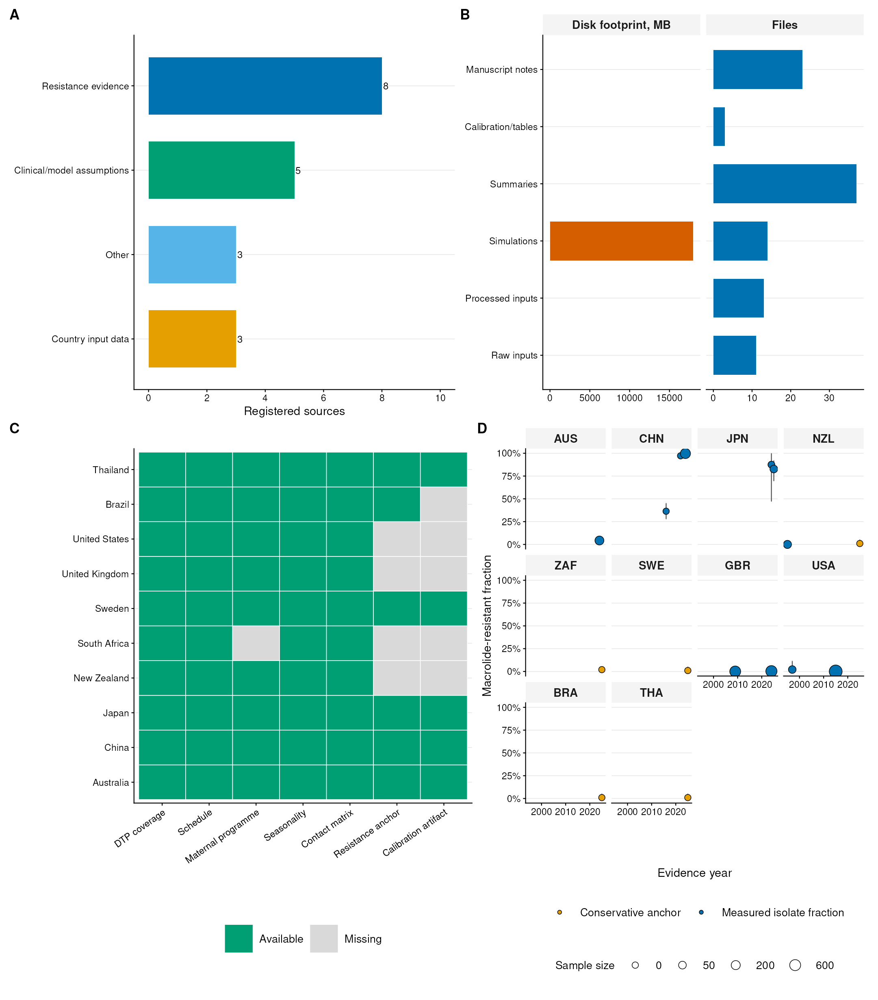

**eFigure 3. Provenance and preprocessing audit for model inputs and analytical outputs.** **(A)** Source domains. Source entries are grouped by country input data, clinical and mechanistic assumptions, and macrolide-resistance evidence. **(B)** Analysis corpus by processing stage. Raw inputs, harmonized inputs, simulations, summaries, tables, and manuscript-support materials are summarized to document data flow through the analysis. **(C)** Country evidence completeness matrix. Availability of population, surveillance, schedule, contact, seasonality, and resistance inputs is shown for each modeled profile. **(D)** Macrolide-resistance evidence timeline. Country-specific resistance anchors and measured isolate or surveillance fractions are plotted by evidence year, with uncertainty intervals where available.

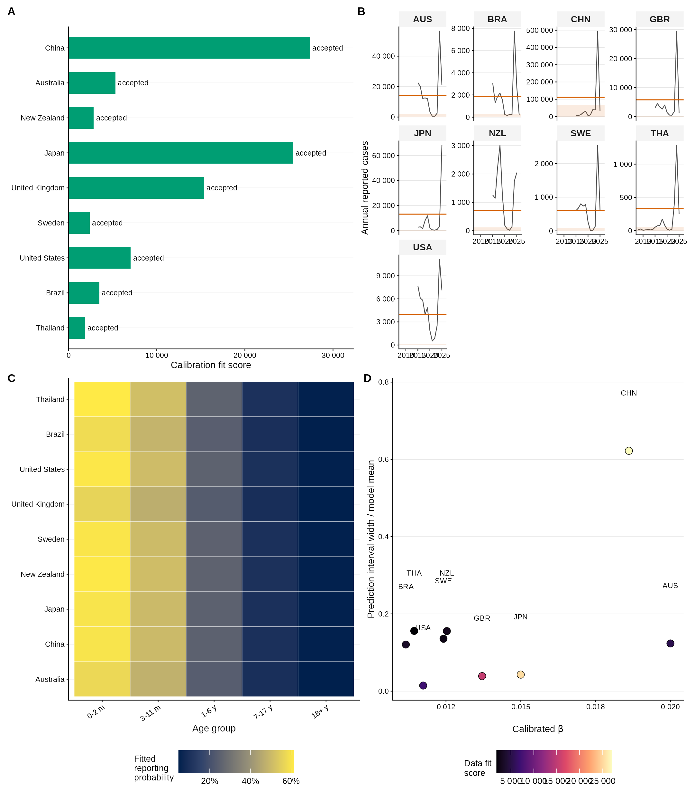

**eFigure 4. Country-level calibration acceptance and fit diagnostics.** **(A)** Calibration acceptance and fit score. Accepted country calibrations are summarized with their retained fit scores and optimizer status. **(B)** Observed and calibrated annual reports. Observed annual reported cases are compared with calibrated annual model means and conditional intervals. **(C)** Fitted reporting probabilities by age. Age-specific reporting probabilities retained after calibration are shown relative to prior reporting assumptions. **(D)** Calibrated transmission and interval width. Calibrated transmission rate is plotted against the relative width of the conditional interval to identify countries with broader residual uncertainty.

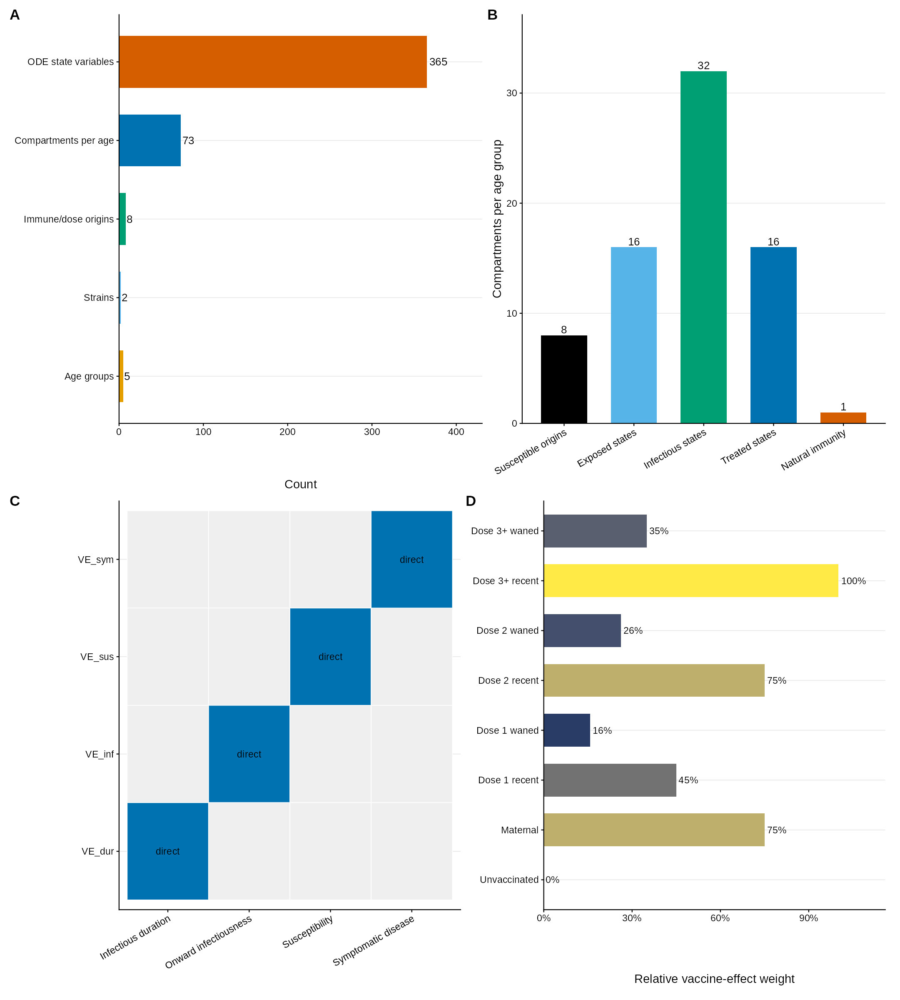

**eFigure 5. Model architecture, compartment accounting, and vaccine-effect mapping.** **(A)** State-space components. The full ODE system comprises eight age groups, two strains, eight susceptible-origin histories, 74 compartments per age group, and 592 dynamic state variables. **(B)** Compartment block accounting. Per-age compartments are decomposed into susceptible-origin, exposed, infectious, treated, and natural/waned-immunity blocks. **(C)** Vaccine-effect routes. VE_sus, VE_sym, VE_inf, and VE_dur are mapped to susceptibility, symptomatic disease, onward infectiousness, and infectious duration. **(D)** Origin-specific effect weights. Maternal, partial-dose, recent, and waned vaccine histories carry distinct relative effect weights used by all vaccine-mechanism scenarios.

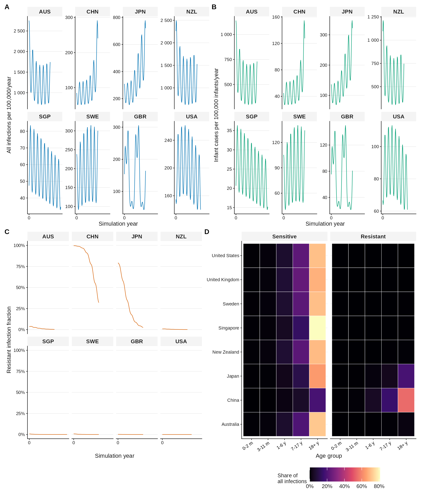

**eFigure 6. Baseline temporal dynamics over the saved analysis period.** **(A)** All-infection incidence at model output time points. Country-specific infection trajectories show recurrent transmission dynamics under the baseline vaccine and resistance assumptions. **(B)** Infant case incidence at model output time points. Symptomatic infant burden is scaled to infant population denominators to highlight country-level differences in risk to the most vulnerable age groups. **(C)** Resistant fraction dynamics. The resistant infection fraction is tracked after burn-in rebalancing to separate scenario initialization from within-analysis strain dynamics. **(D)** Age and strain contribution. The share of infections attributable to each age group and strain summarizes the demographic and resistance composition of baseline transmission.

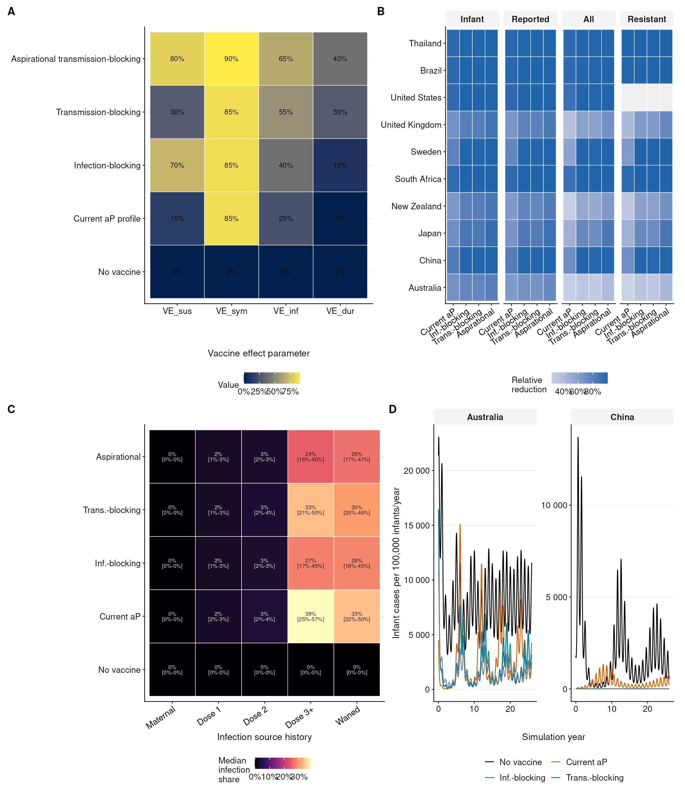

**eFigure 7. Vaccine-mechanism analysis and infection-source decomposition.** **(A)** Vaccine scenario parameter matrix. No-vaccine, aP-like symptom-protective, infection-blocking, transmission-blocking, and upper-bound high-transmission-blocking profiles are compared across VE_sus, VE_sym, VE_inf, and VE_dur. **(B)** Country-specific outcome reductions. Relative reductions in infant cases, reported cases, total infections, and resistant infections are shown for each country-scenario combination. **(C)** Infection-source histories. Median infection shares are decomposed by maternal, dose-1, dose-2, dose-3-plus, and waned source histories. **(D)** Representative vaccine trajectories. Infant case trajectories for Australia and China illustrate how vaccine-mechanism assumptions alter both magnitude and temporal pattern.

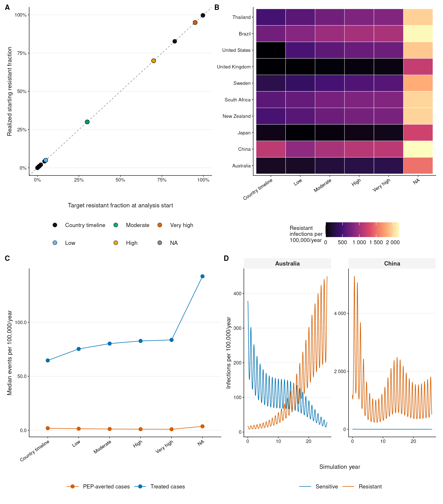

**eFigure 8. Macrolide-resistance evidence, initialization, and dynamic consequences.** **(A)** Scenario target versus realized initialization. Fixed resistance scenarios and country-timeline runs are compared with realized starting resistant fractions after burn-in rebalancing. **(B)** Resistant infection burden. Annualized resistant infection incidence is summarized by country and resistance scenario. **(C)** Treatment and PEP event burden. Treated-case and PEP-averted event rates are compared across resistance assumptions to quantify management-related outcome changes. **(D)** Sensitive and resistant strain trajectories. Representative country-timeline trajectories for Australia and China show how initial resistance prevalence, fitness, and importation interact during the saved analysis period.

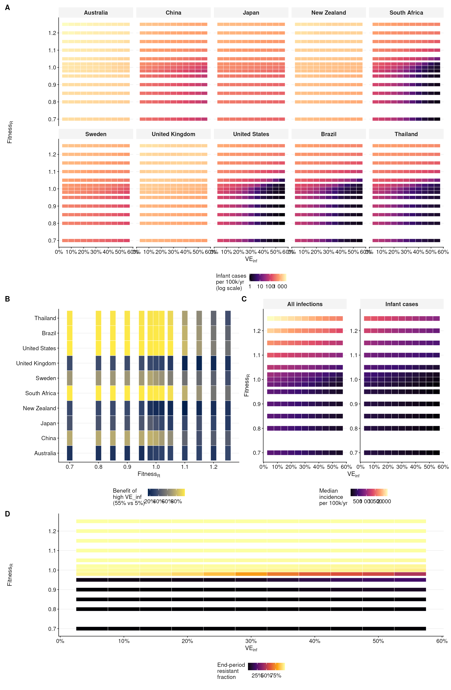

**eFigure 9. Full interaction surface between vaccine transmission blocking and initial resistance prevalence.** **(A)** Country-specific infant burden grid. Annualized infant case incidence is shown for each country across the seven-by-seven grid of VE_inf and initial resistant prevalence. **(B)** Benefit of high transmission blocking. The relative infant-case benefit of increasing VE_inf from the lowest to the highest grid value is displayed by country and resistance prevalence. **(C)** Median burden across countries. Median infant-case and all-infection incidence are summarized across countries over the same parameter grid. **(D)** Threshold for 50% infant-case reduction. The minimum VE_inf required to reduce infant cases by at least 50% relative to the lowest grid value is shown where the threshold is reached.

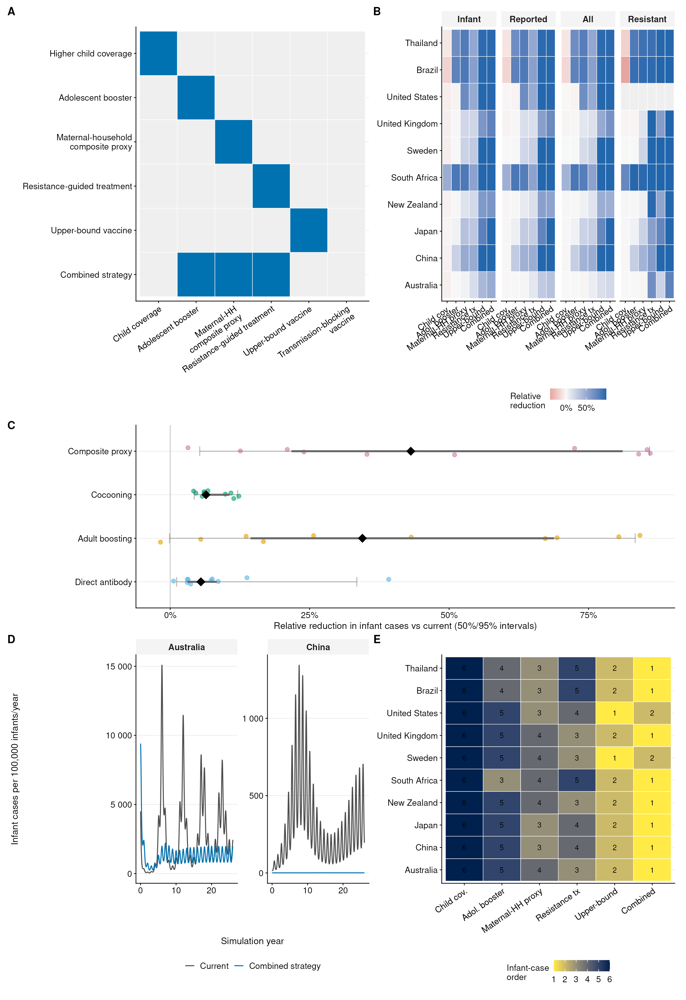

**eFigure 10. Extended intervention-strategy outcomes across countries and endpoints.** **(A)** Intervention lever matrix. Each strategy is mapped to the child-coverage, adolescent-booster, maternal-household composite transmission-reduction proxy, resistance-guided-treatment, and vaccine-improvement levers it modifies. **(B)** Country-specific outcome reductions. Relative reductions in infant cases, reported cases, total infections, and resistant infections are shown for each strategy and country. **(C)** Maternal-household composite proxy decomposition. Infant-case reductions are shown separately for direct antibody protection, adult boosting, cocooning, and the full composite proxy. **(D)** Current versus combined trajectories. Infant case trajectories compare the current strategy with the combined strategy in Australia and China. **(E)** Scenario-order diagnostic by country. Strategies are arranged within each country by relative reduction in infant cases to show heterogeneity in scenario contrasts.

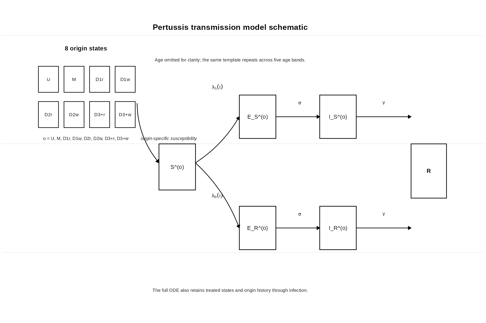

**eFigure 11. Compartmental transmission schematic used to define the dynamic state space.** **(A)** Age-omitted transmission schematic. The schematic condenses the full model into one representative age group, showing origin-specific susceptible histories, strain-specific exposed and infectious branches, treated infection states, and retained infection-source histories. The full ODE repeats this template across eight age groups and couples age groups through the contact matrix, demographic ageing, importation, vaccination, and postexposure prophylaxis.

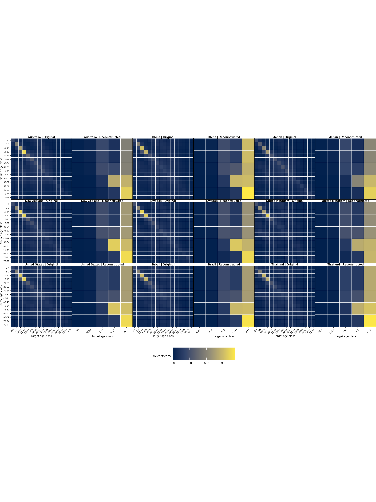

**eFigure 12. Reconstruction and aggregation of country-specific contact matrices.** The dynamic layout pairs the raw 5-year Prem/contactdata matrix with the reconstructed eight-group model matrix for each country in the standard project order: Australia, China, Japan, New Zealand, Sweden, United Kingdom, United States, Brazil, and Thailand. Reconstructed matrices are population weighted and reciprocity balanced before use in force-of-infection calculations.

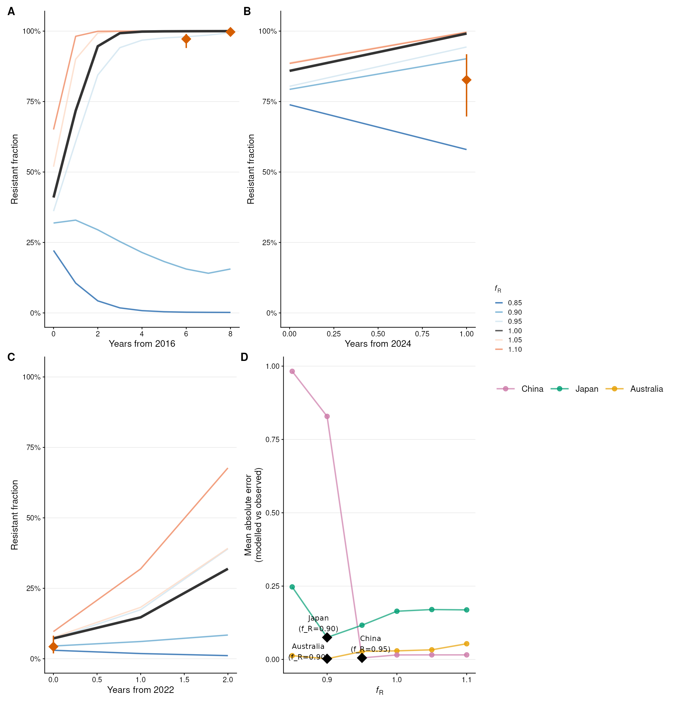

**eFigure 13. Resistance hindcast plausibility checks against observed macrolide-resistance trajectories.** **(A)** China hindcast. Modeled resistant fractions are compared with observed resistance prevalence anchors from 2016 through 2024 across resistant-fitness assumptions. **(B)** Japan hindcast. Modeled trajectories are compared with the observed high-prevalence 2024 to 2025 resistance estimate. **(C)** Australia hindcast. Modeled trajectories are compared with low but detectable 2024 resistance, testing whether the model maintains low resistance under neutral fitness and limited importation. **(D)** Hindcast scoring summary. Mean absolute error is summarized by country and fitness value, with the best-fitting fitness value highlighted for each country.
